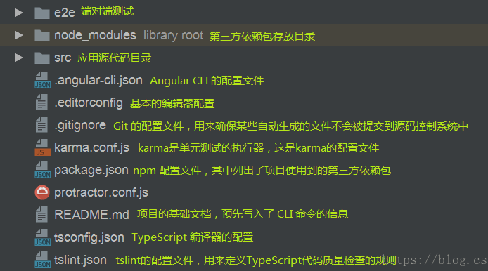
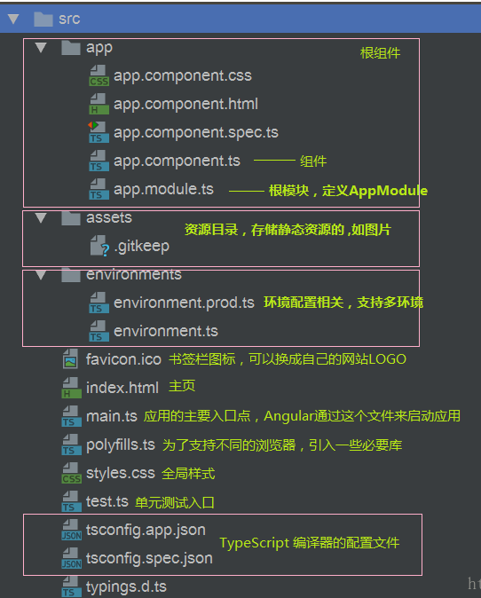

# Angular

## 目录结构

- 首层目录结构



- src目录结构



## 创建组件

```shell
ng g component compoents/xxx
```

最后面的`compoents/xxx`创建组件的相对路径，会在项目文件夹下的`./src/app`下创建文件夹，文件夹内包含四个文件

- `xxx.component.css`组件样式
- `xxx.component.html`组件前端
- `xxx.component.spec.ts`测试用代码
- `xxx.component.ts`有点类似组件的js代码

**使用指令创建组件，可以很方便地在根组件中注入新创建的组件**

## 模板语法

### 绑定属性`[]`

#### 绑定一般变量

```typescript
export class NewsComponent implements OnInit {
  public title: string = '这是一个新闻组件';
  constructor() { }
  ngOnInit() {
  }
}
```

```html
<div [title]="title">
  这里绑定了一个title属性
</div>
```

#### 绑定html`[innerHTML]`

```
<div [innerHTML]="content"></div>
```

#### 绑定class`[ngClass]`

基本用法

```css
.red{
  color:red;
}
.blue{
  color:red;
}
```

```typescript
public flag :boolean = false;
```

```html
<div [ngClass]="{'orange':flag,'red':!flag}">
  动态绑定class
</div>
```

在`*ngIf`中的例子可以改写为

```html
<ol>
  <li *ngFor="let item of arr;let key = index;" [ngClass]="{'red':key==2}">
    {{ key }}----{{ item }}
  </li>
</ol>
```

#### 绑定style

### 数据循环——`*ngFor`

####  普通循环

定义数组的几种方式

```typescript
arr = ['zcl', 'zyt', 'wly', 'txf'];
pulic arr = ['zcl', 'zyt', 'wly', 'txf'];

public arr: any[] = ['zcl', 'zyt', 'wly', 'txf'];
public arr: Array<string> = ['zcl', 'zyt', 'wly', 'txf'];
```
以上几种方式是等价的，建议使用后两种方式定义数组

```html
<ol>
  <li *ngFor="let item of arr">{{ item }}</li>
</ol>
```

#### 带索引

<ol>
  <li *ngFor="let item of arr;let key = index;">{{ key }}----{{ item }}</li>
</ol>

### 条件判断`*ngIf`

```html
<ol>
  <li *ngFor="let item of arr;let key = index;">
    <span *ngIf="key==2" class="red">{{ key }}----{{ item }}</span>
    <span *ngIf="key!=2">{{ key }}----{{ item }}</span>
  </li>
</ol>
```

><font color='red'>注意：Angular中没有ngElse指令</font >

### `ngSwitch`

```typescript
/* 0:审核未通过 1：审核通过 2：待审 其他：无效状态*/
public approvalStatus: number = 3;
```

```html
<span [ngSwitch]="approvalStatus">
  <p *ngSwitchCase="0">审核未通过</p>
  <p *ngSwitchCase="1">审核通过</p>
  <p *ngSwitchCase="2">待审</p>
  <p *ngSwitchDefault>无效状态</p>
</span>
```

### 事件绑定

事件函数声明与定义

```typescript
export class HomeComponent implements OnInit {
  public arr: Array<string> = ['zcl', 'zyt', 'wly', 'txf'];
  /* 0:审核未通过 1：审核通过 2：待审 其他：无效状态*/
  public approvalStatus: number = 3;
  public today: any = new Date();
  constructor() { }

  ngOnInit() {
  }
  handletest() {   //这是新声明定义的事件方法
    alert('hello angular');
  }
}
```

绑定事件

```html
<button (click)="handletest()">测试按钮</button>
```

#### 事件对象`$event`

```typescript
onKeyup(e) {
  if (e.keyCode === 13) {
    console.log(e.target.value);
  }
}
```

```html
输入框：<input (keyup)="onKeyup($event)"/>
```

### 双向数据绑定

#### `ngModel`

- 在`app.module.ts`根模块里引入`FormsModule`模块

```typescript
import { NgModule } from '@angular/core';
import { BrowserModule }  from '@angular/platform-browser';
import { FormsModule } from '@angular/forms'; // <--- JavaScript import from Angular

/* Other imports */

@NgModule({
  imports: [
    BrowserModule,
    FormsModule  // <--- import into the NgModule
  ],
  /* Other module metadata */
})
export class AppModule { }
```

使用

```html
双向绑定输入框：<input [(ngModel)]="modeltest"/>
<div>这是双向绑定输入框的内容：{{ modeltest }}</div>
```

> 注意：这里的`[(ngModel)]`和一般的绑定数据指令不一样，`[(...)]`

## 管道

对绑定到前端的数据做二次处理

### 内置管道

Angular 内置了一些管道，比如 `DatePipe`、`UpperCasePipe`、`LowerCasePipe`、`CurrencyPipe` 和 `PercentPipe`。 它们全都可以直接用在任何模板中。

- `DatePipe`日期管道

```typescript
/* 声明一个日期变量 */
public today: any = new Date();
```

```html
<p>这是格式化日期{{ today | date:'yyyy-MM-dd HH:mm:ss' }}</p>

// 显示效果
// 这是格式化日期2019-05-18 15:07:56
```

### 链式管道

管道可以串联使用

```html
<p>这是单日期管道{{ today | date:'fullDate'}}</p>
<p>这是串联管道{{ today | date:'fullDate' | uppercase }}</p>

//显示效果
//这是单日期管道Saturday, May 18, 2019
//这是串联管道SATURDAY, MAY 18, 2019
```

### 自定义管道

Angular提供了自定义管道的方法

>[官方参考](https://angular.cn/guide/pipes)