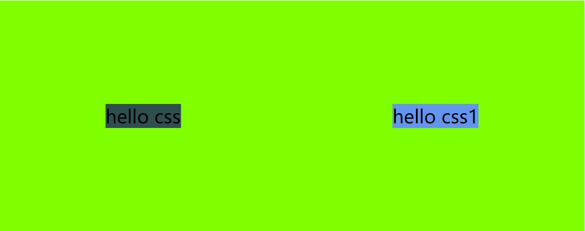
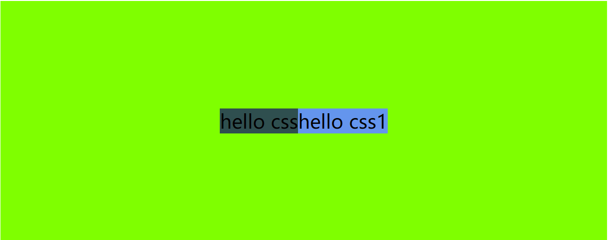

# 让元素水平居中的几种方案

## `<div>`垂直水平居中

### 宽高固定

> 本节参考代码：./css/code/00-元素垂直水平居中.html

方法一：

```css
div{
  position: absolute;
  left: 0;
  right: 0;
  bottom: 0;
  top: 0;
  margin: auto;
  // 一定要设置宽高
  width: 100px;
  height: 100px;
  background: green;
  // 文字水平居中
  text-align: center;
  line-height: 100px;
  box-shadow: inset 10px 10px 10px black;
}
```


使用绝对布局，从实现思路上是让分别让上下和左右的margin值相等（这里因为是正方形，所以四个值都相等），所以`top` 、`left` 、`right` 、`bottom`的值设置为0，`margin`值设置为`auto`即可实现

方法二：

```css
.center {
  position: absolute;
  top: 50%;
  left: 50%;
  width: 18rem;
  height: 10rem;
  margin-left: -9rem;
  margin-top: -5rem;
  background: aqua;
}
```

第二种方法的实现思路是先把div的左上角点定在父级元素的正中心（绝对定位实现），再分别向上和向左偏移div区域的半个高度和宽度，而偏移的具体做法就是将对应的margin设置为负值。

方法三：

```css
div.center2 {
  position: absolute;
  width: 200px;    /* 一定要设置宽高*/
  height: 200px;
  background: green;
  top: calc(50% - 100px);
  left: calc(50% - 100px);
}
```

第三种方法的实现思路与第二种类似，首先设置绝对定位，但是这里使用了css3提供的函数`calc()`，直接在`top`上减去`div`高度的一半，在`left`上减去宽度的一半

### 宽高不定

方法四：

```css
div.center3 {
  position: absolute;
  top: 50%;
  left: 50%;
  background: brown;
  transform: translate(-50%, -50%);
}
```

实现思路与方法三一模一样，但是方法四的优势在于，被居中的元素不会被限制宽高，内容被随意撑开之后依然能够垂直居中显示，如下图所示


方法五：

```css
.wrapper {
  display: flex;
}
.center {
  margin: auto;
}
```

容器设置为flex，子项只需要设置一项margin，如果不设置容器的高度，容器会被内容撑开，居中效果不明显（看起来像是只实现了水平居中），效果如下图所示，设置了flex中的两项内容，默认横向排列。



方法六：

```css
.wrapper {
  display: flex;
  align-items: center;
  justify-content: center;
}
```

依然是使用flex，与方法五的区别在于，方法5没有设置子元素的排列方式，方法六会让所有的子元素全部垂直居中显示，效果如下图所示



## ``水平居中

上面的css样式同样可以作用在img上，但是不是最优的方案

```css
html,body{
  height:100%
}
body{
  text-aligh:center
}
body:after{
  content: "";
  display: inline-block;
  height: 100%;
  vertical-align: middle;
}
img{
  vertical-align: middle;
}
```

## 文字垂直水平居中

```css
.text-center{
  text-align: center;
  line-height: 100px;
}
```

text-align设置为center是为了水平居中，设置行高等于父元素高度，即可实现文字水平居中