[阮一峰flex](http://www.ruanyifeng.com/blog/2015/07/flex-grammar.html?utm_source=tuicool)

# flex

## float、-webkit-box（老版本flex）、flex效果对比

```html
<style>
  *{
    margin: 0;
    padding: 0;
  }
  #wrap{
    width: 100px;
    height: 300px;
    border: 1px solid;
    margin: 100px auto;
    /*display: flex;*/
    /*display: -webkit-box;*/
  }
  #wrap .item{
    width: 50px;
    height: 50px;
    background: pink;
    text-align: center;
    line-height: 50px;
    float: left;
  }
</style>
</head>
<body>
  <div id = "wrap">
    <div class="item">1</div>
    <div class="item">2</div>
    <div class="item">3</div>
    <div class="item">4</div>
    <div class="item">5</div>
  </div>
</body>
```

- `float`

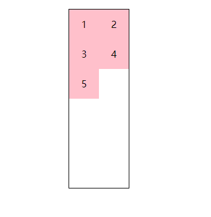

- `-webkit-box`

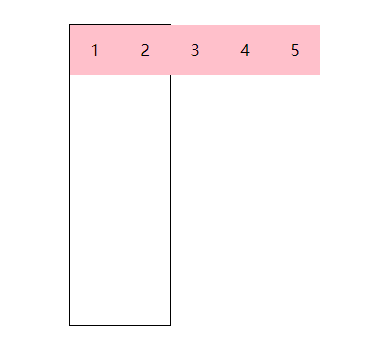

- `flex`

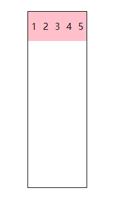

## 相关定义

- flex容器/项目
- 主轴/侧轴
- 项目永远在主轴的正方向上排列

## 新老版本属性分析

### 容器

#### 容器的布局/排列方向

- box

```css
#wrap{
  display: -webkit-box;
  /* 控制主轴和侧轴分别是哪一根 */
  /* 垂直 */
  -webkit-box-orient: vertical;
  /* 水平 */
  -webkit-box-orient: horizontal;
  /* 控制主轴方向 */
  -webkit-box-direction: reverse;
}
```

- flex

```css
#wrap{
  display: flex;
  /* 行 */
  flex-direction: row;
  /* 列 */
  flex-direction: column;
  /* 水平反向 */
  flex-direction: row-reverse;
}
```

水平方向为主轴（新老版本效果相同）


垂直方向为主轴

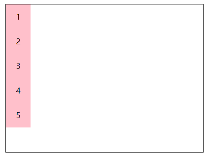

排列方向为`reverse`（老版本）

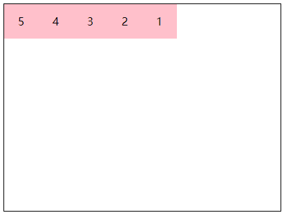

排列方向为`reverse`（新版本）

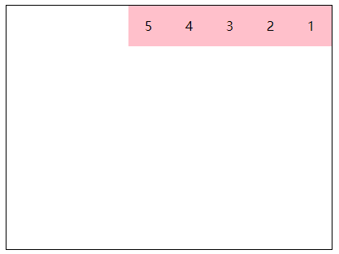

#### 富裕空间管理

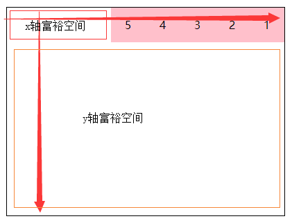

富裕空间如上图所示

##### 主轴方向

- 老版本

```css
#wrap{
  display: -webkit-box;
  /* 取值
  * start：富裕空间在右边(主x) 下边（y）
  * end: 富裕空间在左边（x）上边（y）
  * center: 富裕空间在两边
  * justify：富裕空间在项目之间
  */
  -webkit-box-pack: start;
}
```

- 新版本

```css
#wrap{
  display: flex;
  flex-direction: row;
  /* 取值
  * flex-start：富裕空间在主轴的正方向
  * flex-end: 富裕空间在主轴的反方向
  * center：富裕空间在主轴的两边
  * space-between: 富裕空间在项目之间
  * space-around（box没有的）：富裕空间在项目两边
  */
  justify-content: flex-start;
}
```

`flex-start`

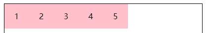

`flex-end`

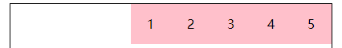

`center`

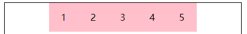

`space-between`

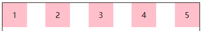

`space-around`

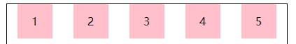

##### 侧轴方向

- 老版本

```css
/* 注意：和侧轴的方向有关 */
#wrap{
  display: -webkit-box;
  /* 取值
  * start：富裕空间在下边
  * end: 富裕空间在上边
  * center: 富裕空间在两边
  */
  -webkit-box-direction: reverse;
  -webkit-box-align: start;
}
```

`start`


`end`

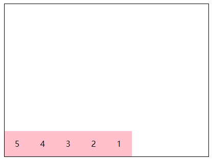

`center`

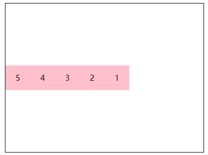

- 新版本

```css
#wrap{
  display: flex;
  /*
  * flex-start 富裕空间在侧轴的正方向
  * flex-end 富裕空间在侧轴的反向向
  * center 富裕空间在侧轴两边
  * baseline(box没有) 按基线对齐
  * stretch(box没有) 等高布局
  */
  align-items: flex-start;
}
```

`baseline`

给第二个项目设置一个100px的行高

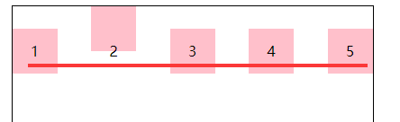

`stretch`

项目不能设置高度

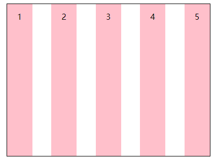

