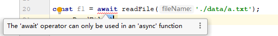

# async-await

## 基本用法

```js
const fs = require('fs');

const readFile = function (fileName) {
	return new Promise(function (resolve, reject) {
		fs.readFile(fileName, function(error, data) {
			if (error)
				return reject(error);
			resolve(data);
		});
	});
};

const asyncReadFile = async function () {
	const f1 = await readFile('./data/a.txt');
	const f2 = await readFile('./data/b.txt');
	console.log(f1.toString());
	console.log(f2.toString());
};

asyncReadFile()
```

async函数返回一个promise对象

## await关键字返回结果

```js
const fs = require('fs');

const readFile = function (fileName) {
	return new Promise(function (resolve, reject) {
		fs.readFile(fileName, function(error, data) {
			if (error)
				return reject(error);
			resolve('nice', data);
		});
	});
};

const asyncReadFile = async function () {
	const f1 = await readFile('./data/a.txt');
	const f2 = await readFile('./data/b.txt');
	console.log(f1.toString());  // nice
	console.log(f2.toString());  // nice
};

asyncReadFile()
```

事实表明只会返回第一个参数

正常情况下，`await`命令后面是一个 Promise 对象，返回该对象的结果。如果不是 Promise 对象，就直接返回对应的值。

```js
async function f() {
  // 等同于
  // return 123;
  return await 123;
}

f().then(v => console.log(v))
```

另一种情况是，`await`命令后面是一个`thenable`对象（即定义`then`方法的对象），那么`await`会将其等同于 Promise 对象。

```js
class Sleep {
  constructor(timeout) {
    this.timeout = timeout;
  }
  then(resolve, reject) {
    const startTime = Date.now();
    setTimeout(
      () => resolve(Date.now() - startTime),
      this.timeout
    );
  }
}

(async () => {
  const sleepTime = await new Sleep(1000);
  console.log(sleepTime);
})();
// 1000
```

### await只能在async函数里面使用

也就是说如果在外面用await是不行的

