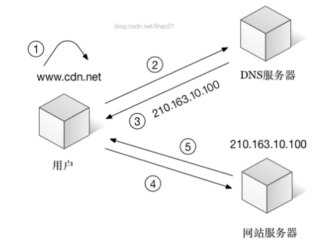

# 前端性能优化

## 减少HTTP请求数量

在浏览器与服务器进行通信时，主要是通过 HTTP 进行通信。浏览器与服务器需要经过三次握手，每次握手需要花费大量时间。而且不同浏览器对资源文件并发请求数量有限（不同浏览器允许并发数），一旦 HTTP 请求数量达到一定数量，资源请求就存在等待状态，这是很致命的，因此减少 HTTP 的请求数量可以很大程度上对网站性能进行优化。

- **CSS Sprites**

  国内俗称CSS精灵，这是将多张图片合并成一张图片达到减少HTTP请求的一种解决方案，可以通过CSS的background属性来访问图片内容。这种方案同时还可以减少图片总字节数。

- **合并 CSS 和 JS 文件**

  现在前端有很多工程化打包工具，如：grunt、gulp、webpack等。为了减少 HTTP 请求数量，可以通过这些工具再发布前将多个CSS或者多个JS合并成一个文件。

- **采用 lazyLoad**

  俗称懒加载，可以控制网页上的内容在一开始无需加载，不需要发请求，等到用户操作真正需要的时候立即加载出内容。这样就控制了网页资源一次性请求数量。

- **使用字体库替换图标**

  每次加载图片都需要一次http请求，但是只要使用了字体库，只需要加载一次字体库，就可以使用多个图标而不需要多次向服务器请求图片。

## 控制资源文件加载优先级

浏览器在加载HTML内容时，是将HTML内容从上至下依次解析，解析到link或者script标签就会加载href或者src对应链接内容，为了第一时间展示页面给用户，就需要将CSS提前加载，不要受 JS 加载影响。

一般情况下都是CSS在头部，JS在底部。

## 利用浏览器缓存

浏览器缓存是将网络资源存储在本地，等待下次请求该资源时，如果资源已经存在就不需要到服务器重新请求该资源，直接在本地读取该资源。

## 使用CDN托管代码

### 什么是CDN

`CDN (Content Delivery Network)` 可直译成内容分发网络。`CDN`的本质仍然李咏缓存技术缓存, 解决的是__如何将数据快速可靠从源站传递到用户的问题__。用户获取数据时，不需要直接从源站获取，通过`CDN`对于数据的分发，用户可以从一个较优的服务器获取数据，从而达到快速访问，并减少源站负载压力的目的。

### CDN加速动机

为什么不从源站进行数据的直接交付，即让用户直接从源站获取数据呢？
如果网络上的数据都使用从源站直接交付到用户的方法，那么将极有可能会出现**访问拥塞**的情况。
如果能有一种技术方案，**将数据缓存在离用户最近的地方，使用户以最快的速度获取**，那这对于减少网站的出口带宽压力，减少网络传输的拥堵情况，将起到很大的作用。CDN正是这样一种技术方案。

### CDN原理

- 用户在通过浏览器访问未使用CDN加速的网站的大致过程如下：

1. 用户在浏览器中输入要访问的域名。
2. 浏览器向DNS服务器请求对该域名的解析。
3. DNS服务器返回该域名的IP地址给浏览器。
4. 浏览器使用该IP地址向服务器请求内容。
5. 服务器将用户请求的内容返回给浏览器。

如图所示

- 使用了CDN，过程变成如下情况

1. 用户在浏览器中输入要访问的域名。
2. 浏览器向DNS服务器请求对域名进行解析。**由于CDN对域名解析进行了调整，DNS服务器会最终将域名的解析权交给CNAME指向的CDN专用DNS服务器。**
3. CDN的DNS服务器将CDN的负载均衡设备IP地址返回给用户。
4. 用户向CDN的负载均衡设备发起内容URL访问请求。
5. CDN负载均衡设备会为用户选择一台合适的缓存服务器提供服务。
   选择的依据包括：
   根据用户IP地址，判断哪一台服务器距离用户最近；
   根据用户所请求的URL中携带的内容名称，判断哪一台服务器上有用户所需内容；
   查询各个服务器的负载情况，判断哪一台服务器的负载较小。
   基于以上这些依据的综合分析之后，负载均衡设置会把缓存服务器的IP地址返回给用户。
6. 用户向缓存服务器发出请求。
7. 缓存服务器响应用户请求，将用户所需内容传送到用户。
   如果这台缓存服务器上并没有用户想要的内容，而负载均衡设备依然将它分配给了用户，那么这台服务器就要向它的上一级缓存服务器请求内容，直至追溯到网站的源服务器将内容拉取到本地。

### 总结

在网站和用户之间引入CDN之后，用户不会有任何与原来不同的感觉。
使用CDN服务的网站，只需将其域名的解析权交给CDN的负载均衡设备，CDN负载均衡设备将为用户选择一台合适的缓存服务器，用户通过访问这台缓存服务器来获取自己所需的数据。
由于缓存服务器部署在网络运营商的机房，而这些运营商又是用户的网络服务提供商，**因此用户可以以最短的路径，最快的速度对网站进行访问。**因此，CDN可以加速用户访问速度，减少源站中心负载压力