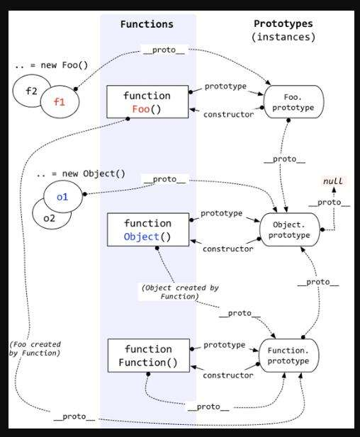

[TOC]
# 关于new关键字

在调用 `new` 的过程中会发生以下四件事情

1. 新生成了一个对象
2. 链接到原型
3. 绑定 this
4. 返回新对象

所以new关键字后面的函数中，this指向新创建的对象，新对象的`__proto__`指向函数的原型，也就是上文中第二件事

**注意**常规来讲，好像没什么问题，看看下面这个例子

``` js
function foo(){
  console.log('this is ' + this.a)

  const obj = {
    a:1
  }
  return obj
}
foo.prototype.b=function (){
  console.log(this.a);
}
const f1 = new foo()
console.log(f1.a); // 1
f1.b() //TypeError f1.b is not a function
```

首先我们需要知道一点，new 前缀会改变return 语句的行为,如果return 的值是对象，那么将会将这个对象返回，否则将返回默认创建的新对象。

如果构造函数有return语句，并且不是`return this`，而是一个全新的对象

> **这是之前的理解，很明显有点问题，并不是顺序有问题，而是绑定的原型对于返回的新对象来说没有多大的意义**
>
> ~~分析上面的代码，我们会发现步骤2的顺序似乎有些问题，因为上述例子中返回对象的继承自Object而非foo，调试中发现`f1`的`Construtor`是`Object()`而非`foo()`~~
> ~~综上，结论是如果构造函数中包含return语句，常规步骤顺序可能有误~~

# JS创建对象（实例）的方法

## 工厂模式

   ```js
function Person(name, age, sex){
  var obj = new Object();
  obj.name = name;
  obj.age = age;
  obj.sex = sex;
  obj.sayHi = function(){
    console.log('hi, I am ' + this.name);
  }
  return obj;
}
var p1 = Person('zcl', 24, 'male');
   ```

   返回一个对象，但是无法识别具体的对象

## 构造函数模式

```js
function Person(name, age, sex){
  this.name = name;
  this.age = age;
  this.sex = sex;
  this.sayHi = function(){
    console.log('hi, I am ' + this.name);
  }
}
var p2 = new Person('zcl', 24, 'male');
```

与工厂模式的不同之处在于

- 没有显式地创建对象
- 直接将属性和方法赋给了this对象
- 没有return语句

> 关于**constructor**（构造函数）属性，它是用来识别对象类型的
>
> ```js
> p1.constructor == Object; //true
> p2.constructor == Person; //true
> p2.constructor == Object; //false
> ```
> 但是推荐使用**instanceof**操作符
>
> ```js
> console.log(p1 instanceof Object);// true
> console.log(p2 instanceof Person);// true
> console.log(p3 instanceof Object);// true
> ```

构造函数模式的**缺点**

构造函数的问题是每个方法都要在每个实例上重新创建一遍，这极大的浪费了内存资源，也就是说每创建一个``` Person ```对象都要在内存中新开辟一定的内存空间。

可以使用以下方式来解决

```js
function Person(name, age, sex){
  this.name = name;
  this.age = age;
  this.sex = sex;
  this.sayHi = sayHi;
  return obj;
}
// 在全局作用域中创建一个函数
function sayHi(){
  console.log('hi, I am ' + this.name);
}
var p2 = new Person('zcl', 24, 'male');
```

但是上述的解决方式会污染全局作用域，所以有了第三种方式

## 原型模式

### 什么叫原型对象

我们创建的每个函数都有一个prototype属性，这个属性是一个指针，指向一个对象，这个对象的用途是包含可以由特定类型的所有实例共享的属性和方法

> 注意：prototype是函数特有的属性，实例对象是没有prototype属性的，但是有\_\_proto__属性指向父类函数的prototype属性

### 原型模式实现

```js
function Person(){

}

Person.prototype.name = 'zcl';
Person.prototype.age = '24';
Person.prototype.sayHi = function(){
  console.log('hi, I am ' + this.name);
}

var p3 = new Person('zcl', 24, 'male');
var p4 = new Person('zcl', 24, 'male');
console.log(p3.sayHi == p4.sayHi);// true
```

> [[Prototype]]的`isPrototypeOf`方法和`Object.getPrototypeOf`方法
>
> ```js
> console.log(Person.prototype.isPrototypeOf(p3));// true
> console.log(Object.getPrototypeOf(p3) == Person.prototype); //true
> ```

当为对象实例添加一个属性时，这个属性就会**屏蔽**原型对象中保存的同名属性

```js
p3.name = 'zyt';
console.log(p3.name); // zyt
```

> `hasOwnProperty()`方法
>
> ```js
> function Person(){
>    
> }
> 
> Person.prototype.name = 'zcl';
> Person.prototype.age = '24';
> Person.prototype.sayHi = function(){
>      console.log('hi, I am ' + this.name);
> }
> 
> var p3 = new Person();
> var p4 = new Person();
> console.log(p3.hasOwnProperty('name'));//false
> p3.name = 'zyt';
> console.log(p3.hasOwnProperty('name'));//true
> ```

## 组合使用构造函数模式和原型模式

```js
function Person(name, age, sex){
  this.name = name;
  this.age = age;
  this.sex = sex;
}
Person.prototype.sayHi = function(){
  console.log('hi, I am ' + this.name);
}
var p5 = new Person('zcl', 24, 'male');
```

## 动态原型模式

```js
function Person(name, age, sex){
  this.name = name;
  this.age = age;
  this.sex = sex;

  if(typeof this.sayHi != 'function'){
    Person.prototype.sayHi = function(){
      console.log('hi, I am ' + this.name);
    }
  }
}
var p6 = new Person('zcl', 24, 'male')
```

## 寄生构造函数模式

有点类似工厂模式+构造函数模式

```js
function Perosn(name, age, sex){
  var o = new Object();
  o.name = name;
  o.age = age;
  o.sex = sex;
  o.sayHi = function(){
    console.log('hi, I am ' + this.name);
  }
  return o;
}

var p7 = new Person('zcl', 24, 'male');
```

## 稳妥构造函数模式

```js
function Perosn(name, age, sex){
  var o = new Object();
  o.sayHi = function(){
    console.log('hi, I am ' + name);
  }
  return o;
}

var p7 = new Person('zcl', 24, 'male');
```

除了调用```sayHi```方法之外没有别的方法能访问```p7```的数据成员

# 继承

## 原型链

不谈原型链直接讲继承就是扯犊子




## 继承方法

### 原型链继承

```js
function SuperType(){
  this.property = true;
}
SuperType.prototype.getSuperValue = function(){
  return this.property
}
function SubType(){
  this.subproperty = false;
}
SubType.prototype = new SuperType();  // 核心
SubType.prototype.getSubValue = function(){
  return this.subproperty;
}
var instance = new SubTpe();
console.log(instance.getSuperValue()); // true
```

原型链继承的**缺点**

```js
function Father(){
  this.colors = ['red', 'blue'];
}
function Son(){

}
Son.prototype = new Father();
var son1 = new Son();
var son2 = new Son();
son1.colors.push('green');
console.log(son1.colors);//"red,blue,green"
console.log(son2.colors);//"red,blue,green"
```

- 原型链中包含引用类型的属性时，某一个子类实例对该属性的修改所有子类实例共享

- 在创建子类实例时，无法向父类的构造函数传参，或者说换一种方法，即使能够传参，也会影响所有的子类实例

### 借用构造函数
别名：<span style='color:red'>**伪造对象**</span>或<span style='color:red'>**经典继承**</span>

  ```js
function Father(){
  this.colors = ['red', 'blue'];
}
function Son(){
  Father.call(this);
}
var son1 = new Son();
var son2 = new Son();
son1.colors.push('green');
console.log(son1.colors);//"red,blue,green"
console.log(son2.colors);//"red,blue"
  ```

> 需要注意的是，使用这种模式创建的子类不是父类的实例
>
> ```js
> console.log(son1 instanceof Father); // false
> console.log(son1 instanceof Son); // true
> ```

借用构造函数模式的**缺点**

- 也是构造函数模式存在的问题：函数无法复用
- 在父类原型中定义的方法，子类不可见，因为子类根本不是父类的实例，子类的原型对象还是子类自身

### 组合继承

别名：**伪经典继承**

原型链继承+借用构造函数继承

```js
function Father(name){
  this.name = name;
  this.colors = ['red', 'blue'];
}
Father.prototype.sayHi = function(){
  console.log('hi, I am ' + this.name);
}
function Son(name, age){
  Father.call(this, name);
  this.age = age;
}
Son.prototype = new Father();
Son.prototype.constructor = Son;
var son1 = new Son('zcl', 24);
son1.colors.push('green');
console.log(son1.colors); // "red, blue, green"

var son2 = new Son('wly', 26);
console.log(son2.colors); // "red, blue"

console.log(son1 instanceof Son); // true
console.log(son1 instanceof Father); // true
```
组合继承的**缺点**

- 无论在什么情况下，都会调用两次父类的构造函数


### 原型式继承

```js
function object(o){
  function F(){}
  F.prototype = o;
  return new F();
}
```

本质上讲，产生的新对象是传入的对象```o```的一个实例副本，即做了一次浅复制

```js
var person = {
  name:'zcl',
  friends:['wly', 'txf', 'zyt']
}
var p1 = object(person);
p1.name = 'zcl1';
p1.friends.push('lt');
console.log(p1.name); // zcl1
var p2 = object(person);
p2.name = 'zcl2';
console.log(p1.name); // zcl1
console.log(person.name); // zcl
console.log(person.friends); // "wly, txf, zyt, lt"
```

>**注意**
>
>p1中原本没有name属性，在定义p1时，name属性只存在p1的原型对象中，但是一旦给p1.name属性赋值，就会覆盖原型属性，而不会直接修改原型属性对象，也就不会修改person对象中name属性的值，但是friends属性不一样，会直接修改原型对象中的friends属性，也就是person的friends属性

### 寄生式继承

借用了原型式继承，创建一个仅由于封装继承过程的函数

思路与寄生式构造模式与工厂模式类似

```js
function createAnother(o){
  var clone = object(o);
  clone.sayHi = function(){
    console.log('hi, I am ' + this.name);
  }
  return clone;
}
```

寄生式继承**缺点**

- 函数无法复用

### 寄生组合式继承

```js
function inheritPrototype(son, father){
  var prototype = object(father.prototype);
  prototype.constructor = son;
  son.prototype = prototype;
}

function Father(name){
  this.name = name;
  this.colors = ['red', 'blue'];
}
Father.prototype.sayHi = function(){
  console.log('hi, I am ' + this.name);
}
function Son(name, age){
  Father.call(this, name);
  this.age = age;
}
inheritPrototype(Son, Father);
Son.prototype.sayAge = function(){
  console.log(this.age);
}
```

