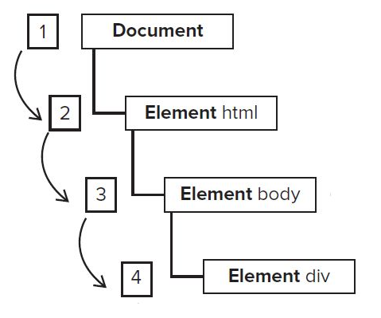
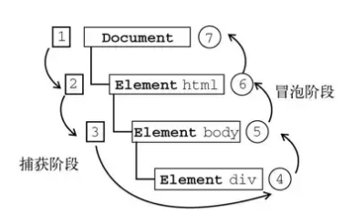

# DOM事件

## 事件流

问题：html页面的哪一部分会拥有某个特定的事件？

问题类比，把手指放在一组同心圆的圆心上，那么手指指向的是哪一个圆？

同理，点击了文档的其中一个按钮，点击的又是什么，按钮？这个按钮的父元素？<html>根标签？甚至是整个文档？那么下面要讨论的就是js或者说是浏览器按照什么顺序处理这些事件的。而**从页面中接收事件的顺序**就是事件流

## 事件冒泡

事件冒泡（IE的事件流），是指事件由开始时具体的元素接收，然后逐级（父元素）向上传播。以下面的html页面为例：

```html
<!DOCTYPE html>
<html lang="en">
<head>
	<meta charset="UTF-8">
	<title>事件模型</title>
</head>
<body>
<div id="myDiv">click</div>
</div>
</body>
</html>
```

单击<div>元素，那么click事件会按照如下顺序传播

1. `<div>`
2. `<body>`
3. `<html>`
4. `document`


看起来像不像泡泡从水底浮出，所以叫事件冒泡

## 事件捕获

事件捕获的思想是不太具体的节点应该更早接收到事件，而最具体的节点应该最后接收到事件。

上面的例子中，单击`<div>`之后，事件的触发顺序如下：

1. `document`
2. `<html>`
3. `<body>`
4. `<div>`



## DOM事件流

“DOM2级事件”规定的事件流包括三个阶段：事件捕获阶段、处于目标阶段、和事件冒泡阶段。还是以上面的例子为例，单击`<div>`元素会按照如图所示顺序触发事件



### 如何理解

就算是这样画出了这种类似流程图的东西，似乎对理解js的事件流没有太多实质性的帮助，来看一个例子

```html
<!DOCTYPE html>
<html lang="en">
<head>
	<meta charset="UTF-8">
	<title>事件模型</title>
</head>
<body>
	<div id="mydiv">
		<button id="mybutton">添加</button>
  </div>
</body>
<script>
	const hbtn = document.getElementById('mybutton');
	hbtn.addEventListener('click',function (event) {
		alert('hello world');
	},true);
	const hdiv = document.getElementById('mydiv');
	hdiv.addEventListener('click',function (event) {
		alert(this.id);
	},true);
</script>
</html>
```

在看这个例子之前，先讲一个dom提供的方法`addEventListener`，这个方法接收三个参数，分别是

- 事件类型(`string`)
- 事件触发回调函数（`callback function`）
- 调用时机（`boolean`）

第三个参数默认值为false，表示在冒泡阶段调用函数，反之，则表示在捕获阶段开始调用

这个方法的功能是给dom元素挂载相应的操作事件，单击，悬停，失去焦点等等。。。

注意到上面的例子中，`<div id="mydiv">`内部包含一个`<button id="mybutton">`，给这两个元素都绑定了单击事件，并且触发时机都是捕获阶段，点击按钮，浏览器肯定会弹出两次对话框，下面分析这两次弹框的先后顺序

按照事件流的标准，事件捕获阶段`document`->`<html>`->`<body>`->`<div>`

此时`<div id="mybutton">`的点击事件触发，对话框先弹出`mydiv`，然后才是`hello world`

如果把给`<div>`绑定点击事件的第三个参数改为false，那么对话框会先弹出`hello world`，然后才是`mydiv`。

> 除了`addEventlistener`之外，所有的dom还有一些默认的操作事件，例如的dom的`onClick`属性，通过这种方法绑定的事件会在冒泡阶段触发，同时存在两种方法绑定的事件，依然遵循先后顺序

>div的点击事件，点击margin区域也会触发

