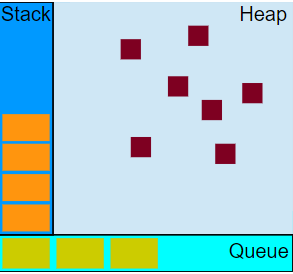

# 深入理解javascript中的事件循环event-loop

## 异步函数

如果在函数返回的时候，调用者还不能够得到预期结果，而是需要在将来通过一定的手段得到，那么这个函数就是异步的

```js
fs.readFile('foo.txt', 'utf8', function(err, data) {
    console.log(data);
});
```

异步函数实际上很快就调用完成了，因为是非阻塞的。但是后面还有异步操作、通知主线程、主线程调用回调函数等很多步骤。我们把整个过程叫做`异步过程`。异步函数的调用在整个异步过程中，只是一小部分

一个异步过程通常是这样的：

- 主线程发起一个异步请求，异步任务接收请求并告知主线程已收到(异步函数返回)；
- 主线程可以继续执行后面的代码，同时异步操作开始执行；
- 执行完成后通知主线程；
- 主线程收到通知后，执行一定的动作(调用回调函数)

因此，一个异步过程包括两个要素：注册函数和回调函数，其中注册函数用来发起异步过程，回调函数用来处理结果

对于同步任务来说，按顺序执行即可；但是，对于异步任务，各任务执行的时间长短不同，执行完成的时间点也不同，主线程如何调控异步任务呢？这就用到了消息队列

## 消息队列

有些文章把消息队列称为任务队列，或者叫事件队列，总之是和异步任务相关的队列

可以确定的是，它是队列这种先入先出的数据结构，和排队是类似的，哪个异步操作完成的早，就排在前面。不论异步操作何时开始执行，只要异步操作执行完成，就可以到消息队列中排队

这样，主线程在空闲的时候，就可以从消息队列中获取消息并执行

消息队列中放的消息具体是什么东西？消息的具体结构当然跟具体的实现有关。但是为了简单起见，可以认为：消息就是注册异步任务时添加的回调函数。

## 可视化描述

人们把javascript调控同步和异步任务的机制称为**事件循环**，首先来看事件循环机制的可视化描述



- 执行栈

函数调用形成了一个栈帧

```js
function foo(b) {
  var a = 10;
  return a + b + 11;
}
function bar(x) {
  var y = 3;
  return foo(x * y);
}
console.log(bar(7));
```

当调用`bar`时，创建了第一个帧 ，帧中包含了`bar`的参数和局部变量。当`bar`调用`foo`时，第二个帧就被创建，并被压到第一个帧之上，帧中包含了`foo`的参数和局部变量。当`foo`返回时，最上层的帧就被弹出栈（剩下`bar`函数的调用帧 ）。当`bar`返回的时候，栈就空了

- 堆

对象被分配在一个堆中，即用以表示一个大部分非结构化的内存区域

- 队列

一个 JavaScript 运行时包含了一个待处理的消息队列。每一个消息都与一个函数相关联。当栈拥有足够内存时，从队列中取出一个消息进行处理。这个处理过程包含了调用与这个消息相关联的函数（以及因而创建了一个初始堆栈帧）。当栈再次为空的时候，也就意味着消息处理结束

## 事件循环

> 注意：异步任务和回调函数的关系是，异步任务中包含回调函数，就像fs.readfile()本身是一个异步任务，它很快就能执行完毕，但是回调函数是等待执行的。

下面来详细介绍事件循环。下图中，主线程运行的时候，产生堆和栈，栈中的代码调用各种外部API，异步操作执行完成后，就在消息队列中排队。只要栈中的代码执行完毕，主线程就会去读取消息队列，依次执行那些异步任务所对应的回调函数


> 上图中webapis的部分不太准确，应该统称为异步任务

详细步骤如下：

　　1. 所有同步任务都在主线程上执行，形成一个执行栈
　　2. 主线程之外，还存在一个"消息队列"。只要异步操作执行完成，就到消息队列中排队
  　3. 一旦执行栈中的所有同步任务执行完毕，系统就会按次序读取消息队列中的异步任务，于是被读取的异步任务结束等待状态，进入执行栈，开始执行
  　4. 主线程不断重复上面的第三步

## 微任务和宏任务

就算是异步任务，进入回调队列的顺序也是有说法的~~或者说回调队列中包含微任务队列和宏任务队列，而一个宏任务中也可能包含其他的微任务和宏任务~~

- 微任务：promise.then catch finally、MutationObserver、process.nextTick(node)

- 宏任务：dom事件、计时器、setImmediate(非标准)、网络请求回调（xhr）

回调队列会被分为两个部分，微任务队列和宏任务队列，~~也就是说在每一轮栈中的任务执行完成之后，微任务先入栈执行，然后是宏任务入栈执行，而这个时候宏任务内又可能包含微任务或宏任务，等到这一轮的宏任务结束之后，队列中又包含新的微任务队列和宏任务队列，直到所有的任务全部执行完毕，事件循环结束。~~

> 果然是每学每新，现在真不敢轻易说搞懂了
>
> 2021年5月11日17:15:34

微任务队列应该是客观存在的，但是不管是微任务还是宏任务一旦入进入call stack，其实就没有微任务和宏任务之分了。

微任务的执行细分起来也可分为两种，“同步”和“异步”，这么说可能无法理解，看以下两个promise的例子

```js
// demo1 同步
new Promise(resolve => {
  resolve()
}).then(() => {
  doSomething
})
```

```js
// demo2 异步
new Promise(reolve => {
  setTimeout(resolve)
}).then(()=>{
  doSomething
})
```

demo1和demo2的区别在于resolve是否是在异步任务中触发

## 例题

```js
console.log(1)
setTimeout(()=>{
  console.log(2)
  new Promise(resolve=>{
    console.log(3)
    resolve()
  }).then(()=>{
    console.log(4)
  })
})

new Promise(resolve=>{
  console.log(5)
  setTimeout(()=>{
    console.log(6)
  })
  resolve()
}).then(()=>{
  console.log(7)
})

// 1 5 7 2 3 4 6
```

> 2020年9月5日14:22:39
>
> 原来的答案是1 5 7 2 3 6 4，然后有了下面这段强行解释，实际经过测试，假设有两个宏任务a，b，a在b前面定义且耗时相同，那么a肯定先执行，当a中的微任务与b的耗时相同时，a中的微任务应该先于b执行，当a中的宏任务与b的耗时相同时，a中的宏任务晚于b执行
>
> ~~这道题的关键在于6和4谁先输出谁后输出，第一轮栈中的任务执行完之后，宏任务队列中有两个计时器宏任务，由于先后关系，2和3先打印，这时候微任务打印4入微任务队里，同时另一个宏任务开始执行，等到第二个宏任务开始执行后，才开始执行下一轮的微任务~~

```js
console.log(1)
setTimeout(()=>{
  console.log(2)
  new Promise(resolve=>{
    console.log(3)
    setTimeout(resolve)
  }).then(()=>{
    console.log(4)
  })
})

new Promise(resolve=>{
  console.log(5)
  setTimeout(()=>{
    console.log(6)
  })
  resolve()
}).then(()=>{
  console.log(7)
})

new Promise(resolve=>{
  resolve()
}).then(()=>{
  console.log(8)
})

// 1 5 7 2 3 6 4
```

```js
var p = new Promise((resolve,reject) => {
    console.log(0)
    reject()
    console.log(1)
    resolve()
    console.log(2)
  })
p.then(res => {
  console.log(3)
}).then(res => {
  console.log(4)
}).catch(res => {
  console.log(5)
}).then(res => {
  console.log(6)
}).catch(res => {
  console.log(7)
}).then(res => {
  console.log(8)
})
```


## 浏览器中的事件循环和node.js中的区别

- node.js


从上图中，大致看出 node 中的事件循环的顺序：

外部输入数据–>轮询阶段(poll)–>检查阶段(check)–>关闭事件回调阶段(close callback)–>定时器检测阶段(timer)–>I/O 事件回调阶段(I/O callbacks)–>闲置阶段(idle, prepare)–>轮询阶段（按照该顺序反复运行）…

- timers 阶段：这个阶段执行 timer（setTimeout、setInterval）的回调
- I/O callbacks 阶段：处理已完成的I/O操作的回调函数，如文件系统读写、网络请求等。
- idle, prepare 阶段：仅 node 内部使用
- poll 阶段：处理新的I/O事件，如果队列为空，且没有设置的定时器，将阻塞并等待新的I/O事件。在执行完回调后，也会检查并执行微任务队列。
- check 阶段：执行 setImmediate() 的回调
- close callbacks 阶段：执行 socket 的 close 事件回调

**事件队列在其中的执行时机：**

- 微任务队列（Microtasks Queue）：在每个阶段完成后（除了 idle 和 prepare 阶段），事件循环都会检查并执行微任务队列中的所有任务。这包括Promise的回调、`process.nextTick()` 的回调、以及MutationObserver等。
- 宏任务队列（Macrotasks Queue）：宏任务会根据它们所属的阶段，分别在 timers、poll、check 等阶段被处理。例如，`setTimeout()` 设置的回调会在 timers 阶段执行，而 `setImmediate()` 的回调则在 check 阶段执行。

 **setTimeout 和 setImmediate**

```js
setTimeout(function timeout () {
  console.log('timeout');
},0);
setImmediate(function immediate () {
  console.log('immediate');
});
```

这段代码在node环境中可能会有两种情况，这是由于node.js中事件循环机制的特殊性引起的

**其他不同点**

浏览器中没有setImmediate方法，或者说大部分的浏览器都不支持这个api

**process.nextTick**

这个函数其实是独立于 Event Loop 之外的，它有一个自己的队列，当每个阶段完成后，如果存在 nextTick 队列，就会清空队列中的所有回调函数，并且优先于其他 microtask 执行。

## 参考资料

[深入理解javascript中的事件循环event-loop](https://www.cnblogs.com/xiaohuochai/p/8527618.html)

[浏览器与Node的事件循环(Event Loop)有何区别?](https://zhuanlan.zhihu.com/p/54882306)

