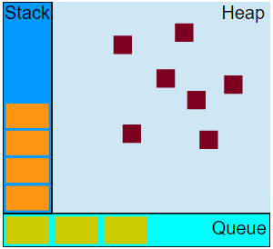
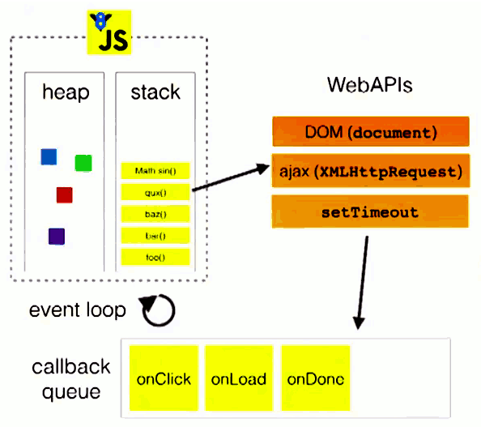

[转载](https://www.cnblogs.com/xiaohuochai/p/8527618.html)

# 深入理解javascript中的事件循环event-loop

## 异步函数

如果在函数返回的时候，调用者还不能够得到预期结果，而是需要在将来通过一定的手段得到，那么这个函数就是异步的

```js
fs.readFile('foo.txt', 'utf8', function(err, data) {
    console.log(data);
});
```

异步函数实际上很快就调用完成了，因为是非阻塞的。但是后面还有异步操作、通知主线程、主线程调用回调函数等很多步骤。我们把整个过程叫做`异步过程`。异步函数的调用在整个异步过程中，只是一小部分

一个异步过程通常是这样的：

- 主线程发起一个异步请求，异步任务接收请求并告知主线程已收到(异步函数返回)；
- 主线程可以继续执行后面的代码，同时异步操作开始执行；
- 执行完成后通知主线程；
- 主线程收到通知后，执行一定的动作(调用回调函数)

因此，一个异步过程包括两个要素：注册函数和回调函数，其中注册函数用来发起异步过程，回调函数用来处理结果

对于同步任务来说，按顺序执行即可；但是，对于异步任务，各任务执行的时间长短不同，执行完成的时间点也不同，主线程如何调控异步任务呢？这就用到了消息队列

## 消息队列

有些文章把消息队列称为任务队列，或者叫事件队列，总之是和异步任务相关的队列

可以确定的是，它是队列这种先入先出的数据结构，和排队是类似的，哪个异步操作完成的早，就排在前面。不论异步操作何时开始执行，只要异步操作执行完成，就可以到消息队列中排队

这样，主线程在空闲的时候，就可以从消息队列中获取消息并执行

消息队列中放的消息具体是什么东西？消息的具体结构当然跟具体的实现有关。但是为了简单起见，可以认为：消息就是注册异步任务时添加的回调函数。

## 可视化描述

人们把javascript调控同步和异步任务的机制称为**事件循环**，首先来看事件循环机制的可视化描述



- 执行栈

函数调用形成了一个栈帧

```js
function foo(b) {
  var a = 10;
  return a + b + 11;
}
function bar(x) {
  var y = 3;
  return foo(x * y);
}
console.log(bar(7));
```

当调用`bar`时，创建了第一个帧 ，帧中包含了`bar`的参数和局部变量。当`bar`调用`foo`时，第二个帧就被创建，并被压到第一个帧之上，帧中包含了`foo`的参数和局部变量。当`foo`返回时，最上层的帧就被弹出栈（剩下`bar`函数的调用帧 ）。当`bar`返回的时候，栈就空了

- 堆

对象被分配在一个堆中，即用以表示一个大部分非结构化的内存区域

- 队列

一个 JavaScript 运行时包含了一个待处理的消息队列。每一个消息都与一个函数相关联。当栈拥有足够内存时，从队列中取出一个消息进行处理。这个处理过程包含了调用与这个消息相关联的函数（以及因而创建了一个初始堆栈帧）。当栈再次为空的时候，也就意味着消息处理结束

## 事件循环

> 注意：异步任务和回调函数的关系是，异步任务中包含回调函数，就像fs.readfile()本身是一个异步任务，它很快就能执行完毕，但是回调函数是等待执行的。

下面来详细介绍事件循环。下图中，主线程运行的时候，产生堆和栈，栈中的代码调用各种外部API，异步操作执行完成后，就在消息队列中排队。只要栈中的代码执行完毕，主线程就会去读取消息队列，依次执行那些异步任务所对应的回调函数



> 上图中webapis的部分不太准确，应该统称为异步任务

详细步骤如下：

　　1. 所有同步任务都在主线程上执行，形成一个执行栈
　　2. 主线程之外，还存在一个"消息队列"。只要异步操作执行完成，就到消息队列中排队
  　3. 一旦执行栈中的所有同步任务执行完毕，系统就会按次序读取消息队列中的异步任务，于是被读取的异步任务结束等待状态，进入执行栈，开始执行
  　4. 主线程不断重复上面的第三步

## 微任务和宏任务

就算是异步任务，进入回调队列的顺序也是有说法的，或者说回调队列中包含微任务队列和宏任务队列

