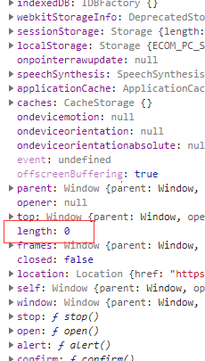

# this作用域问题

一般来说，**谁调指谁**是一个基本原则，但是这并不是一个非常好的面试回答，虽然从某种程度上，这有助于帮我们判断this指向问题，但是不能涵盖所有的情况，建议从函数调用的4种方式展开

1. 函数式调用
2. 方法调用模式
3. 构造函数调用模式（this指向实例）
4. call、apply、bind

## 函数式调用

```js
var age = 10
var person = {
  age:12,
  say(){
    function f(){
      console.log(this.age)
    }
    f()
  }
}
person.say()// 10
```

**以此模式调用函数时，this被绑定到全局对象**。这是语言设计上的一个错误。倘若语言设计正确，那么当内部函数被调用时，this应该仍然绑定到外部函数的this变量。这个设计错误的后果就是方法不能利用内部函数来帮助它工作，因为内部函数的this被绑定了错误的值(全局对象)，所以不能共享该方法对对象的访问权。

这种情况是不遵从所谓**谁调指谁**原则的

解决方法，内部函数外使用一个变量保存this

```js
var age = 10
var person = {
  age:12,
  say(){
    var that = this
    function f(){
      console.log(that.age)
    }
    f()
  }
}
person.say()// 12
```

## 方法调用模式

当一个函数被保存为对象的一个属性时，我们称它为一个方法。当一个对象的方法被调用时，this被绑定到调用方法的对象。

```js
var age = 10
var person = {
  age:12,
  say(){
    console.log(this.age)
  }
}
person.say()// 12
```

这就有点像所谓的**谁调指谁**

### 在数组中的特例

```js
var arr=[
  function(){
    console.log(this)
  },
  1,
  2,
]
arr[0]()
//输出结果
[f, 1, 2]
```

很显然，数组其实也是对象，虽然这种调用方式在写法上可能更加贴近函数调用模式，但是从打印结果来看，这很显然属于方法调用模式有点类似于`arr.0()`

反过来想，方法调用模式也可以写成

```js
person['say']()
```

## 构造器调用模式

如果在一个函数前面带上 new 关键字来调用，那么背地里将会创建一个连接到该函数的prototype成员的新对象，同时this会被绑定到那个新对象上。

```js
function foo(){
  console.log('this is' + this)
}
new foo()
// this is [object]
```

new 前缀也会改变return 语句的行为,如果return 的值是对象，那么将会将这个对象返回，否则将返回默认创建的新对象。

```js
function foo(){
  console.log('this is ' + this.a)
  const obj = {
    a:1
  }
  return obj
}

const f1 = new foo()
console.log(f1.a) 

// this is undefied
// 1
```

> 新知识点，买一送一

这里可以看到，虽然返回的实例中确实有属性a，但是在代码执行上仍然存在先后顺序

## call、apply、bind

### 相同点

改变函数运行时上下文

### 不同点

- apply()和call()的第一个参数都是被替换的新的上下文，而apply()的第二个参数必须是数组或类数组，而call()是接受参数列表
- bind()与apply()和call()又有本质区别，后两者是立即执行，而bind()返回的是一个新的函数，供之后调用

## 特殊情况——箭头函数

箭头函数作为函数式调用设计失误的解决方案而提出（例a如下）

```js
var age = 10
var person = {
  age:12,
  say(){
    var f=()=>{
      console.log(this.age)
    }
    f()
  }
}
person.say()// 12
```

箭头函数的特点中有一点是**函数体内的`this`对象，就是定义时所在的对象，而不是使用时所在的对象。**

所以call、apply、bind对箭头函数是不起作用的

```js
var age = 10
var person = {
  age:12,
  say(){
    var f=()=>{
      console.log(this.age)
    }
    f.call({age:9})
  }
}
person.say()// 12
```

再看下面的例子

```js
var age = 10
var person = {
  age:12,
  say:()=>{
    console.log(this.age)
  }
}
person.say()// 10
```

**这是因为对象不构成单独的作用域**，导致`say`箭头函数定义时的作用域就是全局作用域。阮一峰的es6教程中也有相关内容。

最后一个例子

```js
var age = 10
var person = {
  age:12,
  say:()=>{
    console.log(this.age)
  }
}
var person1 = {
  age:13,
  say(){
    var f=person.say
    f()
  }
}
person1.say()// 10
```

这个例子看起来和例a很像，内层函数`f`是一个箭头函数，虽然是`person`的一个属性，那么结果是不是13呢，然而并不是，还是紧扣箭头函数特征：**函数体内的`this`对象，就是定义时所在的对象，而不是使用时所在的对象。**

该例中，person.say定义时在person内，对象不构成单独作用域，所以person.say定义时的作用域是全局作用域，所以f被调用时打印的结果为全局变量age=10

## 综合例题

```js
var length = 10;
function fn(){
  console.log(this.length)
}
var obj = {
  length: 5,
  method: function(fn){
    fn()
    arguments[0]()
  }
}
obj.method(fn, 1)

// 输出结果
// 10
// 2
// 如果注释掉第一行代码 输出结果
// 0
// 2
```

（1）首先如果不注释第一行代码，`obj`调用自己的`method`方法，传了两个参数，第一个是在全局定义的函数`fn`，第二个参数是number类型的常量

进入method，立即调用`fn`，因为`fn`是一个函数式调用，所以this指向全局，也就是window，打印结果是10

再看接下来执行的`arguments[0]()`，`arguments`是一个数组，表示函数的实参列表，也就是说这个数组中包含两个元素，第一个是传进去的`fn`，第二个是传进去的常量1，然后它调用了第0个元素表示的函数，所以这里是方法调用模式中的特例，作为数组元素被调用，this指向数组本身，我们经常会忽略数组中其实默认是有`length`属性的，即使在写for循环的时候经常会用，数组长度为2，所以打印结果是2

（2）如果注释了第一行代码，不在全局定义length属性，正常分析，length未定义，返回undefined，那么答案就错了，事实上，全局window是有length属性的，默认值为0



这就是这道题隐藏最深的点了