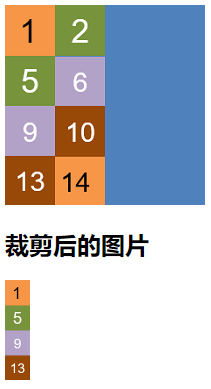
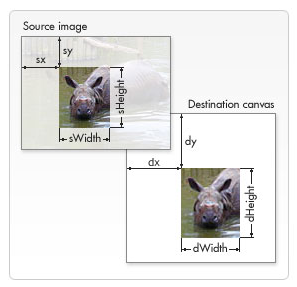

# 前端js操作截取图片

主要使用用canvas相关api来实现图片裁剪



## 在vue中使用

```vue
<template>
  <div>
    
    <div>
      <h2>裁剪后的图片</h2>
      
    </div>
  </div>
</template>

<script>
import logo from '@/assets/imgtest1.png'
import defaultImg from '@/assets/default.png'
export default {
  name: 'ImgUtils',
  data () {
    return {
      imgSrc: logo,
      handleSrc: null,
      defaultImg
    }
  },
  async created () {
    try {
      this.handleSrc = await this.handleImg({
        src: this.imgSrc,
        rect: {
          x: 0, // 截取方格左上角横坐标
          y: 0, // 截取方格左上角纵坐标
          width: 50, // 截取方格宽度
          height: 200 // 截取方格高度
        }
      })
    } catch (err) {
      console.error(err)
      this.handleSrc = this.defaultImg
    }
  },
  methods: {
    handleImg (opts) {
      return new Promise((resolve, reject) => {
        const { src, rect } = opts
        if (!src || !rect) {
          reject(new Error('opts params Error!'))
        }
        const img = new Image()
        img.src = src
        img.onload = function () {
          const canvas = document.createElement('canvas')
          const ctx = canvas.getContext('2d')
          const { x, y, width, height } = rect
          canvas.width = width
          canvas.height = height
          ctx.drawImage(this, x, y, width, height, 0, 0, width, height)
          const url = canvas.toDataURL('image/png')
          resolve(url)
        }
        img.onerror = function (err) {
          reject(err)
        }
      })
    }
  }
}
</script>
```

handleImg封装为Promise函数，resolve的值为裁剪后图片的url

- 核心方法drawImage

  具体可参考MDN文档[CanvasRenderingContext2D.drawImage()](https://developer.mozilla.org/zh-CN/docs/Web/API/CanvasRenderingContext2D/drawImage)

  该方法有三个重载实现

  代码中使用的是一个9参数的实现

  ```js
  void ctx.drawImage(image, sx, sy, sWidth, sHeight, dx, dy, dWidth, dHeight);
  ```

  imge可以是HTMLImageElement，就是img dom对象，其他八个参数表示的含义如下图所示

  

> **注意**：使用该方法的前提是无需设置原图大小，即使用`image`图像的默认大小，如果源图像比例有缩放，参数opts中对应的rect需要作出对应调整，或者对图源进行调整，使用文档上已经渲染的dom，而不是new一个新的`Image`对象

