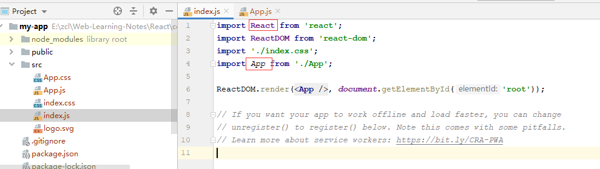

# React

## 创建第一个React项目

### 老方法

全局安装React脚手架

```shell
npm install -g create-react-app
```

利用脚手架创建项目

```shell
create-react-app xxxx
```

### 官网文档方法

通过npx安装

```shell
npx create-react-app my-app
```

这种方法不需要安装其他东西，只要有node环境即可创建项目

> **注意**
>
> 第一行的 `npx` 不是拼写错误 —— 它是 [npm 5.2+ 附带的 package 运行工具](https://medium.com/@maybekatz/introducing-npx-an-npm-package-runner-55f7d4bd282b)。

## 目录结构

index.js



组件名称**必须**要大写，引入的`React`模块会解析

## JSX语法

允许在js代码中使用html的语法结构

通常情况下JSX表达式会使用`()`包裹起来

从理解上，一个标签即为一个jsx对象，与vue`<template></template>`模板要求类型，一个组件中的jsx只能包含一个根标签。也就是只能有一个最高级别的jsx对象

```jsx
class Todo extends React.Component {
  render() {
    return (
      <div>第一个根jsx</div>
      <div>第二个根jsx</div>
    )
  }
}
```

上面这段代码中，此种写法是不合法的。

应改为：

```jsx
class Todo extends React.Component {
  render() {
    return (
      <div>
        <div>第一个根jsx</div>
        <div>第二个根jsx</div>
      </div>
    )
  }
}
```

但是这种无意义的div显然让这个代码看起来不怎么舒服，那么就可以可以使用这种方法，使用`<React.Fragment>`标签

```jsx
class Todo extends React.Component {
  render() {
    return (
      <React.Fragment>
        <div>第一个根jsx</div>
        <div>第二个根jsx</div>
      </React.Fragment>
    )
  }
}
```

### 在JSX中嵌入表达式

- 变量

  ```jsx
  const name = 'Josh Perez';
  const element = <h1>Hello, {name}</h1>;
  ```

- 函数表达式

  ```jsx
  function formatName(user) {
    return user.firstName + ' ' + user.lastName;
  }
  
  const user = {
    firstName: 'Harper',
    lastName: 'Perez'
  };
  
  const element = (
    <h1>
      Hello, {formatName(user)}!
    </h1>
  );
  ```

- jsx嵌套调用

## State

有点类型vue中的data属性

react中是没有双向绑定的，并且，修改state属性中的值不能通过`this.state`直接修改，必须通过setState()方法来进行修改

```jsx
export calss MyInput extends React.Component{
  constructor(props){
    super(props)
    this.state = {
      input: ''
    }
    this.handleChange = this.handleChange.bind(this)
  }
  
  render(){
    return (
      <input onChang={this.handleChange}/>
    )
  }
  
  handleChange(e){
    this.setState({
      input: e.target.value
    })
  }
}
```

## 组件通信

### 父传子

通过props属性传递

```jsx
// 父组件
export default class Father extends React.Component {
  this.state = {
    title: '我是你爹'
  }
  render(){
    return (
      <Son title={this.state.title}/>
    )
  }
}
// 子组件
export default class Son extends React.Component {
  render(){
    return <p>{this.props.title}</p>
  }
}
```

### 子传父

通过事件传递

```jsx
// 父组件
export default class Father extends React.Component {
  this.state = {
    title: '我是你爹'
  }
  render(){
    return (
      <div>
        {this.state.title}
      	<Son getTitle={this.handleGetTitle.bind(this)}/>
      </div>  
    )
  }

	handleGetTitle(title) {
    this.setStete({
      title: title
    })
  }
}

// 子组件
export default class Son extends React.Component {
  
  render(){
    return <button onClick={this.onClck.bind(this)}>这是子组件按钮</button>
  }
  
  onClick(){
    this.props.getTitle('歪歪歪，我是儿子')
  }
}
```

