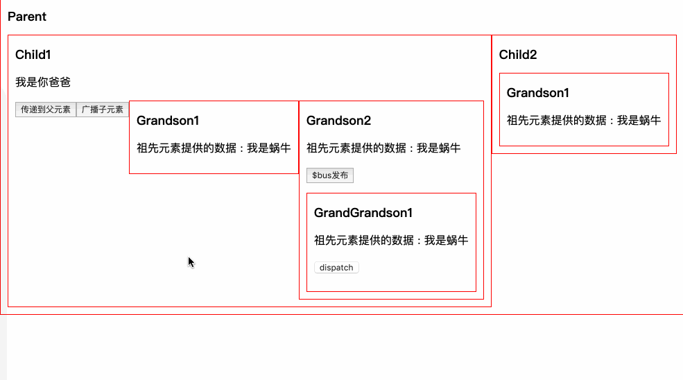

# VUE组件化实战

## 组件间通信

### 父传子

props传递

### 子传父

Vue更推荐单向数据流，所以子组件想修改传递的数据，需要通知父组件来修改，使用`$emit`触发父元素传递的事件

### 兄弟组件

兄弟组件不能直接通信，只需要父元素搭个桥即可

### 祖先后代 provide&inject

props一层层传递，爷爷给孙子还好，如果嵌套了五六层还这么写，十分不便，使用一个稍微冷门的API，`provide/indect`，类似React中的上下文，专门用来跨层级提供数据

> 注：只能从高往低传

App.vue

```html
<!-- App.vue -->
<template>
  <div id="app">
    <Child/>
  </div>
</template>

<script>
import Child from './components/Tree.vue'
export default {
  name: 'app',
  provide:{
    titile:'这是祖先title'
  },
  components:{
    Child
  },
  data () {
    return {
      name:'开课吧'
    }
  }
}
</script>
```

Child.vue

```html
<!-- Child.vue -->
<template>
    <div>
      <h2>Child</h2>
      <div>
        <GrandChild/>
      </div>
    </div>
</template>

<script>
import GrandChild from './GrandChild' 
export default {
  components:{GrandChild}
}
</script>
```

GrandChild.vue

```html
<!-- GrandChild.vue -->
<template>
    <div>
      <h2>Grandson1</h2>
      <div>
        祖先元素提供的{{title}}
      </div>
    </div>
</template>

<script>
export default {
  name: 'GrandChild'
  // 注入组先元素的数据
  inject:['title']
}
</script>
```

但是provide和inject不是响应式的，如果子孙元素想通知祖先，就需要hack一下，Vue1中有dispatch和boardcast两个方法，但是vue2中被干掉了，可以自己模拟一下

原理就是可以通过this.parent和this.children来获取父组件和子组件，通过递归实现

### disptch和boardcast

**多用于各组件库**

#### dipatch

递归获取$parent即可

```html
<button @click="dispatch('dispatch', 'hello i am grandgrandchild')">
  dispatch
</button>
```

```js
methods:{
  dispatch(eventName, data) {
    let parent = this.$parent
    // 查找父元素
    while(parent){
      if(parent){
        // 父元素用$emit触发
        parent.$emit(eventName,data)
        // 递归查找父元素
        parent = parent.$parent
      } else {
        break
      }
    }
  }
}
```

注意只向上传递了，并没有影响别的元素

#### boardcast

和dispatch类似，递归获取$children来向所有子元素广播

```html
<button @click="dispatch('boardcast', 'hello i am grandfather')">
  广播子元素
</button>
```

```js
function boardcast(eventName, data){
  this.$children.forEach(child => {
    // 子元素触发$emit
    child.$emit(eventName, data)
    if(child.$children.length){
      // 递归调用，通过call修改this指向child
      boardcast.call(child,eventName,data)
    }
  })
}

{
  methods: {
    $boardcast(eventName, data) {
      boardcast.call(this, eventName, data)
    }
  }
}
```

##### 全局挂载dispatch和boardcast

想用的时候，需要自己组件内部定理dispatch和boardcast太烦了，我们挂载到Vue的原型链上，岂不是很high,找到main.js

```js
Vue.prototype.$dispatch =  function(eventName, data) {
  let parent = this.$parent
  // 查找父元素
  while (parent ) {
    if (parent) {
      // 父元素用$emit触发
      parent.$emit(eventName,data)
      // 递归查找父元素
      parent = parent.$parent
    }else{
      break
    }
  }
}

Vue.prototype.$boardcast = function(eventName, data){
  boardcast.call(this,eventName,data)
}
function boardcast(eventName, data){
  this.$children.forEach(child => {
    // 子元素触发$emit
    child.$emit(eventName, data)
    if(child.$children.length){
      // 递归调用，通过call修改this指向 child
      boardcast.call(child, eventName, data)
    }
  });
}

```

这样组件里直接就可以用了 无压力

##### 使用方法

- 子组件中使用了$dispatch,通过按钮点击触发

```html
<template>
  <div>
    <button @click='dispatch'>通知祖先元素</button>
    <p style="color:red">
      {{msg}}
    </p>
  </div>
</template>
```

```js
methods:{
  dispatch(){
    // dispatch是事件名称
    this.$dispatch('dispatch', '来自GrandChild的消息')
  }
}
```

在父组件中监听事件`dispatch`

```js
mounted(){
  this.$on('dispatch',msg=>{
    this.msg = msg
  })
}
```

- 父组件中使用$boardcast，通过按钮点击触发

```html
<template>
  <div>
    <div style="color:red">
      {{msg}}
    </div>
    <button @click='boardcast'>广播事件</button> 
  </div>
</template>
```

```js
methods:{
  boardcast(){
    this.$boardcast('boardcast', '来自App的广播消息')
  }
}
```

在子组件中监听事件

```js
mounted(){
  this.$on('boardcast',msg=>{
    this.msg = msg
  })
}
```

### 没有啥关系的组件：event-bus

如果俩组件没啥关系呢，我们只能使用订阅发布模式来做，并且挂载到Vue.protytype之上，我们来试试，我们称呼这种机制为总线机制，也就是喜闻乐见的 event-bus

```js
class Bus{
  constructor(){
    // {
    //   eventName1:[fn1,fn2],
    //   eventName2:[fn3,fn4],
    // }
    this.callbacks = {}
  }
  $on(name,fn){
    this.callbacks[name] = this.callbacks[name] || []
    this.callbacks[name].push(fn)
  }
  $emit(name,args){
    if(this.callbacks[name]){
      // 存在 遍历所有callback
      this.callbacks[name].forEach(cb=> cb(args))
    }
  }
}

Vue.prototype.$bus = new Bus()
```


使用

```js
// 使用
eventBus(){
    this.$bus.$emit('event-bus','测试eventBus')
}

// 监听
this.$bus.$on("event-bus",msg=>{
    this.msg = '接收event-bus消息:'+ msg
})
```



其实本身Vue就是一个订阅发布的实现，我们偷个懒，把Bus这个类可以删掉，新建一个空的Vue实例就可以啦

```js
Vue.prototype.$bus = new Vue()
```

### vuex

全局状态管理

## elemet-ui组件库体验

- Element-UI：<http://element-cn.eleme.io/>
- element集成：vue add element
- 组件使用：创建一个登陆表单并可以校验用户输入

```html
<el-form :model="model" :rules="rules" ref="loginForm">
  <el-form-item label="用户名" prop="username">
    <el-input v-model="model.username" autocomplete="off"></el-input>
  </el-form-item>
  <el-form-item label="确认密码" prop="password">
    <el-input type="password" v-model="model.password" autocomplete="off"></el-input>
  </el-form-item>
  <el-form-item>
    <el-button type="primary" @click="submitForm('loginForm')">提交</el-button>
  </el-form-item>
</el-form>
```

```js
export default {
  data() {
    return {
      model: { username: "大圣小老弟", password: "" },
      rules: {
        username: [{ required: true, message: "请输入用户名" }],
        password: [{ required: true, message: "请输入密码" }],
      }
    };
  },
  methods: {
    submitForm(form) {
      this.$refs[form].validate(valid=>{
        if (valid) {
          alert('请求登录!')
        } else {
          alert('校验失败！')
        }
      })
    }
  },
};
```

用到了3个组件，咱们思考几个问题

1. el-Input是自定义组件，它是怎么实现双向绑定的？组件竟然还可以v-model
2. FormItem是怎么知道执行校验的，它是怎么知道Input状态的？它是怎么获得对应数据模型的？
3. Form是怎么进行全局校验的？它用什么办法把数据模型和校验规则传递给内部组件？

### 实现k-input

v-model是语法糖，实现自定义组件双向绑定需要指定`:value`和`@input`即可,  并且还需要通知父组件

KInput.vue

```html
<template>
  <div>
    <input :type="type" :value="value" @input="onInput">
  </div>
</template>

<script>
  export default {
    props: {
      value: {
        type: String,
        default: ''
      },
      type: {
        type: String,
        default: 'text'
      }
    },
    methods: {
      onInput(e) {
        // 派发事件，通知父组件输入值变化
        this.$emit('input', e.target.value)

        // 通知父组件校验
        this.$parent.$emit('validate')
      }
    },
  }
</script>

<style scoped>

</style>
```

```html
<h1>{{name}}</h1>
<k-input v-model="name"></k-input>
```

### 实现k-form-item

1. 预留插槽，扩展input
2. 能够展示label和校验的错误信息
3. 能够进行校验

KFormItem.vue

```html
<template>
  <div>
    <label v-if="label">{{label}}</label>
    <slot></slot>
    <p v-if="error">{{error}}</p>
  </div>
</template>

<script>
  export default {
    props: {
      label: {// 输入项标签
        type: String,
        default: ''
      },
      prop: {// 字段名
        type: String,
        default: ''
      },
    },
    data() {
      return {
        error: '' // 校验错误
      }
    },
  };
</script>
```

```html
<k-form-item label="用户名">
  <k-input v-model="name"></k-input>
</k-form-item>
```

### 实现k-form

- 给form-item预留槽位
- 将数据传递给后代便于它们访问数据模型和校验规则
  - provide && inject

KForm.vue

```html
<template>
  <form>
    <slot></slot>
  </form>
</template>

<script>
export default {
  provide() {
    return {
      form: this // 将组件实例作为提供者，子代组件可方便获取
    };
  },
  props: {
    model: { type: Object, required: true },
    rules: { type: Object }
  }
};
</script>
```

### 数据校验

- 思路：校验发生在FormItem，它需要知道何时校验（让Input通知它），还需要知道怎么校验（注入校验规则）

任务1：Input通知校验

```js
onInput(e) {
	// ...
	// $parent指FormItem
	this.$parent.$emit('validate');
}
```

任务2：FormItem监听校验通知，获取规则并执行校验

```js
inject: ['form'], // 注入
mounted(){// 监听校验事件
  this.$on('validate', this.validate)
},
methods: {
  validate() {
    // 获取对应FormItem校验规则
    console.log(this.form.rules[this.prop]);
    // 获取校验值
    console.log(this.form.model[this.prop]);
  }
},
```

```js
import schema from "async-validator";

validate() {
  // 获取对应FormItem校验规则
  const rules = this.form.rules[this.prop];
  // 获取校验值
  const value = this.form.model[this.prop];
  // 校验描述对象
  const descriptor = { [this.prop]: rules };
  // 创建校验器
  const schema = new Schema(descriptor);
  schema.validate({ [this.prop]: value }, errors => {
    if (errors) {
      // 将错误信息显示
      this.error = errors[0].message;
    } else {
      // 校验通过
      this.error = "";
    }
  });
}
```

任务3：表单全局验证

- 改造FormItem的validate方法，使其可以返回Promise

```js
validate() {
  return new Promise((resolve, reject) => {
    // ...
    schema.validate({ [this.prop]: value }, errors => {
      if (errors) {// 校验失败
        reject()
      } else { // 校验通过
        resolve();
      }
    });
  });
}
```

为Form提供validate方法

```js
validate(cb) {
  // 调用所有含有prop属性的子组件的validate方法并得到Promise数组
  const tasks = this.$children
  .filter(item => item.prop)
  .map(item => item.validate());
  // 所有任务必须全部成功才算校验通过，任一失败则校验失败
  Promise.all(tasks)
    .then(() => cb(true))
    .catch(() => cb(false));
}
```

```html
<k-form-item>
	<el-button type="primary" @click="submitForm('kLoginForm')">提交</el-button>
</k-form-item>
```