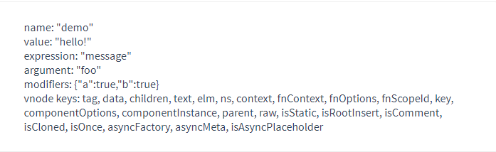

# vue自定义指令

[官方文档](https://cn.vuejs.org/v2/guide/custom-directive.html)

## 作用

自定义指令为什么存在？官方文档给出的原因如下

>...在 Vue2.0 中，代码复用和抽象的主要形式是组件。然而，有的情况下，你仍然需要对普通 DOM 元素进行底层操作，这时候就会用到自定义指令。...

对普通dom元素进行底层操作！有点振聋发聩的意思，我们所熟知的vue指令包含了v-if,v-show,v-for,v-model,v-bind，v-on等等，如果再往下想一层，这些指令无一不是在帮我们操作底层的dom。

- v-if，删除/新增dom节点

- v-show，给dom元素添加/删除内联样式`style="display: none"`
- v-for，循环添加dom节点
- v-model，更新dom节点数据（除此之外，非dom相关的，操作视图更新绑定数据）
- v-bind，更新dom节点数据
- v-on，给dom元素添加事件监听

所以指令的使用场景也很明确了，**当你需要操作dom的时候，不妨想想能不能使用自定义指令**

写到这里的时候，脑海中立马想到一个场景，echarts初始化！那么继续探索一下自定义指令的使用来看看是否能通过自定义指令来更为优雅的实现echarts初始化

## 注册方式

- 全局注册

```js
// 注册一个全局自定义指令 `v-focus`
Vue.directive('focus', {
  // 当被绑定的元素插入到 DOM 中时……
  inserted: function (el) {
    // 聚焦元素
    el.focus()
  }
})
```

- 组件中局部注册

```js
export default {
  name: '',
  data(){
    return {
    }
  },
  ...
  directives: {
    focus: {
      // 指令的定义
      inserted: function (el) {
        el.focus()
      }
    }
	}
  ...
}
```

然后你可以在模板中任何元素上使用新的 `v-focus` property，如下：

```vue
<input v-focus/>
```

需要注意的是，在注册自定义指令时，指令名称并不需要写`v-`

**如果在局部和全局都设置了相同的指令，会以局部设置为准**

## 钩子函数

如何告知浏览器我们希望何时希望调用我们通过指令实现的方法，那就是通过钩子函数，自定义指令目前提供了以下五种钩子函数

- `bind`：只调用一次，指令第一次绑定到元素时调用。在这里可以进行一次性的初始化设置。
- `inserted`：被绑定元素插入父节点时调用 (仅保证父节点存在，但不一定已被插入文档中)。
- `update`：所在组件的 VNode 更新时调用，**但是可能发生在其子 VNode 更新之前**。指令的值可能发生了改变，也可能没有。但是你可以通过比较更新前后的值来忽略不必要的模板更新 (详细的钩子函数参数见下)。
- binding的value值发生变化时，会触发
- `componentUpdated`：指令所在组件的 VNode **及其子 VNode** 全部更新后调用。
- `unbind`：只调用一次，指令与元素解绑时调用。
  - 所在组件被销毁时，会被调用

## 钩子函数参数

在了解了钩子函数之后，再来了解一下钩子函数的参数

指令钩子函数会被传入以下参数：

- `el`：指令所绑定的元素，可以用来直接操作 DOM。

- binding：一个对象，包含以下 property：
  
- `name`：指令名，不包括 `v-` 前缀。
  - `value`：指令的绑定值，例如：`v-my-directive="1 + 1"` 中，绑定值为 `2`。
- `oldValue`：指令绑定的前一个值，仅在 `update` 和 `componentUpdated` 钩子中可用。无论值是否改变都可用。
  - `expression`：字符串形式的指令表达式。例如 `v-my-directive="1 + 1"` 中，表达式为 `"1 + 1"`。
  - `arg`：传给指令的参数，可选。例如 `v-my-directive:foo` 中，参数为 `"foo"`。
  - `modifiers`：一个包含修饰符的对象。例如：`v-my-directive.foo.bar` 中，修饰符对象为 `{ foo: true, bar: true }`。
  
- `vnode`：Vue 编译生成的虚拟节点。移步 [VNode API](https://cn.vuejs.org/v2/api/#VNode-接口) 来了解更多详情。

- `oldVnode`：上一个虚拟节点，仅在 `update` 和 `componentUpdated` 钩子中可用。

以下面的代码为例，

```vue
<div id="hook-arguments-example" v-demo:foo.a.b="message"></div>
```

```js
Vue.directive('demo', {
  bind: function (el, binding, vnode) {
    var s = JSON.stringify
    el.innerHTML =
      'name: '       + s(binding.name) + '<br>' +
      'value: '      + s(binding.value) + '<br>' +
      'expression: ' + s(binding.expression) + '<br>' +
      'argument: '   + s(binding.arg) + '<br>' +
      'modifiers: '  + s(binding.modifiers) + '<br>' +
      'vnode keys: ' + Object.keys(vnode).join(', ')
  }
})

new Vue({
  el: '#hook-arguments-example',
  data: {
    message: 'hello!'
  }
})
```

页面上展示的结果为：



