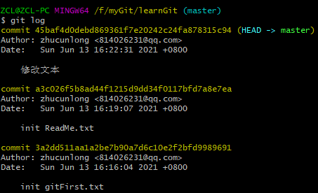
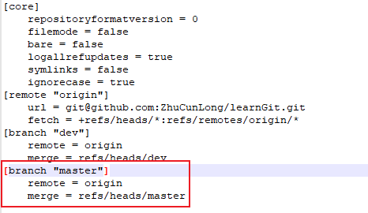

# git常用指令

## 本地管理

- git init

  初始化git仓库

- git add `filenname.[filetype]`

  把文件添加到暂存区

- git commit -m "`info`"

  将暂存区的修改提交文件到本地分支，同时绑定提交信息

  git commit -a

  可以不同git add直接commit代码，仅限修改和删除文件，新增文件还是要add

- git status

  查看工作区各文件的状态

- git log

  查看提交记录

  

- git reset --hard `[version]`

  git reset --hard head^:回退到上一个版本

  git reset --hard [versionid]: 回退到`versionid`的指定版本，版本号不需要写全，git会自动去找，但是为了防止找到多个，还是要多写几位

## 分支管理

- `git push`

  - `git push -u [remote name] [branch name]`

    `-u`：加上这个参数可以建立远端与本地的关联关系，也就是在下次pull或者push的时候，git能知道从哪个分支pull或者push

    `remote name`：远端主机名，一般是origin

    `branch name`：本地分支名
    
  - git push  [remote name] :[remote branch]

    删除远端分支

    等同于：git push [remote name] --delete [remote branch]

    等同于：git push [remote name] -d [remote branch]

- `git branch`

  查看本地所有分支以及当前分支

  - git branch [branch name]

    创建本地分支，但不会切换到新创建的分支

  - git branch -m [old branch name] [new branch name]

    修改本地分支名称

  - git branch -M [old branch name] [new branch name]

    强制修改本地分支名称

  - git branch --set-upstream-to=[remote name]/[remote branch] [local branch]

    设置本地分支与远端分支的关联

- `git checkout`

  - `git checkout -b [branch name]`

    创建本地分支，并切换到创建的分支

    `branch name`：分支名称

  - `git checkout [branch name]`

    切换本地分支

## 常见报错

### 关联关系

`git push`时报错

```shell
fatal: The current branch master has multiple upstream branches, refusing to push.
```

然后设置关联关系

通过`git push -u`提交并设置关联关系，代码确实能够提交，但是会报下面的错误

```shell
warning: branch.master.remote has multiple values
```

或者通过`git branch --set-upstream-to`

也会碰到这个问题

- 解决方案

  查看.git目录下的config文件

  

会发现[baranch "master"]的数据有多组，只保留一组即可，然后再使用`git push -u`或者`git branch --set-upstream-to`来设置远端分支与本地分支的映射关系
