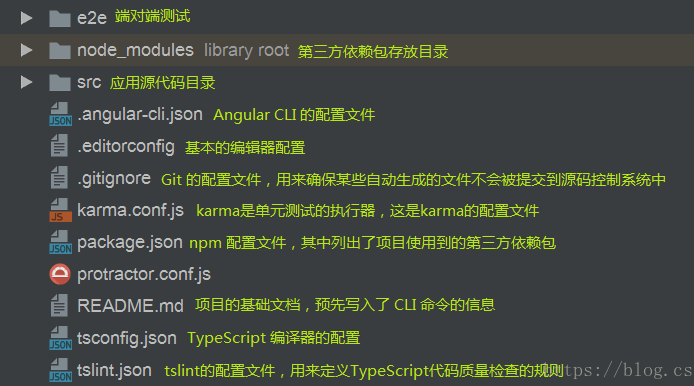
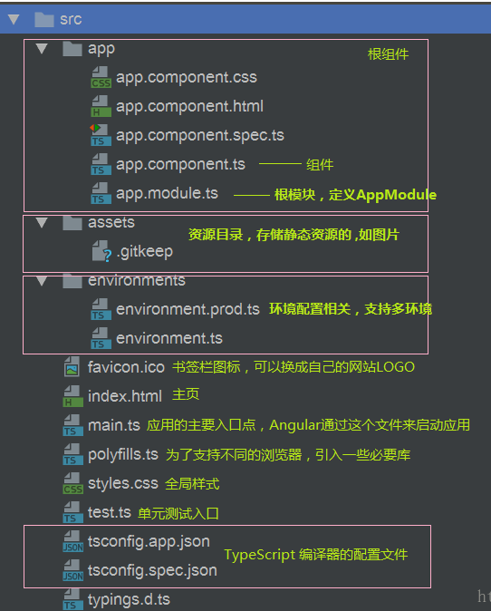

# Angular

## 创建项目

- 安装node.js
- 安装`angular/cli`angular手脚架

```shell
# 全局安装
npm install -g @angular/cli
```

- 创建新项目

```shell
# 直接创建，创建完之后会直接运行npm install安装相关依赖
ng new xxxx

# 跳过npm i
ng new xxx --skip-install
```

## 目录结构

- 首层目录结构



- src目录结构



## 组件

### 创建组件

```shell
ng g component compoents/xxx
```

最后面的`compoents/xxx`创建组件的相对路径，会在项目文件夹下的`./src/app`下创建文件夹，文件夹内包含四个文件

- `xxx.component.css`组件样式
- `xxx.component.html`组件前端
- `xxx.component.spec.ts`测试用代码
- `xxx.component.ts`有点类似组件的js代码

**使用指令创建组件，可以很方便地在根组件中注入新创建的组件**

### 组件通信

#### 父子组件

- 父组件=》子组件

父组件的.html文件和.ts文件

```html
<!-- .html -->
<app-header [title]="title"></app-header>
```

```typescript
// .ts
public title: string = '这是父组件的title'
```

子组件的.html和.ts文件

```html
<!-- .html -->
<h1>{{ title }}</h1>
```

```typescript
// 从angular的核心模块中引入Input模块
import { Component, OnInit, Input } from '@angular/core';

// 使用@Input装饰器声明变量title
@Input() title: any;
```

以上是传递属性，方法同理，甚至可以直接把整个父组件的对象传递给子组件

- 子组件=》父组件

父组件中引入ViewChild，可以获取整个子组件对象，从而访问子组件的各个属性和方法

```html
<app-header #head></app-header>
```

```typescript
import { Component, OnInit, ViewChild } from '@angular/core';

export class HomeComponent implements OnInit {
  @ViewChild('head') head: any;
  constructor() { }

  ngOnInit() {
  }
  handletest() {
    this.head.xxx = 'xxx'
  }
}
```

- 使用广播监听的方式

子组件引入`output`、`EventEmitter`

子组件的.ts

```typescript
import { Component, OnInit, Input, Output, EventEmitter } from '@angular/core';

@Component({
  selector: 'app-header',
  templateUrl: './header.component.html',
  styleUrls: ['./header.component.css']
})
export class HeaderComponent implements OnInit {

  @Output() msgUp = new EventEmitter<string>();
  @Output() titleUp = new EventEmitter();
  constructor() { }

  ngOnInit() {
  }

  run() {
    this.msgUp.emit('子组件歪歪歪，父组件收到不用回答');
  }

  modify() {
    this.title = '子组件修改值了怎么说';
    this.titleUp.emit(this.title);
  }
}
```

父组件的.html
```html
<app-header [title]="title" (msgUp) = "sonsay($event)" (titleUp)="titleUp($event)"></app-header>
```

父组件的.ts
```js
import { Component, OnInit } from '@angular/core';

@Component({
  selector: 'app-home',
  templateUrl: './home.component.html',
  styleUrls: ['./home.component.css']
})
export class HomeComponent implements OnInit {
  public title: string = '这是home组件的title';
  constructor() { }

  ngOnInit() {
  }

  sonsay(e) {
    window.alert(e);
  }

  titleUp(e) {
    this.title = e;
  }
}

```

> 子组件中修改了父组件传进来的值并不会反过来影响父组件，需要使用EventEmitter的方式将修改传回父组件

#### 非父子组件

- 定义服务，参考[服务](# 服务)
- 使用`localstorage`和`sessionstorage`

## 模板语法

### 绑定属性`[]`

#### 绑定一般变量

```typescript
export class NewsComponent implements OnInit {
  public title: string = '这是一个新闻组件';
  constructor() { }
  ngOnInit() {
  }
}
```

```html
<div [title]="title">
  这里绑定了一个title属性
</div>
```

#### 绑定html`[innerHTML]`

```
<div [innerHTML]="content"></div>
```

#### 绑定class`[ngClass]`

基本用法

```css
.red{
  color:red;
}
.blue{
  color:red;
}
```

```typescript
public flag :boolean = false;
```

```html
<div [ngClass]="{'orange':flag,'red':!flag}">
  动态绑定class
</div>
```

在`*ngIf`中的例子可以改写为

```html
<ol>
  <li *ngFor="let item of arr;let key = index;" [ngClass]="{'red':key==2}">
    {{ key }}----{{ item }}
  </li>
</ol>
```

#### 绑定style

### 数据循环——`*ngFor`

####  普通循环

定义数组的几种方式

```typescript
arr = ['zcl', 'zyt', 'wly', 'txf'];
pulic arr = ['zcl', 'zyt', 'wly', 'txf'];

public arr: any[] = ['zcl', 'zyt', 'wly', 'txf'];
public arr: Array<string> = ['zcl', 'zyt', 'wly', 'txf'];
```
以上几种方式是等价的，建议使用后两种方式定义数组

```html
<ol>
  <li *ngFor="let item of arr">{{ item }}</li>
</ol>
```

#### 带索引

<ol>
  <li *ngFor="let item of arr;let key = index;">{{ key }}----{{ item }}</li>
</ol>

### 条件判断`*ngIf`

```html
<ol>
  <li *ngFor="let item of arr;let key = index;">
    <span *ngIf="key==2" class="red">{{ key }}----{{ item }}</span>
    <span *ngIf="key!=2">{{ key }}----{{ item }}</span>
  </li>
</ol>
```

><font color='red'>注意：Angular中没有ngElse指令</font >

### `ngSwitch`

```typescript
/* 0:审核未通过 1：审核通过 2：待审 其他：无效状态*/
public approvalStatus: number = 3;
```

```html
<span [ngSwitch]="approvalStatus">
  <p *ngSwitchCase="0">审核未通过</p>
  <p *ngSwitchCase="1">审核通过</p>
  <p *ngSwitchCase="2">待审</p>
  <p *ngSwitchDefault>无效状态</p>
</span>
```

### 事件绑定

事件函数声明与定义

```typescript
export class HomeComponent implements OnInit {
  public arr: Array<string> = ['zcl', 'zyt', 'wly', 'txf'];
  /* 0:审核未通过 1：审核通过 2：待审 其他：无效状态*/
  public approvalStatus: number = 3;
  public today: any = new Date();
  constructor() { }

  ngOnInit() {
  }
  handletest() {   //这是新声明定义的事件方法
    alert('hello angular');
  }
}
```

绑定事件

```html
<button (click)="handletest()">测试按钮</button>
```

#### 事件对象`$event`

```typescript
onKeyup(e) {
  if (e.keyCode === 13) {
    console.log(e.target.value);
  }
}
```

```html
输入框：<input (keyup)="onKeyup($event)"/>
```

### 双向数据绑定

#### `ngModel`

- 在`app.module.ts`根模块里引入`FormsModule`模块

```typescript
import { NgModule } from '@angular/core';
import { BrowserModule }  from '@angular/platform-browser';
import { FormsModule } from '@angular/forms'; // <--- JavaScript import from Angular

/* Other imports */

@NgModule({
  imports: [
    BrowserModule,
    FormsModule  // <--- import into the NgModule
  ],
  /* Other module metadata */
})
export class AppModule { }
```

使用

```html
双向绑定输入框：<input [(ngModel)]="modeltest"/>
<div>这是双向绑定输入框的内容：{{ modeltest }}</div>
```

> 注意：这里的`[(ngModel)]`和一般的绑定数据指令不一样，`[(...)]`

## 管道

对绑定到前端的数据做二次处理

### 内置管道

Angular 内置了一些管道，比如 `DatePipe`、`UpperCasePipe`、`LowerCasePipe`、`CurrencyPipe` 和 `PercentPipe`。 它们全都可以直接用在任何模板中。

- `DatePipe`日期管道

```typescript
/* 声明一个日期变量 */
public today: any = new Date();
```

```html
<p>这是格式化日期{{ today | date:'yyyy-MM-dd HH:mm:ss' }}</p>

// 显示效果
// 这是格式化日期2019-05-18 15:07:56
```

### 链式管道

管道可以串联使用

```html
<p>这是单日期管道{{ today | date:'fullDate'}}</p>
<p>这是串联管道{{ today | date:'fullDate' | uppercase }}</p>

//显示效果
//这是单日期管道Saturday, May 18, 2019
//这是串联管道SATURDAY, MAY 18, 2019
```

### 自定义管道

Angular提供了自定义管道的方法

>[官方参考](https://angular.cn/guide/pipes)

## 服务

**服务**是一个广义的概念，它包括应用所需的任何值、函数或特性。狭义的服务是一个明确定义了用途的类。它应该做一些具体的事，并做好

> 个人理解：公共工具库utils

### 创建服务

```shell
ng g service my-new-service

#创建到指定目录下
ng g service services/xxx
```

### 引入并配置

```typescript
import { BrowserModule } from '@angular/platform-browser';
import { NgModule } from '@angular/core';

import { AppRoutingModule } from './app-routing.module';
import { AppComponent } from './app.component';

import { StorageService } from './services/storage.service';//<--- 引入服务

/* @Ngmodule装饰器，@NgModule接收一个元数据对象*/
@NgModule({
  declarations: [  /* 配置当前项目运行的组件 */
    AppComponent, NewsComponent, HomeComponent, HeaderComponent
  ],
  imports: [ /* 配置当前模块运行依赖的其他模块 */
    BrowserModule,
    AppRoutingModule,
  ],
  providers: [StorageService], //<--- 配置服务
  bootstrap: [AppComponent]
})

// 根模块不需要导出任何东西， 因为其他组件不需要导入根模块
export class AppModule { }
```

## 操作DOM

### 原生js

在`ngOnInit()`钩子函数中可以直接使用`document`对象中dom的相关api，但是不建议在`ngOnInit`中使用原生js操作dom，可能会出现无法访问的情况

```html
<div id="test">
  测试dom
</div>

<div id="test1" *ngIf="flag">
  测试dom
</div>
```

id为`test1`的dom节点无法在`ngOninit()`中获取到

**建议在另一个钩子函数`ngAfterViewInit()`中使用原生js操作dom**，因为`ngAfterViewInit()`的触发时机是视图加载完成

### `ViewChild`

首先给dom节点设置id，设置id的方式和原生不太一样，使用`#`

```html
<div #test>
  测试box
</div>
```

然后在组件模块中引入angular核心模块中的`ViewChild`

`ViewChild`可以用来获取子组件的实例

## 动画

### state()函数

定义动画的状态和样式，state()函数包含两个参数

- 状态名称`string`
- 样式`style()`函数。

`style()`函数用来定义一组与指定的状态名相关的样式

例如一个动画的组成是由状态A的样式转变为状态B的样式

那么状态A的state()函数是这样的

```js
state('A', style({
  height: '200px',
  opacity: 1,
  backgroundColor: 'yellow'
}))
```

### style()函数

`style()`函数用来定义一组与指定的状态名相关的样式

### transition()函数

定义动画转场，接收两个参数

- string 表达式，用来表示转场的方向
- `animate()`函数，用来定义动画的持续时间、延迟等属性

示例

```js
transition('open => closed', [
  animate('0.2s 100ms ease-out')
])
```

### animate()函数

`animate()`函数可以接受两类型参数

- timings(三个部分别是持续时间、延迟多长时间开始执行、规定加减速方式) - stirng - 'duration delay easing'
  - 等待 100 毫秒，运行 200 毫秒。按照减速曲线运动，快速启动并逐渐减速，直到静止：`'0.2s 100ms ease-out'`
  - 运行 200 毫秒，不等待。按照标准曲线运动，开始很慢，中间加速，最后逐渐减速：`'0.2s ease-in-out'`
  - 立即开始，运行 200 毫秒。按照加速曲线运动，开始很慢，最后达到全速：`'0.2s ease-in'`
- 未知，官网未给出示例

###  trigger()函数

动画需要**触发器**，以便知道该在何时开始。

trigger()函数把上文中所有定义的状态、样式、转场等结合在一起，绑定在组件上

示例:

```js
trigger('openClose', [
  // ...
  state('open', style({
    height: '200px',
    opacity: 1,
    backgroundColor: 'yellow'
  })),
  state('closed', style({
    height: '100px',
    opacity: 0.5,
    backgroundColor: 'green'
  })),
  transition('open => closed', [
    animate('1s')
  ]),
  transition('closed => open', [
    animate('0.5s')
  ]),
]),
```


