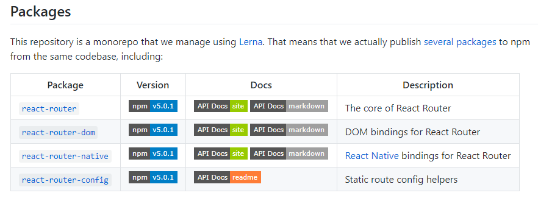

# React-Router

## 使用

查看[官方项目](https://github.com/ReactTraining/react-router)，发现有三个包可以用



第一个是react-router的核心插件，第二个用来开发web项目，第三个用来开发native项目，可以根据实际情况选用后两个插件，一般不会直接使用react-router

安装

```shell
npm install react-router-dom
```

demo

```jsx
import React from "react";
import { BrowserRouter as Router, Route, Link } from "react-router-dom";

function Index() {
  return <h2>Home</h2>;
}

function About() {
  return <h2>About</h2>;
}

function Users() {
  return <h2>Users</h2>;
}

function AppRouter() {
  return (
    <Router>
      <div>
        <nav>
          <ul>
            <li>
              <Link to="/">Home</Link>
            </li>
            <li>
              <Link to="/about/">About</Link>
            </li>
            <li>
              <Link to="/users/">Users</Link>
            </li>
          </ul>
        </nav>

        <Route path="/" exact component={Index} />
        <Route path="/about/" component={About} />
        <Route path="/users/" component={Users} />
      </div>
    </Router>
  );
}

export default AppRouter;
```

## 核心组件

### Route

用来匹配url和组件之间的映射关系，并且渲染。

换种说法，不同于vue中的`<router-view>`，vue中将路由单独写成一个文件，然后根据路由自动替换`<router-view>`里面的内容，这里的Route组件，可以理解为多个单一的router-view，并且抛弃了独立的路由文件，组件本身包含路由属性

常用属性有一下几种

- path：字符串类型，它的值使用来匹配url的
- component：它的值是一个组件，在path匹配成功后会绘制这个组件
- exact：用来指明这个路由是不是排他的匹配
- static：用来指明路径只匹配以斜线结尾的路径

### Link

react-router升级到4.+版本后的一个特有组件，不同于之前版本的anchor-link

类似a标签

与anchor-link会重新加载整个页面不同，Link只会重新加载页面里和当前url可以匹配的部分

### BroserRouter和HashRouter

- BroserRouter

对Router接口的实现，使得页面和浏览器的history保持一致：如window.loaction

- HashRouter

也是对Router接口的实现，只是使用的url的hash部分，比如window.location.hash

区别

1. 如果是非静态站点，要处理各种不同的url，则需要使用broserrouter
2. 如果是静态站点，只需要匹配

## 路由跳转传参

### 动态路由

- 语法

```html
<Link to="/news/20190903001">震惊！xxxxxx</Link>
<Link to="/news/20190903002">xxxxxx细思恐极！</Link>

<route path="/news/:newsid" component={newsDetails}></route>
```

- 获取参数

```js
// newsDetails.jsx   新闻组件
componentDidMount(){
  console.log(this.props.match.params.newsid)
}
```

### 带参路由

- 语法

```html
<Link to="/news?newsid=20190903001">震惊！xxxxxx</Link>
<Link to="/news?newsid=20190903002">xxxxxx细思恐极！</Link>

<route path="/news" component={newsDetails}></route>
```

- 获取参数

```js
// newsDetails.jsx   新闻组件
import url from 'url' // 借用node的核心模块url解析参数

componentDidMount(){
  console.log(url.parse(this.location.search, true).qurey.newsid)
}
```

## 路由重定向

