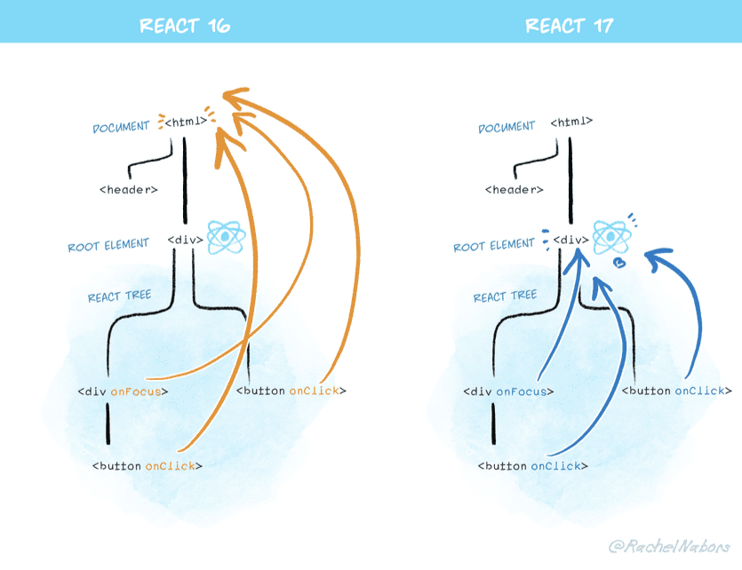

# React事件委托机制

在React组件中，通常会内联编写事件处理程序：

```jsx
<button onClick={handleClick}>
```

类似于此的原始代码是：

```js
myButton.addEventListener('click', handleClick);
```

**注意：这两者并不等价**

> 一方面react并没有直接将事件绑定在对应dom上，另一方面react没有直接使用原生dom事件，而是自创了一个`合成事件`

但是，对于大多数事件，React实际上不会将它们附加到在其上声明它们的DOM节点上。 相反，React会把各个绑定在dom上的这些事件集中收集到页面上的一个**顶层节点**的监听器上，统一管理。  这称为 [event delegation](https://davidwalsh.name/event-delegate).

- why？

  组件会被频繁的创建和销毁，那么事件也会被频繁地注册和移除，这有很大的性能损耗

- how？

  利用了浏览器的事件冒泡机制，所有的事件最终都会冒泡到上层节点，只需要在最外层统一拦截处理即可，处理逻辑是**通过内部的映射关系查找**实际应该响应这个事件的组件实例及其事件处理器，并调用它。

## 一点变化

react16.x版本监听的顶层节点是整个document，后续react17版本改成了react组件的根节点

- why？
  1. 多个版本的react在一个项目中会引起问题
  2. 避免非react相关组件的影响，因为在根节点外可能存在一些别的类型的项目，比如微前端项目或者类似的wrapper逻辑，这样会导致react的事件监听机制监听到其他无关react相关的事件，也可能会影响用户自定以的绑定在document上的相关事件



## 合成事件

React合成事件（SyntheticEvent）是React为了简化跨浏览器的事件处理，而创建的一套封装过的事件对象。在React中，无论是通过JSX语法直接在组件元素上绑定事件处理器，还是在组件类的生命周期方法中处理事件，你接触到的事件对象都是React合成事件对象，而不是原生DOM事件对象。

React合成事件具有以下特点：

1. **一致性**：它为所有浏览器提供了一致的API，解决了不同浏览器间事件处理API存在的细微差异问题。
2. **跨浏览器兼容**：React合成事件依据W3C规范定义了一系列事件对象，并对这些事件进行了跨浏览器的封装。
3. **池化机制**：为了优化性能，React复用了事件对象，事件对象在事件处理器执行完毕后会被回收到事件池中以供后续复用，因此在事件处理器内部如果需要保留事件对象的信息，需要手动调用`event.persist()`方法解除事件对象的关联。
4. **方法与属性**：合成事件对象包含了与原生DOM事件相同的属性和方法，如`target`（事件目标元素）、`type`（事件类型）、`preventDefault()`（阻止默认行为）、`stopPropagation()`（阻止事件冒泡）等。

- why？

  1. **跨浏览器兼容**

  2. **性能优化**

     - **事件池化**：React通过事件池技术复用事件对象，避免频繁创建和销毁事件对象带来的性能损耗。（17版本疑似被废除）
     - **批处理事件**：React能够将多个合成事件批处理在一起，一次性同步到DOM，从而减少与DOM的交互次数，提高性能

  3. **简化事件处理**： React合成事件模仿原生事件接口，并增加了额外的功能，比如自动绑定`this`上下文到组件实例，简化了事件处理器的编写。
  4. **更好的编程模型**： 在React中，合成事件与React组件的虚拟DOM概念相契合，能够在组件挂载、卸载时自动添加和移除事件监听器，符合React组件生命周期管理的便捷性。
  5. **未来可扩展性**： React通过合成事件系统可以更方便地在未来版本中进行优化和扩展，不必受限于原生DOM事件的实现细节和局限性。

     