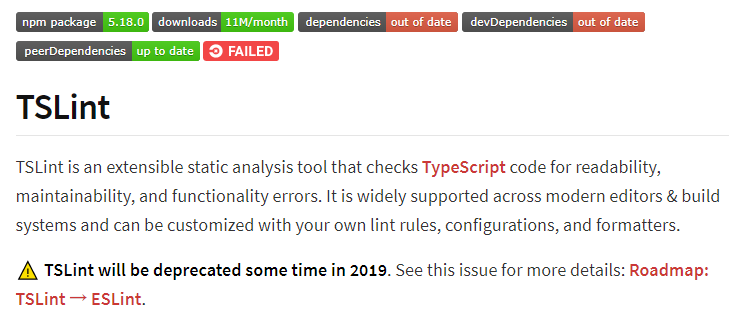
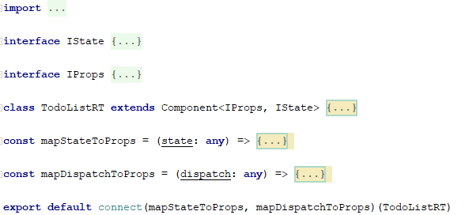
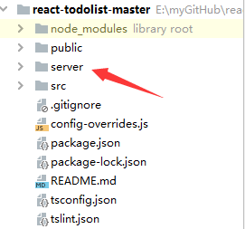
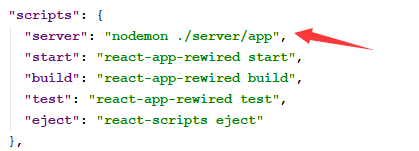
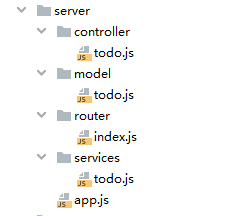
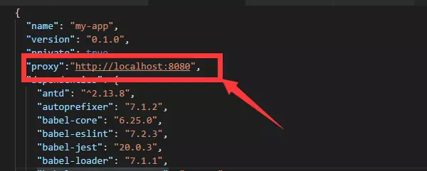

# 采坑合集

## 没有全家桶脚手架

官方脚手架cra（create-react-app）中只有基本的一些开发配置，热更新，js、css解析等等，没有像vue-cli和@angular/cli这两个脚手架各项工具齐备，甚至本身没有暴露出webpack的相关配置，如果需要重新配置webpack，要将相关的配置文件反编译出来，可参考文章https://blog.csdn.net/xiaominghimi/article/details/90212826

## 搭建typescript环境

通过官方脚手架`create-react-app`创建的项目中默认使用的是.js文件

### 在官方全家桶中使用typescript

> **为什么要使用typescrip**t
>
> 为了程序的健壮性，typescript的强类型可以防止在开发阶段出现的的各种类型的错误

官方全家桶中默认使用的js，甚至都不是jsx，那么为了使用typescript，首先就得安装typesript

```shell
npm i typescript --save-dev
```

官方全家桶中使用的与React相关的模块也需要安装typescript版本

React

```shell
npm i @types/react --save-dev
```
ReactDOM

```shell
npm i @types/react-dom --save-dev
```

安装完之后代码会提示报错，React模块没有默认导出，但是运行npm start之后就ok了，但是在默认的测试代码(`./src/App.test.tsx`，不需要可以删除)中有一个问题


提示安装@types/jest，那咱就装吧

```shell
npm i @types/jest --save-dev
```

### 配置tslint

> 2019年8月14日20:16:27
>
> tslint官方已经打算弃用这个项目了，已经在eslint中兼容了ts的代码格式检测，这里我懒得去踩新的坑了，没有更换eslint
>
> 

安装tslint

```shell
npm i tslint --save-dev
```

安装tslint-react

```shell
npm i tslint-react --save-dev
```

tslint-react中有一些针对jsx的编写规范检测

配置tsconfig.json

```json
{
  "compilerOptions": {
    "target": "es5",
    "lib": [
      "dom",
      "dom.iterable",
      "esnext"
    ],
    "allowJs": true,
    "skipLibCheck": true,
    "esModuleInterop": true,
    "allowSyntheticDefaultImports": true,
    "strict": true,
    "forceConsistentCasingInFileNames": true,
    "module": "esnext",
    "moduleResolution": "node",
    "resolveJsonModule": true,
    "isolatedModules": true,
    "noEmit": true,
    "jsx": "preserve"
  },
  "include": [
    "src"
  ]
}

```

配置tslint.json

```json
{
  "extends": ["tslint:recommended", "tslint-react"],
  "rules": {
    "arrow-parens": false,
    "arrow-return-shorthand": [false],
    "comment-format": [true, "check-space"],
    "import-blacklist": [true, "rxjs"],
    "interface-over-type-literal": false,
    "interface-name": false,
    "max-line-length": false,
    "member-access": false,
    "member-ordering": [true, { "order": "fields-first" }],
    "newline-before-return": false,
    "no-empty": false,
    "no-any": false,
    "no-empty-interface": false,
    "no-import-side-effect": false,
    "no-namespace": false,
    "no-console": false,
    "no-inferrable-types": [true, "ignore-params", "ignore-properties"],
    "no-invalid-this": [true, "check-function-in-method"],
    "no-null-keyword": false,
    "no-require-imports": false,
    "no-submodule-imports": false,
    "no-this-assignment": [true, { "allow-destructuring": true }],
    "no-trailing-whitespace": true,
    "object-literal-sort-keys": false,
    "object-literal-shorthand": false,
    "one-variable-per-declaration": false,
    "only-arrow-functions": [true, "allow-declarations"],
    "ordered-imports": false,
    "prefer-method-signature": false,
    "prefer-template": [true, "allow-single-concat"],
    "quotemark": [true, "single", "jsx-double"],
    "semicolon": [true, "never", "ignore-interfaces"],
    "trailing-comma": [false],
    "triple-equals": [true, "allow-null-check"],
    "type-literal-delimiter": false,
    "typedef": [true, "property-declaration"],
    "variable-name": [true, "ban-keywords", "check-format", "allow-pascal-case", "allow-leading-underscore"],
    "max-classes-per-file": false,

    "jsx-no-lambda": false,
    "jsx-no-multiline-js": false,
    "jsx-curly-spacing": [true, { "when": "never", "allowMultiline": false }],
    "jsx-boolean-value": false
  }
}

```

可以在这个文件中修改相关规则，顺手就行

## 样式表的使用

### 配置其他类型的css处理文件

cra脚手架中默认使用CSS，没有配置其他类型的预处理器，只需要安装相关依赖即可。这里比较神奇的一点是，只是在项目中安装了`node-sass`的依赖，并没有在webpack中”显示地“配置scss的loader，开头就提到过cra封装了webpack，未暴露出webpack配置文件，但是项目现在就已经可以处理scss了，猜测cra脚手架有智能添加解析器配置的功能，tsx的解析同理

- scss

安装node-sass

```shell
npm i node-sass -D
```

### 行内样式的使用

React基本上抛弃了dom相关的操作，完全使用js，所以连css的行内样式都是一个对象

```jsx
var divStyle = {
  color: 'white',
  backgroundImage: 'url(' + imgUrl + ')',
  WebkitTransition: 'all', // 注意这里的首字母'W'是大写
  msTransition: 'all' // 'ms'是唯一一个首字母需要小写的浏览器前缀
};

export default Mycomponent(){
  render(){
    return (
      <div style={divStyle}></div>
    )
  }
}

// 以上是使用对象变量方式的引入，如果想简单引用
export default Mycomponent(){
  render(){
    return (
      <div style={{ marginTop: 10}}></div>
    )
  }
}
```

- 命名：小驼峰，基本告别`margin-top`这种形式
- 单位：如果是长度单位，默认不写表示`px`，**如果硬写`px`，反而会报错**，其他单位照常

### 样式没有模块作用域

在组件中通过import引入的样式没有模块作用域，是全局的，没有vue中类似scope的属性，这也就导致了样式表的模块化似乎也是需要自己去配置的，否则会导致不同组件的样式冲突。

**代码中没有样式模块化的配置，此坑未填**

## 配置react-router

[官方文档react-router-dom](https://reacttraining.com/react-router/web/guides/quick-start)

由于现在使用ts来开发，所以，recat-router的相关包也需要使用ts版本的

安装依赖

```shell
npm i @types/react-router-dom -D
```

只安装这个依赖，语法没有错误但是会编译报错，提示没有找到`react-router-dom`这个包，需要再次引入

非ts版的`react-router-dom`

```shell
npm i react-router-dom -D
```

这里的坑在于，初次接触react的话，可能会去直接用`reacta-router`这个包，这个包有吗，当然有，但是如果是开发web前端，官方推荐使用`ract-router-dom`，所以世上哪有那么多坑，完全是开发者文档看少了。具体的相关介绍可以去看看官方对react-router的介绍

[官方介绍](https://github.com/ReactTraining/react-router)

## 没有双绑

没有双绑就会导致需要经常去对原生控件的一些事件进行重写，比如input标签的onChange事件，在这个事件中对绑定的state中的属性进行更新

## 绑定事件

React中绑定事件和vue和angular都大不一样来个例子就明白了

```jsx
export class MyInput extends React.Component {
  constructor(props){
    super(props)
    this.state = {
      count: 0
    }
  }
  
  render(){
    return <input onKeyDonwn={this.handleKeyDown}/>
  }
  
  handleKeyDown(e){
    console.log(this.state.count)
  }
}
```

初看起来，好像没什么问题，但是实际上在`handleKeyDown`事件中是获取不到state中的count的，因为在这个函数中的this指向的是input表示的dom对象，有两种解决方法

第一种，使用bind绑定组件this

```jsx
render(){
    return <input onKeyDonwn={this.handleKeyDown.bind(this)}/>
  }
```

第二种，使用箭头函数定义的函数变量

```jsx
handleKeyDown = (e) => {
  console.log(this.state.count)
}
```

个人感觉第二种方法比较得劲

## 事件参数问题

在进行事件注册时经常会在事件处理函数中使用 `event` 事件对象，例如当使用鼠标事件时我们通过 `clientX`、`clientY` 去获取指针的坐标。

大家可以想到直接把 `event` 设置为 `any` 类型，但是这样就失去了我们对代码进行静态检查的意义。

下面来看个demo

```jsx
export class MyInput extends React.Component {
  render(){
    return <input onKeyDonwn={this.handleKeyDown.bind(this)}/>
  }
  
  handleKeyDown(e: KeyboardEvent<HTMLInputElement>){
    console.log(e.keycode)
  }
}
```

这么一写乍一看好像没什么问题，但是这里坑就坑在`keyboardEvent`同时被react和typescript声明了，而由于某些不知名的原因，这里应该默认是使用ts中定义的`keyboardEvent`，所以就会报keyboradEvent不是一个通用类型，意思应该就是这不是一个泛型接口。

我为什么会发现这点呢，这就要归功于强大的IDE——webstorm，它的查找声明定义的功能真的是太顶了


其实这个时候我也只是猜测，是不是因为重复定义的原因导致编译的时候用错了类型，然后修改成了`React.KeyboardEvent<HTMLInputElement>`，果然就成了。

下面是一些常用的事件接口类型

- ClipboardEvent<T = Element> 剪贴板事件接口类型

- DragEvent<T = Element> 拖拽事件接口类型

- ChangeEvent<T = Element> Change 事件接口类型

- KeyboardEvent<T = Element> 键盘事件接口类型

- MouseEvent<T = Element> 鼠标事件接口类型

- TouchEvent<T = Element> 触摸事件接口类型

- WheelEvent<T = Element> 滚轮事件接口类型

- AnimationEvent<T = Element> 动画事件接口类型

## 使用ant-design

依照[官方教程——在TypseScript使用](https://ant.design/docs/react/use-in-typescript-cn)中的步骤来进行配置即可，唯一可能涉及到坑的地方就是css按需配置，按照教程的操作来进行配置，比较简单。

教程中提出了一种可以在不使用eject指令的情况下复写webpack的方法，有时间可以深入研究一下

## redux

如雷贯耳的react生态中不可或缺的工具(mobx: ¿)，我将它定义为工具的原因是因为我不知道如何正确的称呼它，框架？架构？就好像我现在开始意识到react根本就不是一个框架，而是一个js库。

要想快速的理解redux的核心思想，看看[阮一峰的教程](http://www.ruanyifeng.com/blog/2016/09/redux_tutorial_part_one_basic_usages.html)就明白了，时隔三年，依然是经典。

### redux谷歌开发者工具


可以通过谷歌的开发者工具，在开发阶段调试时动态监测redux中状态state变化，是一个非常实用的谷歌小插件，但是如果想要在ts中使用，也有点小坑需要踩

根据[官网的使用说明](<https://github.com/zalmoxisus/redux-devtools-extension>)，如果在不添加其他依赖包的情况下，使用这个工具只需要在创建store时的`createStore`函数中使用第二个参数

```
const store = createStore(
	reducer,
	window.__REDUX_DEVTOOLS_EXTENSION__ && window.__REDUX_DEVTOOLS_EXTENSION__()
);
```

`createStore`的第二个参数就是需要添加的内容，但是在ts中会报这样一个错误


可以依据文档中的后面给出的高级设置进行配置。在文件`./src/store/index.ts`中有实例可以参考

搞定之后就是下面这个样子，给力嗷


### combineReducers

如果项目比较庞大，一个reducer显得过于臃肿，想使用模块化的reducer怎么办呢，redux提供了`combineReducers`方法，用以组合多个reducer，合并为一个reducer。如果使用了组合reducer，每个ruducer中都有各自的state，那么最后store中的state是怎样的？

```js
const rootReducer = combineReducers({
  todo: todoReducer,
  msg: msgReducer
})
```

在使用这个方法的时候，本质上是对state做了再次封装，以上面的代码为例，想要访问todo模块中state中的数据，那么可以这么使用`this.state.todo.xxx`

### redux中间件redux-thunk

#### 概念

用来处理redux的复杂逻辑，比如异步请求。redux-thunk中间件可以让action创建函数不仅仅返回一个action对象，也可以是返回一个函数

> **个人疑问**
>
> 为什么不把异步操作放在reducer里面执行?去查了阮一峰的教程，发现了原因


#### 使用

- 安装依赖

```shell
npm i redux-thunk -S
```

这里不需要安装ts版本的`redux-thunk`

- 引包

注意这里有一个坑，就是如果想使用中间件的化，需要利用上一节中安装的[redux-devtools-extension](https://github.com/zalmoxisus/redux-devtools-extension)

使用方法，大意就是说和开发工具的中间件一起合并使用

```js
import {combineReducers, createStore, applyMiddleware} from 'redux'
import {todoReducer} from './todo/reducer'
import thunk from 'redux-thunk'

// 安装redux-devtools-extension的可视化工具。
import { composeWithDevTools } from 'redux-devtools-extension/developmentOnly'

const rootReducer = combineReducers({
  todo: todoReducer
})

const store = createStore(rootReducer, composeWithDevTools(
  applyMiddleware(thunk)
))

export default store
```

### redux中间件react-redux

> 注意：redux和react没有任何关系，核心概念就是那一套东西，store、state、action、reduce，这里的react-redux解决了了一些在react中使用redux的痛点问题。在react中使用redux，只要是依赖redux进行状态管理的组件，就需要引入sotre，这就会显得非常繁琐，开发体验很差，那么能不能只在一个地方引入之后，全局都可以使用呢，ract-redux帮我们解决了这个问题。它的实现思路是将store作为顶层组件的一个数据进行存放，然后在需要使用sotre的子组件的props属性上，挂载state或者是action,这样，就能够达到一处引入，多处使用的效果，并且，使用这种方式，能够使我们不用每次都去订阅state的状态变化，react-redux内部全部帮我们封装好了，使用起来也非常方便。

- provider

将顶层组件包裹在Provider组件之中，所有组件都处于react-redux的控制之下，store作为参数放到provider组件中，方便其中所有子组件调用

```tsx
import React from 'react'
import './App.scss'
import { BrowserRouter as Router, Route, Link} from 'react-router-dom'
import Home from './pages/Home'
import TodoList from './pages/TodoList'
import {Provider} from 'react-redux'
import TodoListR from './pages/TodoList-Redux'
import TodoListRT from './pages/TodoList-Redux-Thunk'
import store from './store'

function App() {
  return (
    <Provider store={store}>
      <Router>
        <div className={'menu'}>
          <ul>
            <li>
              <Link to="/">Home</Link>
            </li>
            <li>
              <Link to="/todolist">TodoList</Link>
            </li>
            <li>
              <Link to="/todolist_redux">TodoList-redux</Link>
            </li>
            <li>
              <Link to="/todolist_thunk">TodoList-thunk</Link>
            </li>
          </ul>
        </div>
        <Route exact path="/" component={Home}/>
        <Route exact path="/todolist" component={TodoList}/>
        <Route exact path="/todolist_redux" component={TodoListR}/>
        <Route exact path="/todolist_thunk" component={TodoListRT}/>
      </Router>
    </Provider>
  )
}

export default App
```

- connect

connec的使用可以让组件中不需要在subscribe数据获取视图的更新，同时提供了两个回调函数`mapStateToProps`和`mapDispatchToProps`，分别将state和dipatch挂载在组件的props属性中



可以看到，在使用了react-redux的组件当中，代码的结构会非常清晰，刨除模块的引入导出和接口声明，组件类只负责视图部分的展示和调用数据交互接口，`mapStateToProps`负责解决从sotre中接入state，并且state发生变化也不需要订阅更新，`mapDispatchToPrpos`负责动作分发，从这两个函数的名字可以看出来，它们是被挂载到了这个组件的props属性中，所以完全可以在组件类中通过`this.props`来访问state和dispatch方法。

## Node+Koa2+mongoDB

原本打算使用Node+tyepscript构建项目后端，但是在Node中使用typescript坑实在是太多了，首先要解决node不支持es6的模块化的问题，然后是需要兼顾各种工具包的ts版本，有些工具包的ts版本的用法和js版本的用法差别非常大，解决了语法问题，又会出现编译出错，最终在引入mongoDB的时候我选择了放弃使用typescript。

### 项目目录



在cra脚手架创建的项目目录的基础上，新增了一个文件夹server，在这个文件夹内编写后端的代码，这种做法可以兼顾前端，使用同一个package.json文件，避免了创建另一个新的项目。

### 添加项目启动指令



nodemon可以实现服务端代码的热更新，老生常谈的问题了

全局安装

```shell
npm i nodemon -g
```

项目中安装

```shell
npm i nodemon -D
```

运行后端代码

```shell
npm run server
```

### koa2

没什么好说的，按照[官方文档](<https://github.com/koajs/koa>)来就好

### mongoose

操作mongoDB数据库可以使用官方开发的工具包（忘了叫什么名字了），但是现在使用最多的还是mongoose工具包，它本质上是对官方提供的相关api做了再次封装

[mongoose官方文档](<https://mongoosejs.com/docs/guide.html>)

## 前后端交互

### 前端

在前端使用了现在常用的axios，又借鉴了[[PanJiaChen]vue-element-admin](https://github.com/PanJiaChen/vue-element-admin/blob/master/src/utils/request.js)项目中对axios的封装

前端请求写法

```js
import request from '../utils/request'

export const getTodoList = async () => {
  return request({
    url: '/api/todo/list',
    method: 'get'
  })
}
```

### 后端

先看目录



借鉴了java Spring三层结构的controller和services，没有DAO层是因为基于mongoDB的数据库操作数据实在太方便了，不需要复杂的sql语句，所以直接把数据获取放在了services层，在controller层中做前后端的数据交互，然后在路由中调用controller中的方法

router——获取todo列表

```js
router.get('/todo/list', async (ctx, next) => {
	await controller.getTodoList(ctx)
})
```

controller——获取todo列表

```js
const getTodoList = async (ctx) => {
	let data
	try {
		data = await services.getTodoList()
	} catch (e) {
		ctx.response.status = 500
		data = {
			code: 0,
			msg: e.message
		}
	}
	ctx.body = data
}
```

services——获取todo列表

```js
const getTodoList = async () => {
	return new Promise((resolve, reject) => {
		Todo.find((err, ret) => {
			if (err) {
				reject(err)
			} else {
				resolve({
					code: 1,
					data: ret,
					msg: '数据获取成功'
				})
			}
		})
	})
}
```

### 跨域

由于项目前端所占用的端口号为3000，所以node服务端不能使用同一个端口号，所以项目中服务端配置的端口号为3001，那么这样一来，要想向localhost:3001发起请求，必然涉及到一个跨域的问题，这里的解决方法使用了一个常见的http跨域代理中间件`http-proxy-middleware`

- 使用方法

  - 在src目录下创建`setupProxy.js`(为什么没用ts，别问，问就是爬不出坑)

  - ```js
    // setupProxy.js
    const proxy = require('http-proxy-middleware')
    
    // 跨域代理设置
    module.exports = (app) => {
    	app.use('/api', proxy({
    		target: 'http://localhost:3001/',
    		changeOrigin: true,
    		pathRewrite: {
    			'^/api': ''
    		}
    	}))
    }
    ```
    
   - 前端axios中所有的url前加上`/api`

#### 隐性大坑

在网上可能有一种在react中解决跨域问题的方法是直接在package.json文件中加一个跨域相关的键值对，key是“proxy”，如果value只是一个跨域目的地的字符串，不会有任何问题



但是要想只通过/api的方式来发起跨域请求，配置的值就必须是一个对象

```js
"proxy": {
  "/api": {
    "target": "http://localhost:8080",
      "pathRewrite": {
        "^/api" : ""
      },
        "changeOrigin": true
  }
}
```

但是这时候坑的地方来了，crx脚手架中有一个包叫`react-scripts`，这个包的版本目前已经到了3.+，如果安装上述的方式引入了键值对，这个时候它会告诉你不支持解析对象，但是package.json中值是对象的键值对有很多，有人把这个归结于`react-srcipts`的一个高版本bug，所以解决的方式可以将这个包降级，[crx的官方文档](https://create-react-app.dev/docs/proxying-api-requests-in-development#docsNav)就跨域这个问题也给出了参考，不推荐使用这种方式，而其所推荐的方式正是最开始的那种使用http代理中间件的方式。