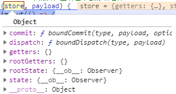

# how-to-play-vuex

## 主旨

彻底玩转vuex，基本用法，以及modules和getters用法

## Project setup
```
yarn install
```

### Compiles and hot-reloads for development
```
yarn serve
```

### Compiles and minifies for production
```
yarn build
```

### Lints and fixes files
```
yarn lint
```

### Customize configuration
See [Configuration Reference](https://cli.vuejs.org/config/).

## 基本用法

在项目中引入vuex

```shell
npm i vuex -S
```

添加store文件夹，在文件夹中添加index.js

```js
// index.js

import Vue from 'vue'
import Vuex from 'vuex'

Vue.use(Vuex)

const state = {
  outA: '外部state中的变量a',
  outCount: 0
}

const mutations = {
  EDITA (state, payload) {
    state.outA = payload
  },
  OUTADD (state) {
    state.outCount += 1
  },
  OUTREDUCE (state) {
    state.outCount -= 1
  }
}

const actions = {
  editA ({ commit }, payload) {
    setTimeout(() => {
      commit('EDITA', payload)
    }, 1000)
  }
}

export default new Vuex.Store({
  state,
  mutations,
  actions
})
```

在main.js中添加store

```js
import Vue from 'vue'
import App from './App.vue'
import router from './router'
import store from './store'

Vue.config.productionTip = false

new Vue({
  router,
  store,
  render: h => h(App)
}).$mount('#app')
```

在组件使用

```vue
<template>
  <div>
    <h1>基本用法</h1>
    <div>
      <div>外部变量a的值：{{outA}}</div>
      <input v-model="a"/>
      <button @click="handleEditA">修改outA</button>
      <button @click="handleEditA1">异步修改</button>
      <div>
        外部数据count：{{outCount}}
        <button @click="handleAdd">+</button>
        <button @click="handleReduce">-</button>
      </div>
    </div>
  </div>
</template>

<script>
export default {
  name: 'pageVuex',
  computed: {
    outA () {
      return this.$store.state.outA
    },
    outCount () {
      return this.$store.state.outCount
    }
  },
  data () {
    return {
      a: '',
      b: ''
    }
  },
  methods: {
    handleEditA () { // 修改state中的数据
      this.$store.commit('EDITA', this.a)
    },
    handleEditA1 () { // 使用异步的方式修改state中的数据
      this.$store.dispatch('editA', this.a)
    },
    handleAdd () {
      this.$store.commit('OUTADD')
    },
    handleReduce () {
      this.$store.commit('OUTREDUCE')
    }
  }
}
</script>
```

### 关于mutations和actions

1. mutations和actions中的属性名可以完全相同，并不会影响程序的正常运行，也不会报错
2. mutations中的属性名推荐使用大写
3. acttions中方法的第一个参数是一个包含commit、dispatch等方法或者属性的对象



4. mutation中可以执行异步修改state中的数据，但是不推荐这么做，不利于追踪state的状态更改
5. actions中方法的第一个参数的包含的state对象，是可以直接操作的，state中的数据也能修改成功，但是也不推荐这么干

## modules

在store文件夹下新建一个modules目录

新建模块文件

```js
// user.js
const state = {
  name: 'zcl',
  age: 25
}

const mutations = {
  UPDATENAME: (state, payload) => {
    state.name = payload
  },
  ADDAGE: state => {
    state.age += 1
  }
}

const actions = {
  updateName ({ commit }, payload) {
    setTimeout(() => {
      commit('UPDATENAME', payload)
    }, 1000)
  }
}

export default {
  // namespaced: true,
  state,
  mutations,
  actions
}
```

在store/index.js中添加modules

```js
// ....省略

const modules = {
  user
}

export default new Vuex.Store({
  state,
  mutations,
  actions,
  modules     // 添加modules
}) 
```

> 1. 在模块的mutations中，**state只能够访问自己模块内的数据**
> 2. 在模块的actions中，可以通过操作第一个参数中的rootGetters和rootState来访问其他模块中的内容

### namespaced

**注意**：modules的mutations和actions中名称是可复用的，这就会造成，如果不同模块中包含相同的mutations和actions名称，那么这些模块中的mutation和action都会触发。为了防止这种情况的产生，vuex提供了namespaced属性

在对应的modules中添加namespaced属性

```js
export default {
  namespaced: true,
  state,
  mutations,
  actions
}
```

在组件中使用，需要加上对应的模块名称，这样就能防止同时触发不同模块的相同mutation，action同理

```js
methods: {
  handelUpdateName () {
    this.$store.commit('goods/UPDATENAME', 载荷)
  }
}
```

### 花式引入modules的方法

当vuex中的模块很多时，你又不想一个一个的import然后写进对象中，可以使用下面的代码解决

```js
// https://webpack.js.org/guides/dependency-management/#requirecontext
const modulesFiles = require.context('./modules', true, /\.js$/)

// you do not need `import app from './modules/app'`
// it will auto require all vuex module from modules file
const modules = modulesFiles.keys().reduce((modules, modulePath) => {
  // set './app.js' => 'app'
  const moduleName = modulePath.replace(/^\.\/(.*)\.\w+$/, '$1')
  const value = modulesFiles(modulePath)
  modules[moduleName] = value.default
  return modules
}, {})

const state = {
  outA: '外部state中的变量a',
  outCount: 0
}
```

## getters

添加外部文件也可，在index.js或者各自模块中添加也可

```js
// getters.js
const getters = {
  userInfo: (state) => {
    return `我是${state.name}，今年${state.age}岁`
  }
}

export default getters
```

在index.js中引入

```js
export default new Vuex.Store({
  state,
  mutations,
  actions,
  modules,
  getters    // 引入getters
})
```

在和namespaced的联动上，其处理方式和mutations和actions类似

```js
this.$store.getters['user/userInfo'] // 当模块开启namespaced之后这么使用
this.$store.getters.user.userInfo // 这种写法不管如何都会报错
this.$store.getters.userInfo // 当模块未开启namespaced时这么使用
```
