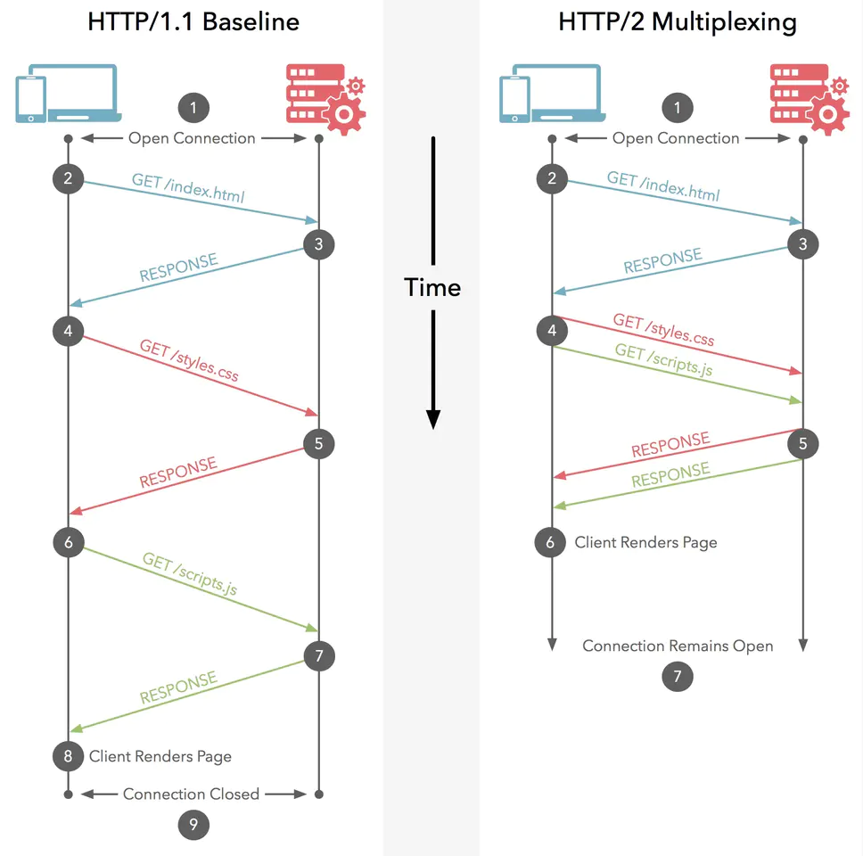

# http

## 状态码

1xx：指示信息--表示请求已接收，继续处理
2xx：成功--表示请求已被成功接收、理解、接受
3xx：重定向--要完成请求必须进行更进一步的操作
4xx：客户端错误--请求有语法错误或请求无法实现
5xx：服务器端错误--服务器未能实现合法的请求

## http请求方法

HTTP协议中定义了浏览器和服务器进行交互的不同方法，基本方法有4种，分别是GET，POST，PUT，DELETE。这四种方法可以理解为，对服务器资源的查，改，增，删。

- GET：从服务器上获取数据，也就是所谓的查，仅仅是获取服务器资源，不进行修改。
- POST：偏向创建新的数据。用户注册、发布文章、上传文件等场景。**非冥等**
- PUT：创建或者修改数据。偏向修改**幂等**
- DELETE：从字面意思也能看出，这种方式就是删除服务器数据的过程。
- HEAD： 请求获取由`Request-URI`所标识的资源的响应消息报头
- OPTIONS： `CORS`跨域请求的预检请求；

### get和post区别

1. Get是不安全的，因为在传输过程，数据被放在请求的URL中；Post的所有操作对用户来说都是不可见的。 
2. Get请求提交的url中的数据最多只能是2048字节，这个限制是浏览器或者服务器给添加的，http协议并没有对url长度进行限制，目的是为了保证服务器和浏览器能够正常运行，防止有人恶意发送请求。Post请求则没有大小限制。
3. Get限制Form表单的数据集的值必须为ASCII字符；而Post支持整个ISO10646字符集。
4. Get执行效率比Post方法好。

### 为什么get比post快

1. post需要在请求的body部分包含数据，所以会多了几个数据描述部分的首部字段（如content-type），但是这个影响可以忽略不计

2. 比较关键的一点是，get请求只产生一个TCP数据包，POST产生两个TCP数据包

   **post请求的过程：**

   1).浏览器请求tcp连接（第一次握手）

   2).服务器答应进行tcp连接（第二次握手）

   3).浏览器确认，并发送post请求头（第三次握手，这个报文比较小，所以http会在此时进行第一次数据发送）

   4).服务器返回100 continue响应（视post请求头是否携带{"Expect":"100-continue"}而定）

   5).浏览器开始发送数据

   6).服务器返回200 ok响应

   **get请求的过程**

   1).浏览器请求tcp连接（第一次握手）

   2).服务器答应进行tcp连接（第二次握手）

   3).浏览器确认，并发送get请求头和数据（第三次握手，这个报文比较小，所以http会在此时进行第一次数据发送）

   4).服务器返回200 ok响应

   上面的过程很明显的展示了get和post请求过程的差异，

   **GET**：浏览器会把**http header和data一并发送出去**

   **POST**：浏览器**先发送header**，然后**再发送data**（Firefox只发送一次，未求证）

   这就势必会导致，post请求的整体效率比get要低

## http常见请求头

### 缓存

- expires
- cache-control

- If-Modified-Since
  - 这个请求头后面跟的是一个时间戳，表示在这个时间点以后，资源被修改过，则重新请求，这个时间点会在首次请求资源的响应头中携带
- If-None-Match
  - 这个请求头的值是一个Etag，在第一次请求资源时会在响应头中携带，如果响应头的值与if-None-Match不匹配，则表示资源被修改过，需要重新请求

## http常见响应头

- Etag

  对应请求头中的If-None-Match字段

- Last-Modified

  对应请求头中的If-Modified-Since字段

### 跨域

- Access-Control-Allow-Origin: *
  - 允许所有来源访问
- Access-Control-Allow-Method: POST,GET
  - 允许访问的方式
- Access-Control-Allow-Headers: Content-type, Authorization, Accept
  - 允许携带的头部
- Access-Control-Allow-Credentials: true
  - 该字段可选。它的值是一个布尔值，表示是否允许发送Cookie。默认情况下，Cookie不包括在CORS请求之中。设为`true`，即表示服务器明确许可，Cookie可以包含在请求中，一起发给服务器。这个值也只能设为`true`，如果服务器不要浏览器发送Cookie，删除该字段即可。
- Access-Control-Max-Age: 5
  - 该字段可选，用来指定本次预检请求的有效期，单位为秒。上面结果中，有效期是5s，即允许缓存该条回应5秒，在此期间，不用发出另一条预检请求。

## http缓存机制

浏览器第一次请求时：

浏览器后续在进行请求时：

### 强缓存

只要请求了一次，在有效时间内，不会再请求服务器（请求都不会发起），直接从浏览器本地缓存中获取资源。

主要字段有

- expires：date（过期日期）
- cache-control： max-age=time（毫秒数，多久之后过期）|no-cache|no-store

如果expires和cache-control同时存在，cache-control会覆盖expires。建议两个都写，cache-control是http1.1的头字段，expires是http1.0的头字段，都写兼容会好点。

### 协商缓存

无论是否变化，是否过期都会发起请求，如果内容没过期，直接返回304，从浏览器缓存中拉取文件，否则直接返回更新后的内容

### 优先级问题

- cache-control和expires
  - **cache-control**胜出
- If-Modified-Since和If-None-Match
  - **If-None-Match**胜出，**服务器会优先验证ETag**，一致的情况下，才会继续比对Last-Modified，最后才决定是否返回304。
  - 这里有点迷，有一种说法说RFC规定两者之间没有优先级，如果都有的话需要都发给服务器，没有优先级之分，但是面试官希望得到的答案肯定是If-None-Match

### Last-Modified VS Etag

你可能会觉得使用Last-Modified已经足以让浏览器知道本地的缓存副本是否足够新，为什么还需要Etag呢？HTTP1.1中Etag的出现主要是为了解决几个Last-Modified比较难解决的问题：

- 一些文件也许会周期性的更改，但是他的内容并不改变(仅仅改变的修改时间)，这个时候我们并不希望客户端认为这个文件被修改了，而重新GET；
- 某些文件修改非常频繁，比如在秒以下的时间内进行修改，(比方说1s内修改了N次)，If-Modified-Since能检查到的粒度是s级的，这种修改无法判断(或者说UNIX记录MTIME只能精确到秒)；
- 某些服务器不能精确的得到文件的最后修改时间。

这时，利用Etag能够更加准确的控制缓存，因为Etag是服务器自动生成或者由开发者生成的对应资源在服务器端的唯一标识符。

## http特点

1. 无状态：协议对客户端没有状态存储，对事物处理没有“记忆”能力，比如访问一个网站需要反复进行登录操作（所以需要cookie）

2. 无连接：HTTP/1.1之前，由于无状态特点，每次请求需要通过TCP三次握手四次挥手，和服务器重新建立连接。比如某个客户机在短时间多次请求同一个资源，服务器并不能区别是否已经响应过用户的请求，所以每次需要重新响应请求，需要耗费不必要的时间和流量。

3. 基于请求和响应：基本的特性，由客户端发起请求，服务端响应

4. 简单快速、灵活

5. 通信使用明文、请求和响应不会对通信方进行确认、无法保护数据的完整性

- 缺点

  无状态、不安全、队头阻塞

  **队头阻塞（http1.x版本）：**开启长连接时，只建立一个`TCP`连接，同一时刻只能处理一个请求，那么当请求耗时过长时，其他请求就只能阻塞状态

## http各版本

http协议目前有三个版本

- http1.0
- http1.1
- http2

### HTTP1.0和HTTP1.1

**HTTP1.0**：默认是短连接

> 什么是短连接：简单来说就是，**每次与服务器交互，都需要新开一个连接**，试想一下这种场景：请求一张图片，新开一个连接，请求一个CSS文件，新开一个连接，请求一个JS文件，新开一个连接。HTTP协议是基于TCP的，TCP每次都要经过**三次握手，四次挥手，慢启动**...这都需要去消耗我们非常多的资源的！
>
> **HTTP 1.0规定浏览器与服务器只保持短暂的连接，浏览器的每次请求都需要与服务器建立一个TCP连接，服务器完成请求处理后立即断开TCP连接，服务器不跟踪每个客户也不记录过去的请求。**

**HTTP1.1**：默认是持久化连接

>持久化连接：**建立一次连接，多次请求均由这个连接完成**！(如果阻塞了，还是会开新的TCP连接的)，相关字段：keep-alive

以上是http1.0和1.1的最显著区别，除此之外，HTTP1.1还加入了其他特性

1. 请求的流水线(`Pipelining`)处理
2. 增加缓存处理（新的字段如cache-control）
3. 增加Host字段、支持断点传输等

### HTTP1.1的Pipelining理论

**请求的流水线（Pipelining）处理，在一个TCP连接上可以传送多个HTTP请求和响应，减少了建立和关闭连接的消耗和延迟。**例如：一个包含有许多图像的网页文件的多个请求和应答可以在一个连接中传输，但每个单独的网页文件的请求和应答仍然需要使用各自的连接。**HTTP 1.1还允许客户端不用等待上一次请求结果返回，就可以发出下一次请求，但服务器端必须按照接收到客户端请求的先后顺序依次回送响应结果，以保证客户端能够区分出每次请求的响应内容。**

### HTTP1.1和HTTP2.0

#### HTTP/1.1存在的缺陷

1、**TCP连接数限制**

对于同一个域名，浏览器最多只能同时创建 6~8 个 TCP 连接 (不同浏览器不一样)。为了解决数量限制，出现了 `域名分片` 技术，其实就是资源分域，将资源放在不同域名下 (比如二级子域名下)，这样就可以针对不同域名创建连接并请求，以一种讨巧的方式突破限制，但是滥用此技术也会造成很多问题，比如每个 TCP 连接本身需要经过 DNS 查询、三步握手、慢启动等，还占用额外的 CPU 和内存，对于服务器来说过多连接也容易造成网络拥挤、交通阻塞等

2、**队头阻塞（Head Of Line Blocking)问题**

每个 TCP 连接同时只能处理一个请求 - 响应，浏览器按 FIFO 原则处理请求，如果上一个响应没返回，后续请求 - 响应都会受阻。为了解决此问题，出现了 **管线化 - pipelining 技术**，但是管线化存在诸多问题，比如第一个响应慢还是会阻塞后续响应、服务器为了按序返回响应需要缓存多个响应占用更多资源、浏览器中途断连重试服务器可能得重新处理多个请求、还有必须客户端 - 代理 - 服务器都支持管线化

#### HTTP/2.0优势

https默认使用http2.0协议

·1、二进制分帧

帧是数据传输的最小单位，以二进制传输代替原本的明文传输，原本的报文消息被划分为更小的数据帧，帧代表着最小的数据单位，每个帧会标识出该帧属于哪个流，流也就是多个帧组成的数据流。

2、**多路复用**

在一个 TCP 连接上，我们可以向对方不断发送帧，每帧的 stream identifier 的标明这一帧属于哪个流，然后在对方接收时，根据 stream identifier 拼接每个流的所有帧组成一整块数据。
把 HTTP/1.1 每个请求都当作一个流，那么多个请求变成多个流，请求响应数据分成多个帧，不同流中的帧交错地发送给对方，这就是 HTTP/2 中的多路复用。

3、服务端推送

浏览器发送一个请求，服务器主动向浏览器推送与这个请求相关的资源，这样浏览器就不用发起后续请求。

**但是`Chrome106`版本禁用了，改为`103状态码`**

Server-Push 主要是针对资源内联做出的优化，相较于 http/1.1 资源内联的优势:

- 客户端可以缓存推送的资源
- 客户端可以拒收推送过来的资源
- 推送资源可以由不同页面共享
- 服务器可以按照优先级推送资源

4、Header 压缩 (HPACK)

5、应用层的重置连接

对于 HTTP/1 来说，是通过设置 tcp segment 里的 reset flag 来通知对端关闭连接的。这种方式会直接断开连接，下次再发请求就必须重新建立连接。HTTP/2 引入 RST_STREAM 类型的 frame，可以在不断开连接的前提下取消某个 request 的 stream，表现更好。

6、请求优先级设置

HTTP/2.0 里的每个 stream 都可以设置依赖 (Dependency) 和权重，可以按依赖树分配优先级，解决了关键请求被阻塞的问题

7、流量控制

每个 http/2.0 流都拥有自己的公示的流量窗口，它可以限制另一端发送数据。对于每个流来说，两端都必须告诉对方自己还有足够的空间来处理新的数据，而在该窗口被扩大前，另一端只被允许发送这么多数据。

### HTTP 3.0

`Google`搞了一个基于 `UDP` 协议的 `QUIC` 协议，并且使用在了 `HTTP/3` 上。目前还在试验阶段（2024年3月11日17:17:01）

#### HTTP3 出现原因 & HTTP2 缺点

- 底层协议还是`TCP`，仍然需要`三次握手`来确认连接成功，
- `TCP`的`队头阻塞`并没有彻底解决，在 `HTTP2` 中，多个请求是跑在一个`TCP`连接中的。但当`HTTP/2`出现丢包时，整个 `TCP` 都要开始等待重传，那么就会阻塞该`TCP`连接中的所有请求。

#### QUIC

- 实现了快速握手功能。由于QUIC是基于UDP的，不需要三次握手，这意味着QUIC可以用最快的速度来发送和接收数据。
  - `3RTT => 0/1 RTT`；根据是否要`TLS`加密
- 实现了类似TCP的可靠传输，虽然UDP不提供可靠性的传输，但QUIC在UDP的基础之上增加了一层来保证数据可靠性传输。
  - 用的`ACK`模式，只是`QUIC`中包丢了就丢了，会重传一个`新序号`的包，通过包内的`offset`字段来确定这个包的位置；
- 集成了 `TLS` 加密功能，目前`QUIC`使用的是`TLS1.3`，相较于早期版本`TLS1.3`有更多的优点，其中最重要的一点是减少了握手所花费的`RTT`个数。
- 同样也提供了`拥塞控制`机制，包括`慢启动`、`拥塞避免`等；
- 也实现了`多路复用`，每个请求会在 `quic` 层面定义为一个 `stream`，丢包也只影响当前`stream`；彻底解决 `TCP` 中队头阻塞的问题（详细可阅读下文）