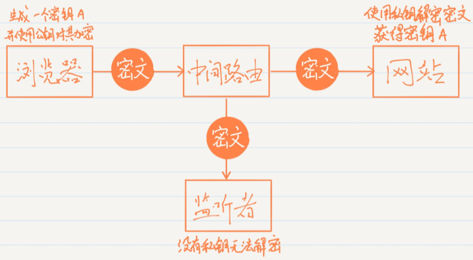
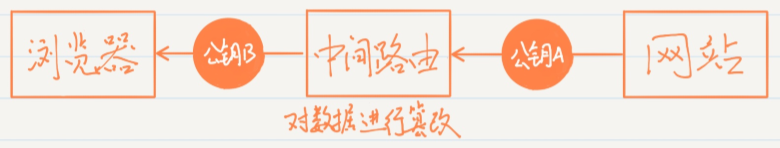

# https

概念：是以安全为目标的HTTP通道，简单讲是HTTP的安全版，即HTTP下加入SSL层，HTTPS的安全基础是SSL，因此加密的详细内容就需要SSL。

## HTTP缺点

1. 通信使用明文，内容可能会被窃听
2. 不验证通信双方的身份，通信双方可能被伪装
3. 无法证明报文的完整性，所以容易被篡改

解决方案：

1. 加密防止窃听
2. 通信之前验证证书
3. MD5，SHA-1校验

## HTTP+加密+认证+完整性保护=HTTPS

HTTP+SSL(TLS)=HTTPS

- 加密方式
  - HTTP采用对称秘钥和非对称秘钥的混合加密方式
- 证书
  - 证书用来确保对称秘钥的真实性，也可确认通信方的真实身份。

### 加密方式

- 对称加密

  客户端和服务器共用同一个密钥，该密钥可以用于加密一段内容，同时也可以用于解密这段内容。对称加密的优点是加解密效率高，但是在安全性方面可能存在一些问题，因为密钥存放在客户端有被窃取的风险。对称加密的代表算法有：AES、DES等。

- 非对称加密

  非对称将密钥分成了两种：公钥和私钥。**公钥**通常存放在**客户端**，**私钥**通常存放在**服务器**。使用公钥加密的数据只有用私钥才能解密，反过来使用私钥加密的数据也只有用公钥才能解密。非对称加密的优点是安全性更高，因为客户端发送给服务器的加密信息只有用服务器的私钥才能解密，因此不用担心被别人破解，但缺点是加解密的效率相比于对称加密要差很多。非对称加密的代表算法有：RSA、ElGamal等。

> 思考一个问题：https使用何种加密方式

我们都知道，http协议使用明文传输，很容易被监听者获取到传输的数据，只要使用密文传输，即便是被监听者获取到了数据，他们也无法得知解密后的数据，除非监听者有**秘钥**

所以需要思考的重要问题是：**浏览器和网站怎样商定使用什么秘钥？**

### 问题一：如何安全的创建一个秘钥A用作对称加密

这绝对是一个计算机界的难题，浏览器和网站要使用相同的密钥才能正常对数据进行加解密，但是如何让这个密钥只让它们俩知晓，而不被任何监听者知晓呢？**你会发现不管怎么商定，浏览器和网站（服务端）的首次通信过程必定是明文的。这就意味着，按照上述的工作流程，我们始终无法创建一个安全的对称加密密钥。**

所以，只使用对称加密看来是永远无法解决这个问题了，这个时候我们需要将非对称加密引入进来，协助解决无法安全创建对称加密密钥的问题。

那么为什么非对称加密就可以解决这个问题呢？通过示意图的方式来理解一下：

可以看到，如果我们想要安全地创建一个对称加密的密钥，可以让浏览器这边来随机生成，但是生成出来的密钥不能直接在网络上传输，而是要用网站提供的公钥对其进行非对称加密。由于公钥加密后的数据只能使用私钥来解密，因此这段数据在网络上传输是绝对安全的。而网站在收到消息之后，只需要使用私钥对其解密，就获取到浏览器生成的密钥了。

另外，使用这种方式，只有在浏览器和网站首次商定密钥的时候需要使用非对称加密，一旦网站收到了浏览器随机生成的密钥之后，双方就可以都使用对称加密来进行通信了，因此工作效率是非常高的。

### 问题二：如何获取网站（服务端）的公钥来加密创建秘钥A

那么，上述的工作机制你认为已经非常完善了吗？其实并没有，因为我们还是差了非常关键的一步，**浏览器该怎样才能获取到网站的公钥呢**？虽然公钥是属于公开的数据，在网络上传输不怕被别人监听，但是如果公钥被别人篡改了怎么办？示意图如下：

也就是说，只要我们从网络上去获取任何网站的公钥，就必然存在着公钥被篡改的风险。而一旦你使用了假的公钥来对数据进行加密，那么就可以被别人以假的私钥进行解密，后果不堪设想。

方案设计到这里好像已经进入了死胡同，因为无论如何我们都无法安全地获取到一个网站的公钥，而我们显然也不可能将世界上所有网站的公钥都预置在操作系统当中。

### CA机构

这个时候，就必须引入一个新的概念来打破僵局了：CA机构。CA机构专门用于给各个网站签发数字证书，从而保证浏览器可以安全地获得各个网站的公钥。

那么CA机构是如何完成这个艰巨的任务的呢？

- 首先，我们作为一个网站的管理员需要向CA机构进行申请，将自己的公钥提交给CA机构。CA机构则会使用我们提交的公钥，再加上一系列其他的信息，如网站域名、有效时长等，来制作证书。
- 证书制作完成后，CA机构会使用自己的私钥对其加密，并将加密后的数据返回给我们，我们只需要将获得的加密数据配置到网站服务器上即可。
- 然后，每当有浏览器请求我们的网站时，首先会将这段加密数据返回给浏览器，此时浏览器会用CA机构的公钥来对这段数据解密。
- 如果能解密成功，就可以得到CA机构给我们网站颁发的证书了，其中当然也包括了我们网站的公钥。

### 握手过程

1. client向server发送请求https://baidu.com，然后连接到server的443端口，发送的信息主要是随机值1和客户端支持的加密算法。

2. server接收到信息之后给予client响应握手信息，包括随机值2和匹配好的协商加密算法，这个加密算法一定是client发送给server加密算法的子集。

3. 随即server给client发送第二个响应报文是数字证书。服务端必须要有一套数字证书，可以自己制作，也可以向组织申请。区别就是自己颁发的证书需要客户端验证通过，才可以继续访问，而使用受信任的公司申请的证书则不会弹出提示页面，这套证书其实就是一对公钥和私钥。传送证书，这个证书其实就是公钥，只是包含了很多信息，如证书的颁发机构，过期时间、服务端的公钥，第三方证书认证机构(CA)的签名，服务端的域名信息等内容。

4. 客户端解析证书，这部分工作是由客户端的TLS来完成的，首先会验证公钥是否有效，比如颁发机构，过期时间等等，如果发现异常，则会弹出一个警告框，提示证书存在问题。如果证书没有问题，那么就生成一个随即值（预主秘钥）。

5. 客户端认证证书通过之后，接下来是通过随机值1、随机值2和预主秘钥组装会话秘钥。然后通过证书的公钥加密会话秘钥。

6. 传送加密信息，这部分传送的是用证书加密后的会话秘钥，目的就是让服务端使用秘钥解密得到随机值1、随机值2和预主秘钥。（如果是出于确保会话秘钥未被修改的目的，需要对比解密出的随机值1、2和预主秘钥是否和服务端收到的一致。）

7. 服务端解密得到随机值1、随机值2和预主秘钥，然后组装会话秘钥，跟客户端会话秘钥相同。（服务端还用组装吗？）

8. 客户端通过会话秘钥加密一条消息发送给服务端，主要验证服务端是否正常接受客户端加密的消息。

9. 同样服务端也会通过会话秘钥加密一条消息回传给客户端，如果客户端能够正常接受的话表明SSL层连接建立完成了。

## 总结

- 我们需要一个秘钥作为客户端与服务端加密通信的秘钥，也就是对称加密的方式，但是这个秘钥有可能被攻击者获取，因为客户端必然要告知服务端这个秘钥。
- 那么在传输这个秘钥的时候，使用非对称加密的技术，使用服务端提供的公钥去加密，然后服务端用自己的私钥解密。但是问题是，当客户端向服务端请求这个公钥时，攻击者虽然没有私钥去根据这个公钥进行解密，但是可以对这个公钥进行篡改。
- 引入第三方机构CAL

### 问题

1. 客户端是如何制作秘钥的？

   

[转载：写一篇最好懂的https讲解](https://blog.csdn.net/guolin_blog/article/details/104546558)

