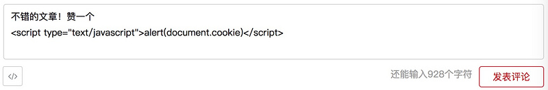
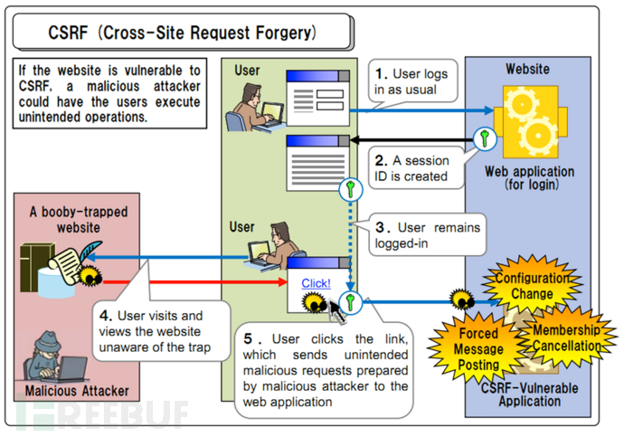

# XSS、CSRF 以及如何防范

在 Web 安全领域中，XSS 和 CSRF 是最常见的攻击方式。下面我们首先简单了解一下什么是 XSS 和 CSRF 。

## XSS

`XSS`，即 Cross Site Script，中译是跨站脚本攻击；

其原本缩写是 CSS，但为了和层叠样式表(Cascading Style Sheet)有所区分，因而在安全领域叫做 XSS。

XSS 攻击是指攻击者在网站上注入恶意的客户端代码，通过恶意脚本对客户端网页进行篡改，从而在用户浏览网页时，对用户浏览器进行控制或者获取用户隐私数据的一种攻击方式。

攻击者对客户端网页注入的恶意脚本一般包括 JavaScript，有时也会包含 HTML 和 Flash。有很多种方式进行 XSS 攻击，但它们的共同点为：将一些隐私数据像 cookie、session 发送给攻击者，将受害者重定向到一个由攻击者控制的网站，在受害者的机器上进行一些恶意操作。

### xss类型

XSS攻击可以分为3类：反射型（非持久型）、存储型（持久型）、基于DOM。

- 反射型 （Reflected XSS ） 发出请求时，XSS代码出现在url中，作为输入提交到服务器端，服务器端解析后响应，XSS代码随响应内容一起传回给浏览器，最后浏览器解析执行XSS代码。这个过程像一次反射，所以叫反射型XSS。

  搜索功能，输入框输入，使用get请求，查询结果服务端渲染，将输入内容放在了html中，导致携带在其中的恶意0脚本代码执行

- 存储型存  Stored XSS和 Reflected XSS的差别就在于，具有攻击性的脚本被保存到了服务器端（数据库，内存，文件系统）并且可以被普通用户完整的从服务的取得并执行，从而获得了在网络上传播的能力。

  例如：有这样一个网站，可以让你对某个文章输入评论（存储型）：

  

- DOM型 （DOM-based or local XSS） 即基于DOM或本地的 XSS 攻击：其实是一种特殊类型的反射型 XSS，它是基于 DOM文档对象模型的一种漏洞。可以通过 DOM来动态修改页面内容，从客户端获取 DOM中的数据并在本地执行。基于这个特性，就可以利用 JS脚本来实现 XSS漏洞的利用。

  有以下可能

  1、`<script>`标签

  2、a标签的href、img 上src，例如：``

  3、`innerHTML/outerHTML=xx` 或 `setTimeout/setInterval` (执行js)

  4、`document.write` 或 eval

  5、`location`、`onclick`、`onerror`、`onload`、`onmouseover`等事件（执行js），例如：``

  6、在 style 属性中，包含类似 `background-image:url(“javascript:alert('XSS')”);`的代码（新版本浏览器已经可以防范）

  7、在 style 属性和标签中，包含类似 `expression(…)` 的 CSS 表达式代码(新版本浏览器已经可以防范)

实际情况下的攻击例子：

### 防御措施

1. 输入过滤。

   避免 XSS 的方法之一主要是将用户输入的内容进行过滤。对所有用户提交内容进行可靠的输入验证，包括对 URL、查询关键字、POST数据等，仅接受指定长度范围内、采用适当格式、采用所预期的字符的内容提交，对其他的一律过滤。(客户端和服务器都要)

2. 输出转义

​       例如： 往 HTML 标签之间插入不可信数据的时候，首先要做的就是对不可信数据进行 HTML Entity 编码 [HTML 字符实体](http://www.w3school.com.cn/html/html_entities.asp)

```js
function htmlEncodeByRegExp  (str){  
         var s = "";
         if(str.length == 0) return "";
         s = str.replace(/&/g,"&amp;");
         s = s.replace(/</g,"&lt;");
         s = s.replace(/>/g,"&gt;");
         s = s.replace(/ /g,"&nbsp;");
         s = s.replace(/\'/g,"&#39;");
         s = s.replace(/\"/g,"&quot;");
         return s;  
 }
var tmpStr="<p>123</p>";   
var html=htmlEncodeByRegExp (tmpStr)
console.log(html) //&lt;p&gt;123&lt;/p&gt;
document.querySelector(".content").innerHTML=html; //<p>123</p>
```

3.  使用 HttpOnly Cookie

将重要的cookie标记为httponly，这样的话当浏览器向Web服务器发起请求的时就会带上cookie字段，但是在js脚本中却不能访问这个cookie，这样就避免了XSS攻击利用JavaScript的document.cookie获取cookie。

现代web开发框架如vue.js、react.js等，在设计的时候就考虑了XSS攻击对html插值进行了更进一步的抽象、过滤和转义，我们只要熟练正确地使用他们，就可以在大部分情况下避免XSS攻击。

4. 内容安全策略CSP

   现在主流的浏览器内置了CSP，它的实现/执行全部由浏览器完成，开发者只需配置。

   【CSP 实质】

   白名单制度，开发者明确告诉客户端，哪些外部资源可以加载和执行，等同于提供白名单。

   【CSP 作用】

   - 限制加载其他域下的资源文件，这样即使黑客插入了一个 JavaScript 文件，这个 JavaScript 文件也是无法被加载的
   - 禁止向第三方域提交数据，这样用户数据也不会外泄
   - 禁止执行内联脚本和未授权的脚本
   - 还提供了上报机制，这样可以帮助我们尽快发现有哪些 XSS 攻击，以便尽快修复问题

   【启用CSP的两种方法】

   1、HTTP 响应头 **Content-Security-Policy**

   

   2、网页的标签

   

   | default-src  **‘self’** | 用来设置下面图中各个选项的默认值 **限制所有的外部资源，都只能从当前域名加载** |
   | :---------------------: | :----------------------------------------------------------- |
   |    script-src ‘self’    | 脚本：只信任当前域名                                         |
   |    child-src https:     | 框架（frame）：必须使用HTTPS协议加载                         |
   |       report-uri        | 告诉浏览器，应该把注入行为报告给哪个网址                     |

## CSRF

`CSRF` , 即Cross-site request forgery）中译是跨站请求伪造；CSRF 顾名思义，是伪造请求，冒充用户在站内的正常操作。我们知道，绝大多数网站是通过 cookie 等方式辨识用户身份（包括使用服务器端 Session 的网站，因为 Session ID 也是大多保存在 cookie 里面的），再予以授权的。所以要伪造用户的正常操作，最好的方法是通过 XSS 或链接欺骗等途径，让用户在本机（即拥有身份 cookie 的浏览器端）发起用户所不知道的请求。



你可以这样来理解：
    攻击者盗用了你的身份，以你的名义发送恶意请求，对服务器来说这个请求是完全合法的，但是却完成了攻击者所期望的一个操作，比如以你的名义发送邮件、发消息，盗取你的账号，添加系统管理员，甚至于购买商品、虚拟货币转账等。 如下：其中Web A为存在CSRF漏洞的网站，Web B为攻击者构建的恶意网站，User C为Web A网站的合法用户。

### 步骤

1.  用户名和密码请求登录网站A；
2.  在用户信息通过验证后，网站A产生Cookie信息并返回给浏览器，此时用户登录网站A成功，可以正常发送请求到网站A；
3.  用户未退出网站A之前，在同一浏览器中，打开一个TAB页访问网站B；
4.  网站B接收到用户请求后，返回一些攻击性代码，并发出一个请求要求访问第三方站点A；
5.  浏览器在接收到这些攻击性代码后，根据网站B的请求，在用户不知情的情况下携带Cookie信息，向网站A发出请求。网站A并不知道该请求其实是由B发起的，所以会根据用户C的Cookie信息以C的权限处理该请求，导致来自网站B的恶意代码被执行。 

举例：

 受害者 Bob 在银行有一笔存款，通过对银行的网站发送请求

 `http://bank.example/withdraw?account=bob&amount=1000000&for=bob2` 

可以使 Bob 把 1000000 的存款转到 bob2 的账号下。通常情况下，该请求发送到网站后，服务器会先验证该请求是否来自一个合法的 session，并且该 session 的用户 Bob 已经成功登陆。

​    黑客 Mallory 自己在该银行也有账户，他知道上文中的 URL 可以把钱进行转帐操作。Mallory 可以自己发送一个请求给银行：

`http://bank.example/withdraw?account=bob&amount=1000000&for=Mallory`。

但是这个请求来自 Mallory 而非 Bob，他不能通过安全认证，因此该请求不会起作用。

​    这时，Mallory 想到使用 CSRF 的攻击方式，他先自己做一个网站，在网站中放入如下代码：

 `src=”http://bank.example/withdraw?account=bob&amount=1000000&for=Mallory ”`，并且通过广告等诱使 Bob 来访问他的网站。当 Bob 访问该网站时，上述 url 就会从 Bob 的浏览器发向银行，而这个请求会附带 Bob 浏览器中的 cookie 一起发向银行服务器。大多数情况下，该请求会失败，因为他要求 Bob 的认证信息。但是，如果 Bob 当时恰巧刚访问他的银行后不久，他的浏览器与银行网站之间的 session 尚未过期，浏览器的 cookie 之中含有 Bob 的认证信息。这时，悲剧发生了，这个 url 请求就会得到响应，钱将从 Bob 的账号转移到 Mallory 的账号，而 Bob 当时毫不知情。等以后 Bob 发现账户钱少了，即使他去银行查询日志，他也只能发现确实有一个来自于他本人的合法请求转移了资金，没有任何被攻击的痕迹。而 Mallory 则可以拿到钱后逍遥法外。

### 特点

1、**不能拿到 Cookie**，也看不到 Cookie 的内容，仅仅是“冒用”

2、向服务器提交操作，但是不直接窃取数据，对于**服务器返回的结果**，由于浏览器同源策略的限制，**攻击者也无法进行解析**

3、攻击一般发起在第三方网站，而不是被攻击的网站；被攻击的网站无法阻止攻击发生

### 防御措施

​	（1）验证 HTTP Referer 字段，利用 HTTP 头中的 Referer 判断请求来源是否合法，Referer记录了该 HTTP 请求的来源地址。

> 优点：简单易行，只需要在最后给所有安全敏感的请求统一增加一个拦截器来检查 Referer 的值就可以。特别是对于当前现有的系统，不需要改变当前系统的任何已有代码和逻辑，没有风险，非常便捷。
> 缺点：Referer 的值是由浏览器提供的，不可全信，低版本浏览器下 Referer 存在伪造风险。用户自己可以设置浏览器使其在发送请求时不再提供 Referer 时，网站将拒绝合法用户的访问。

​    （2）在请求地址中添加 token 并验证。CSRF 攻击之所以能够成功，是因为黑客可以完全伪造用户的请求，该请求中所有的用户验证信息都是存在于 cookie 中，因此黑客可以在不知道这些验证信息的情况下直接利用用户自己的 cookie 来通过安全验证。要抵御CSRF，关键在于在请求中放入黑客所不能伪造的信息，并且该信息不存在于 cookie 之中。可以在 HTTP 请求中以参数的形式加入一个随机产生的 token，并在服务器端建立一个拦截器来验证这个 token，如果请求中没有 token 或者 token 内容不正确，则认为可能是 CSRF 攻击而拒绝该请求。

> 优点：这种方法要比检查 Referer 要安全一些，token 可以在用户登陆后产生并放于 session 之中，然后在每次请求时把 token 从 session 中拿出，与请求中的 token 进行比对。
>
> 缺点：对所有请求都添加 token 比较困难。难以保证 token 本身的安全，依然会被利用获取到 token。

（3）在 HTTP 头中自定义属性并验证
 这种方法也是使用 token 并进行验证，和上一种方法不同的是，这里并不是把 token 以参数的形式置于 HTTP 请求之中，而是把它放到 HTTP 头中自定义的属性里。通过 XMLHttpRequest 这个类，可以一次性给所有该类请求加上 csrftoken 这个 HTTP 头属性，并把 token 值放入其中。这样解决了上种方法在请求中加入 token 的不便，同时，通过 XMLHttpRequest 请求的地址不会被记录到浏览器的地址栏，也不用担心 token 会透过 Referer 泄露到其他网站中去。

> 优点：统一管理 token 输入输出，可以保证 token 的安全性。
> 缺点：有局限性，无法在非异步的请求上实施。

（4）验证码，强制用户参与交互

> 优点：简单易行
>
> 缺点：局限性，不可能给所有的交互都加上验证码

## 明确考察点

明确 xss和csrf是什么

明确xss和 csrf攻击的特点 

如何防范xss和csrf攻击

### 回答思路

首先明确 xss(Cross Site Scripting )是跨站脚本攻击   csrf(Cross-site request forgery)是跨站请求伪造， 然后分别举一下两种攻击的例子，最后谈下两种攻击的防范措施。

## 相关扩展

1. [XSS 和 CSRF简述及预防措施](https://www.cnblogs.com/yangsg/p/10621496.html)
2. [服务器受到DDoS攻击](https://www.jianshu.com/p/e7a5fdc67b8f)

