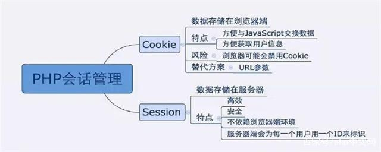
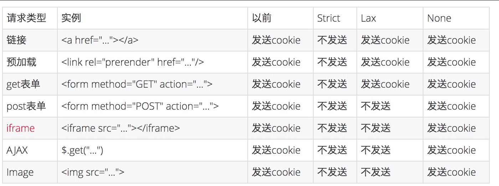

>面试问题：HTTP是无状态的连接，如何让服务器知道正在和谁通信？

# cookie和session



用一些生动形象的实例来描述`cookie` 与 `session`。某家咖啡店有喝5杯咖啡免费赠一杯咖啡的优惠，然而一次性消费5杯咖啡的机会微乎其微，这时就需要某种方式来记录某位顾客的消费数量。有以下几种方案：

   1、该店的店员很厉害，能记住每位顾客的消费数量，只要顾客一走进咖啡店，店员就知道该怎么对待了。**这种做法就是协议本身支持状态。 **

​    2、发给顾客一张卡片，上面记录着消费的数量，一般还有个有效期限。每次消费时，如果顾客出示这张卡片，则此次消费就会与以前或以后的消费相联系起来。**这种做法就是在客户端保持状态。**（cookie）

​    3、发给顾客一张会员卡，除了卡号之外什么信息也不纪录，每次消费时，如果顾客出示该卡片，则店员在店里的纪录本上找到这个卡号对应的纪录添加一些消费信息。**这种做法就是在服务器端保持状态。**（session）

由于HTTP协议是无状态的，而出于种种考虑也不希望使之成为有状态的，因此，上面两种方案就成为现实的选择。具体来说cookie机制采用的是在客户端保持状态的方案，而session机制采用的是在服务器端保持状态的方案。同时我们也看到，由于采用服务器端保持状态的方案在客户端也需要保存一个标识，所以session机制可能需要借助于cookie机制来达到保存标识的目的，但实际上它还有其他选择。 

## cookie

### 什么是cookie

`HTTP Cookie`（也叫`Web Cookie`或浏览器`Cookie`）是服务器发送到用户浏览器并保存在本地的一小块数据，它会在浏览器下次向同一服务器再发起请求时被携带并发送到服务器上。通常，它用于告知服务端两个请求是否来自同一浏览器，如保持用户的登录状态。Cookie使基于**无状态**的HTTP协议记录稳定的状态信息成为了可能。

Cookie主要用于以下三个方面：

- 会话状态管理（如用户登录状态、购物车、游戏分数或其它需要记录的信息）
- 个性化设置（如用户自定义设置、主题等）
- 浏览器行为跟踪（如跟踪分析用户行为等）

### 理解cookie机制

cookie机制的基本原理就如上面的例子一样简单，但是还有几个问题需要解决：

- “会员卡”如何分发
- “会员卡”的内容
- 以及客户如何使用“会员卡”。

正统的cookie分发是通过扩展HTTP协议来实现的，服务器通过在HTTP的响应头中加上一行特殊的指示以提示浏览器按照指示生成相应的cookie。然而纯粹的客户端脚本如JavaScript或者VBScript也可以生成cookie。 

 而cookie的使用是由浏览器按照一定的原则在后台自动发送给服务器的。浏览器检查所有存储的cookie，如果某个cookie所声明的作用范围大于等于将要请求的资源所在的位置，则把该cookie附在请求资源的HTTP请求头上发送给服务器。意思是麦当劳的会员卡只能在麦当劳的店里出示，如果某家分店还发行了自己的会员卡，那么进这家店的时候除了要出示麦当劳的会员卡，还要出示这家店的会员卡。  

**cookie的内容主要包括：名字，值，过期时间，路径和域。 **

- 路径(Path)和域(Domain)

其中域可以指定某一个域比如.google.com，相当于总店招牌，比如宝洁公司，也可以指定一个域下的具体某台机器比如[www.google.com](http://www.google.com/)或者froogle.google.com，可以用飘柔来做比。路径就是跟在域名后面的URL路径，比如/或者/foo等等，可以用某飘柔专柜做比。路径与域合在一起就构成了cookie的作用范围。

- 过期时间(Expire||Max-Age)

如果不设置过期时间，则表示这个cookie的生命期为浏览器会话期间，只要关闭浏览器窗口，cookie就消失了。这种生命期为浏览器会话期的cookie被称为会话cookie。会话cookie一般不存储在硬盘上而是保存在内存里，当然这种行为并不是规范规定的。如果设置了过期时间，浏览器就会把cookie保存到硬盘上，关闭后再次打开浏览器，这些cookie仍然有效直到超过设定的过期时间。 

#### sameSite

2 月份发布的 Chrome80 版本中默认屏蔽了第三方的 Cookie，这会导致阿里系的很多应用都产生问题，为此还专门成立了问题小组，推动各 BU 进行改造。

##### 作用

我们先来看看这个属性的作用：

SameSite 属性可以让 Cookie 在跨站请求时不会被发送，从而可以阻止跨站请求伪造攻击（CSRF）。

##### 属性值

SameSite 可以有下面三种值：

1. **Strict** 仅允许一方请求携带 Cookie，即浏览器将只发送相同站点请求的 Cookie，即当前网页 URL 与请求目标 URL 完全一致。
2. **Lax** 允许部分第三方请求携带 Cookie
3. **None** 无论是否跨站都会发送 Cookie

之前默认是 None 的，Chrome80 后默认是 Lax。

##### 跨域和跨站

首先要理解的一点就是跨站和跨域是不同的。同站(same-site)/跨站(cross-site)」和第一方(first-party)/第三方(third-party)是等价的。但是与浏览器同源策略（SOP）中的「同源(same-origin)/跨域(cross-origin)」是完全不同的概念。

同源策略的同源是指两个 URL 的协议/主机名/端口一致。例如，https://www.taobao.com/pages/...，它的协议是 https，主机名是 [www.taobao.com，端口是](http://www.taobao.xn--com%2C-ye1g628gmm4a/) 443。

同源策略作为浏览器的安全基石，其「同源」判断是比较严格的，相对而言，Cookie中的「同站」判断就比较宽松：只要两个 URL 的 eTLD+1 相同即可，不需要考虑协议和端口。其中，eTLD 表示有效顶级域名，注册于 Mozilla 维护的公共后缀列表（Public Suffix List）中，例如，.com、.co.uk、.github.io 等。eTLD+1 则表示，有效顶级域名+二级域名，例如 taobao.com 等。

举几个例子，www.taobao.com 和 [www.baidu.com](http://www.baidu.com/) 是跨站，www.a.taobao.com 和 [www.b.taobao.com](http://www.b.taobao.com/) 是同站，a.github.io 和 b.github.io 是跨站(注意是跨站)。

##### 影响范围

接下来看下从 None 改成 Lax 到底影响了哪些地方的 Cookies 的发送？直接来一个图表：



从上图可以看出，对大部分 web 应用而言，Post 表单，iframe，AJAX，Image 这四种情况从以前的跨站会发送三方 Cookie，变成了不发送。

Post表单：应该的，学 CSRF 总会举表单的例子。

iframe：iframe 嵌入的 web 应用有很多是跨站的，都会受到影响。

AJAX：可能会影响部分前端取值的行为和结果。

Image：图片一般放 CDN，大部分情况不需要 Cookie，故影响有限。但如果引用了需要鉴权的图片，可能会受到影响。

除了这些还有 script 的方式，这种方式也不会发送 Cookie，像淘宝的大部分请求都是 jsonp，如果涉及到跨站也有可能会被影响。

##### 问题

我们再看看会出现什么的问题？举几个例子：

1. 天猫和飞猪的页面靠请求淘宝域名下的接口获取登录信息，由于 Cookie 丢失，用户无法登录，页面还会误判断成是由于用户开启了浏览器的“禁止第三方 Cookie”功能导致而给与错误的提示

2. 淘宝部分页面内嵌支付宝确认付款和确认收货页面、天猫内嵌淘宝的登录页面等，由于 Cookie 失效，付款、登录等操作都会失败

3. 阿里妈妈在各大网站比如今日头条，网易，微博等投放的广告，也是用 iframe 嵌入的，没有了 Cookie，就不能准确的进行推荐

4. 一些埋点系统会把用户 id 信息埋到 Cookie 中，用于日志上报，这种系统一般走的都是单独的域名，与业务域名分开，所以也会受到影响。

5. 一些用于防止恶意请求的系统，对判断为恶意请求的访问会弹出验证码让用户进行安全验证，通过安全验证后会在请求所在域种一个Cookie，请求中带上这个Cookie之后，短时间内不再弹安全验证码。在Chrome80以上如果因为Samesite的原因请求没办法带上这个Cookie，则会出现一直弹出验证码进行安全验证。

6. 天猫商家后台请求了跨域的接口，因为没有 Cookie，接口不会返回数据

##### 解决

解决方案就是设置 SameSite 为 none。

不过也会有两点要注意的地方：

1. HTTP 接口不支持 SameSite=none

如果你想加 SameSite=none 属性，那么该 Cookie 就必须同时加上 Secure 属性，表示只有在 HTTPS 协议下该 Cookie 才会被发送。

1. 需要 UA 检测，部分浏览器不能加 SameSite=none

IOS 12 的 Safari 以及老版本的一些 Chrome 会把 SameSite=none 识别成 SameSite=Strict，所以服务端必须在下发 Set-Cookie 响应头时进行 User-Agent 检测，对这些浏览器不下发 SameSite=none 属性

### cookie跨域时要如何处理

## Session

### 什么是Session

session称为会话信息，位于web服务器上，服务器使用一种类似于散列表的结构（也可能就是使用散列表）来保存信息。 

### Session机制

程序需要为某个客户端的请求创建一个session的时候，服务器首先检查这个客户端的请求里是否已包含了一个session标识 - 称为session id，如果已包含一个session id则说明以前已经为此客户端创建过session，服务器就按照session id把这个session检索出来使用（如果检索不到，可能会新建一个），如果客户端请求不包含session id，则为此客户端创建一个session并且生成一个与此session相关联的session id，session id的值应该是一个既不会重复，又不容易被找到规律以仿造的字符串，这个session id将被在本次响应中返回给客户端保存。 

保存这个session id的方式可以采用cookie，这样在交互过程中浏览器可以自动的按照规则把这个标识发挥给服务器。一般这个cookie的名字都是类似于SEEESIONID，而。比如weblogic对于web应用程序生成的cookie，JSESSIONID=ByOK3vjFD75aPnrF7C2HmdnV6QZcEbzWoWiBYEnLerjQ99zWpBng!-145788764，它的名字就是JSESSIONID。 

>也就是说Session的保存结果有点类似于如下方式
>
>```js
>Session = {
>    SessionID: 'vjFD75aPnrF7C2HmdnV6QZcEbzWoWiBYEnLerjQ99zWpB',
>    name: 'zcl',
>    age: '18'
>}
>```

在谈论session机制的时候，常常听到这样一种误解<span style='color:red'>**“只要关闭浏览器，session就消失了”**</span >。其实可以想象一下会员卡的例子，除非顾客主动对店家提出销卡，否则店家绝对不会轻易删除顾客的资料。对session来说也是一样的，除非程序通知服务器删除一个session，否则服务器会一直保留，程序一般都是在用户做log off的时候发个指令去删除session。然而浏览器从来不会主动在关闭之前通知服务器它将要关闭，因此服务器根本不会有机会知道浏览器已经关闭，<span style='color:red'>**之所以会有这种错觉，是大部分session机制都使用会话cookie来保存session id，而关闭浏览器后这个session id就消失了，再次连接服务器时也就无法找到原来的session。**</span >如果服务器设置的cookie被保存到硬盘上，或者使用某种手段改写浏览器发出的HTTP请求头，把原来的session id发送给服务器，则再次打开浏览器仍然能够找到原来的session。 

恰恰是由于关闭浏览器不会导致session被删除，迫使服务器为seesion设置了一个失效时间，当距离客户端上一次使用session的时间超过这个失效时间时，服务器就可以认为客户端已经停止了活动，才会把session删除以节省存储空间。   

## 区别

1. cookie数据存放在客户端浏览器上，session数据存在服务器上
2. cookie的安全性较差，别人可以分析存放在本地的cookie并进行cookie欺骗，考虑到安全应当使用session
3. session会在一定时间内保存在服务器上，多并发的情况下，会比较占用服务器性能，考虑到减轻服务器性能方面，应当使用cookie。
4. 单个cookie保存的数据不能超过4k，很多浏览器都限制一个站点最多保存20个cookie。

