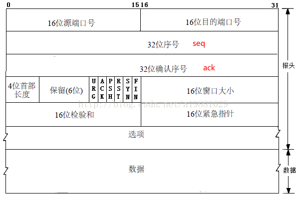
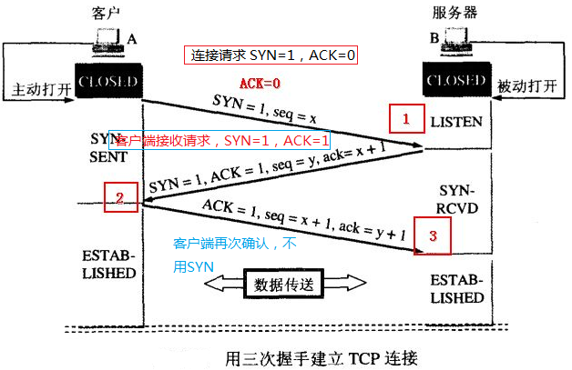
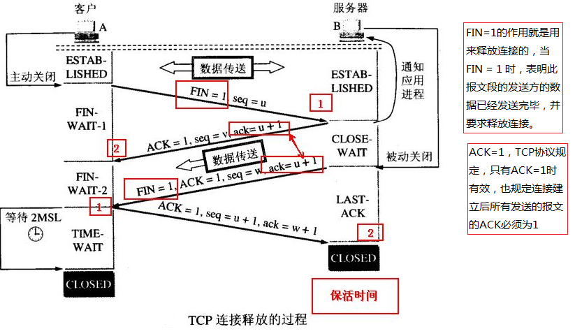

# TCP/IP协议三次握手、四次挥手

## TCP报文格式

- seq（序号）

  4个字节，32位，用来标识TCP发端向TCP收端发送的数据字节流序号

- ack（确认序号）

  4个字节，32位，TCP协议规定，只有ACK=1时有效，也规定连接建立后所有发送的报文的ACK必须为1

    一旦连接建立，该值将始终发送（同ACK标志），用来标识TCP收端向发端发生的数据字节流序号

- SYN（标志位）

  长1位，在连接建立时用来同步序号。当SYN=1而ACK=0时，表明这是一个连接请求报文。对方若同意建立连接，则应在响应报文中使SYN=1和ACK=1. 因此,SYN置1就表示这是一个连接请求或连接接受报文。

- ACK（标志位）

  长1位，置位表示确认号字段有效；TCP协议规定，只有ACK=1时有效，也规定连接建立后所有发送的报文的ACK必须为1

- FIN（标志位）

  长1位，用于释放TCP连接时标识发送方比特流结束；即完，终结的意思， 用来释放一个连接。当 FIN = 1时，表明此报文段的发送方的数据已经发送完毕，并要求释放连接。

## 三次握手

1. 由Client发出请求连接即 SYN=1 ACK=0 (请看头字段的介绍), TCP规定SYN=1时不能携带数据，但要消耗一个序号,因此声明自己的序号是 seq=x

2. Server 进行回复确认，即 SYN=1 ACK=1 seq=y, ack=x+1,

3. Client 再进行一次确认，但不用SYN 了，这时即为 ACK=1, seq=x+1, ack=y+1.

### 为什么需要第三次

- 前两次握手只能保证客户端正常，即客户端知道自己可以发送请求给服务端，且服务端也能收到服务端的请求，但是服务端不能确定客户端端是否收到了自己的回复，需要第三次握手来告知服务端，客户端确实收到了我服务端的回复，我服务端也是正常的。通过这种方式来保证tcp的可靠性
- 防止已经失效的连接请求报文突然又传送到了服务器，从而产生错误。
  - 假设客户端发送了第一条请求报文，但是因为网络原因在网络节点中滞留时间过长，由于TCP的客户端迟迟没有收到确认报文，以为服务器没有收到，此时重新向服务器发送这条报文，此后客户端和服务器经过两次握手完成连接，传输数据，然后关闭连接。
  - 此时此前滞留的那一次请求连接，网络通畅了到达服务器，这个报文本该是失效的，但是，两次握手的机制将会让客户端和服务器再次建立连接，这将导致不必要的错误和资源的浪费。
  - 如果采用的是三次握手，就算是那一次失效的报文传送过来了，服务端接受到了那条失效报文并且回复了确认报文，但是客户端不会再次发出确认。由于服务器收不到确认，就知道客户端并没有请求连接。

## 四次挥手

1. 当客户A 没有东西要发送时就要释放 A 这边的连接，A会发送一个报文（没有数据），其中 FIN 设置为1, 
2. 服务器B收到后会返回给应用程序一个报文，ACK置1，确认收到关闭连接的请求，这时A那边的连接已经关闭，即A不再发送信息（但仍可接收信息）。
3. A收到B的确认后进入等待状态，等待B请求释放连接， 这时有可能服务器还有数据未发送完，B数据发送完成后就向A请求连接释放，也是用FIN=1 表示， 并且用 ack = u+1
4. A收到后回复一个确认信息，确认位ACK置1，并进入 TIME_WAIT 状态， 等待 2MSL 时间。

### 建立连接只需要三次，释放连接为什么需要四次

建立连接时，当服务端收到客户端的建立连接请求，可以立即发送一条报文，SYN和ACK都置为1，表示这既是一条**请求建立连接的申请报文**也是一条**表示已收到你方请求的应答报文**，但是释放连接时不能这么干，因为当服务端收到客户端申请释放连接的报文时，也就是第一次挥手的时候，此时服务端可能还有数据需要传输，所以不能立即终止与客户端的通信，需要先发送一条确认报文告知客户端已收到你方申请，也就是第二次挥手，然后等到所有数据都已经发送向客户端，再发起第三次挥手申请结束客户端与服务端的连接。换句话说，第二次挥手和第三次挥手不能合并，所以需要四次。     

### 为什么TIME_WAIT状态需要经过2MSL(最大报文段生存时间)才能返回到CLOSE状态？

- **保证客户端发送的最后一个ACK报文能够到达服务器**，因为这个ACK报文可能丢失，**服务器已经发送了FIN+ACK报文，请求断开，客户端却没有回应，于是服务器又会重新发送一次，而客户端就能在这个2MSL时间段内收到这个重传的报文，接着给出回应报文**，并且会重启2MSL计时器。

- 防止类似与“三次握手”中提到了的“已经失效的连接请求报文段”出现在本连接中。客户端发送完最后一个确认报文后，在这个2MSL时间中，就可以**使本连接持续的时间内所产生的所有报文段都从网络中消失，这样新的连接中不会出现旧连接的请求报文**。

- 2MSL，最大报文生存时间，一个MSL 30 秒，2MSL = 60s

