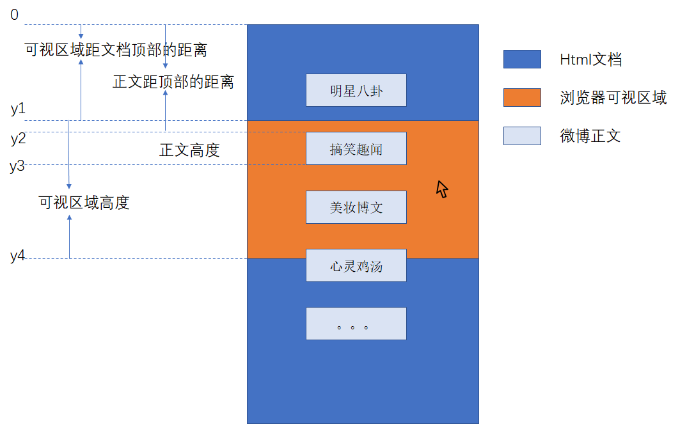
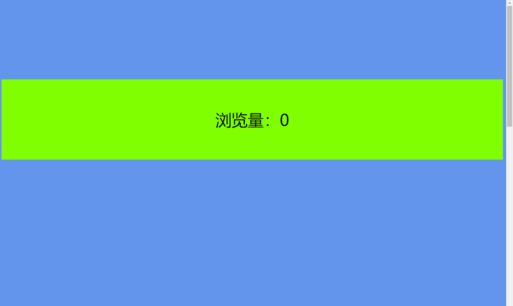

# 组件实现

用来记录那些现在市面上常见的那些组件实现方式，以自己实现为主，参考源码为辅，为将来设计完善自己的组件库做准备

## 浏览量自增组件

### 需求分析

微博、空间动态中经常能看到浏览量统计，不同于博客，点击之后浏览量自动加1，这种碎片化的推送信息，浏览次数不能以常规的点击方式来统计，**用户可能甚至根本不会点击内容**，匆匆一瞥就把滚动条往下滑动了，所以如何设计一个自动统计用户浏览这些零散信息的浏览量，是大有操作空间的。

首先规定用户的什么行为作为一次浏览，考虑用户在每个信息前停留的时间，以及浏览页面的习惯，做出如下规定

**如果一条微博或好友动态在用户的屏幕前停留超过2s，那么我们认为这条动态被用户浏览了**

你可能会说，“如果动态比较短，比如只有一个字，1s都不用就看完了，难道还非得停留2s，这不就造成了浏览数据量统计的误差吗”，当然，考虑到实际场景，停留的时间可能会根据信息的长短做出相应调整，这是对软件最终实现结果的优化，但是整个实现机制是不会有太大的变动的。上面的规定，换成开发者的角度是下面这样的

**如果一个html元素（多为一个div，或者一个组件），在可视区域内停留超过2s，发送请求给后台，告诉后台给该组件绑定的信息浏览量加1**

### 实现思路

- step1 如何判断一个元素是否在可视区内

  

<p style="text-align:center">图1</p>

如图所示，判断一个元素是否在可视区内的条件就是`y1<=y2&&y3<=y4`，使用这种判断条件，规定了类似图中“心灵鸡汤”这类元素不在可视区内（或者说不完全在可视区内），代码实现如下

html部分

```html
<!DOCTYPE html>
<html lang="en">
<head>
	<meta charset="UTF-8">
	<title>浏览量自增</title>
	<style>
		#count{
			margin-top: 200px;
			background: chartreuse;
			height: 200px;
			font-size: 40px;
			line-height: 200px;
			text-align: center;
		}
		body{
			height: 2000px;
			overflow: auto;
		}
	</style>
</head>
<body>
	<div id="count">浏览量：0</div>
</body>
</html>
```

效果如下



<p style="text-align:center">图2</p>

图中绿色背景的部分作为一条微博正文

判断该部分是否在可视区域内

```js
function isInSight() {
  var visibleArea = document.documentElement.clientHeight;//屏幕可视区域的高度
  var ele = document.getElementById('count');
  //元素相对于文档顶部的距离,即图1中的y2
  var eleTop = ele.offsetTop;
  //获取浏览器窗口顶部距离文档顶部的距离（滚动条滚动的距离），即图1中的y1
  var scrollTop = document.documentElement.scrollTop;
  return scrollTop <= eleTop && (eleTop + ele.offsetHeight) <= (scrollTop + visibleArea)
}
```

- setup2 如何判断div在可视区域内停留了2s

最开始我的想法是，记录div由不在可视区域（false）进入可视区域（true）的时刻`t1`，再记录由true变为fasle的时刻`t2`，判断`t2-t1`的差值是否大于2s，但是这种处理逻辑会造成非常不好的效果，例如，用户在看到最后一条记录的时候，看完之后直接把浏览器关了，那么我就获取不到`t2`了，并且这种做法在时效性上是很差的，假设用户盯着这条动态看了10min，或者把浏览器切到这个地方去上厕所了，那么获取`t2`的时刻就非常的晚，这样过很久之后一条动态的浏览次数才会+1，这显然是不能接受的。

所以上面那种做法是不可取的，那么换一种策略，仍然记录t1，在t1时刻的2s之后再去判断div是否在区域内，如果还在，认为它在可视区域内停了2s，否则没有停够2s，但是这种做法仍然有漏洞，例如，用户在2s内快速滑动滚动条，用户在`t1+0.1s`的时候将一条动态划出了屏幕，在`t1+1.9s`的时候将这条动态划回了屏幕，此时时间来到`t1+2s`，该条动态在屏幕内，按照上文所述的逻辑，就会得出该条动态被浏览的错误结论，但是相较方法1，在时效性上是有很大提升的。

最完美的做法应该是这样处理的，利用计时器**时刻**判断div是否在可视区域内，如果为false，更新时间节点t1，如果为true，计算当前时间与t1差值是否大于2s。

具体实现使用了对象劫持

```js
// 定义一个这样的对象记录组件（div）的相关信息
let obj = {
  updateTime:null,    // div不在可视区域的时刻，实时更新
  conut:0,  // 浏览次数，结合后台返回结果
  isUpdated: false,  // 是否被浏览过，浏览过后不再判断
  ele:document.getElementById('count'),  // 组件dom对象
  callback: function () { // 回调函数：设置停留时间超过2s后所做的操作，这里可以进行前后端交互
    this.ele.innerText = `浏览量：1`
    console.log('您已经停留超过2s了')
  }
}

Object.defineProperty(obj,'isInSight',{
  get: function () {
    return this.isInSight
  },
  set: function (newValue) {
    /* 如果已经浏览过没必要更新*/
    if(this.isUpdated){
      return
    }
    /*如果不在可视化区域,或者首次运行，更新时间*/
    if(!newValue || !this.updateTime) {
      this.updateTime = new Date();
    } else {
      // 否则计算时间差
      const difference = new Date() - this.updateTime
      if(difference>2000){
        this.callback()
        this.isUpdated = true
      }
    }
  }
})

obj.isInSight = isInSight()
//启动计时器
setInterval(()=>{
  obj.isInSight = isInSight()
});
```

### 总结

上面的实现方法依然不算完美，因为计时器是非常损耗性能的，如果使用一个计时器同时更新多个组件的状态，那么只能等到所有的组件都被浏览过一次之后才能去销毁这唯一的一个计时器，如果每个组件的状态更新都使用不同的计时器，等到该组件被浏览之后再销毁，那么创建大量计时器的花销和多个计时器同时运行的损耗也是非常大的。如果可行的话，监听`document.documentElement.scrollTop`或者`ele.offsetTop`属性的变化来进行判断或许是不错的尝试，原生dom的属性能否被监听呢？这或许是下一个可以尝试的点。