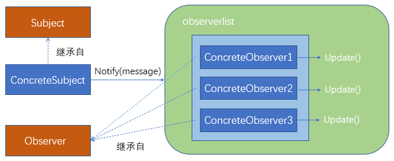
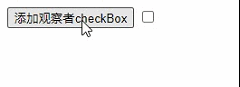
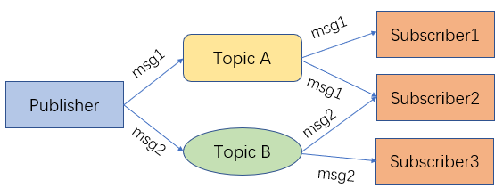

# observer和subscribe/publish

## observer（观察者模式）

### 概念

> 一个或多个观察者对目标的状态敢兴趣，他们通过将自己依附在目标对象上以便注册所感兴趣的内容。目标状态发生改变并且观察者可能对这些改变感兴趣，就会发送一个通知消息，调用每个观察的更新方法，当观察者不在对目标状态感兴趣是，他们可以简单地将自己从中分离
>
> ——引用自《javascript设计模式》引用《设计模式：可复用面向对象软件的基础》

《JavaScript设计模式》一书中给出了观察者模式的实现方法，使用了四个组件（书中原文翻译，感觉比较奇怪，实际看起来更像是一个普通类、抽象类和分别继承自这两个类的实例对象）来实现Observer模式

- Subject（目标）

  维护一系列的观察者，方便添加或删除观察者

- Observer（观察者）

  为哪些在目标状态发生改变时需获得通知的对象提供一个更新接口

- ConcreteSubject（具体目标）

  状态发生改变时，向Obser发出通知，存储ConcreteObserver的状态

- ConcreteObserver（具体观察者）

  存储一个指向ConcreteSubject的引用，实现Observer的更新接口，以使自身状态与目标状态保持一致



### 实现

> 一下代码部分来源于《JavaScript设计模式》，这本书出版时间较长，使用的语法相对老旧，做了一些调整

首先实现一个维护观察者列表的类ObserverList，本质上是一个数组扩展，在es6广泛普及的今天，这个封装看起来十分没有必要

- ObserverList

```js
class ObserverList{
	constructor() {
		this.observerList = []
	}
	Add(obj){
		return this.observerList.push(obj)
	}
	Empty(){
		this.observerList = []
	}
	Count(){
		return this.observerList.length
	}
	Get(index){
		if(index>-1&&index<this.observerList.length){
			return this.observerList[index]
		}
	}
	Insert(obj, index){
		let pointer = -1
		if(index === 0){
			this.observerList.unshift(obj)
			pointer = index
		} else if(index === this.observerList.length){
			this.observerList.push(obj)
			pointer = index
		}
		return pointer
	}
	IndexOf (obj, startIndex){
		let i = startIndex, pointer = -1
		while(i<this.observerList.length){
			if(this.observerList[i] === obj){
				pointer = i
			}
			i++
		}
		return pointer
	}
	RemoveIndexAt(index){
		if(index === 0){
			this.observerList.shift()
		} else if(index === this.observerList.length -1){
			this.observerList.pop()
		}
	}
}
```

- Subject

```js
class Subject{
	constructor() {
		this.observers = new ObserverList()
	}
	AddObserver (observer) {
		this.observers.Add(observer)
	}
	RemoveObserver (observer) {
		this.observers.RemoveIndexAt(this.observers.IndexOf(observer, 0))
	}
	Notify (message) {
		const observerCount = this.observers.Count()
		for(let i = 0;i<observerCount;i++){
			this.observers.Get(i).Update(message)
		}
	}
}
```

- Observer

Observer类看起来很像是一个抽象类，在javascript中存在感会更一低，但是设计模式并不是和计算机语言强相关的科学，那么在js中，只要是拥有Update方法的对象，都可以认为是Observer对象

```js
class Observer {
 constructor() {
  this.Update = function (){
  	// Todo
  }
 }
}
```

### 应用

程序要求：

- 能够向页面中添加新的checkbox的按钮
- 一个控制级checkbox，能够控制所有页面上添加的checkbox的状态（选中还是非选中）

这个功能看起来和checkbox的全选有点类似

实现的效果如下



代码实现如下

```html
<!DOCTYPE html>
<html lang="en">
<head>
	<meta charset="UTF-8">
	<title>Title</title>
</head>
<body>
<button id="addNewObserver">添加观察者checkBox</button>
<input id="mainCheckbox" type="checkbox"/>
<div id="observersContainer"></div>
<script src="observer.js"></script>
<script src="subject.js"></script>
</body>
<script>
    function extend(obj, extension){
        for(let key in obj){
            extension[key] = obj[key]
        }
	}
	const controlCheckbox = document.getElementById('mainCheckbox')
	const addBtn = document.getElementById('addNewObserver')
	const container = document.getElementById('observersContainer')
	// 具体目标 ConcreteSubject
	// 利用Subject扩展controlCheckbox
	extend(new Subject(), controlCheckbox)
	extend(Subject.prototype, controlCheckbox)

	// controlCheckbox["onclick"] = new Function("controlCheckbox.Notify(controlCheckbox.checked)")
	controlCheckbox.onclick = () => {controlCheckbox.Notify(controlCheckbox.checked)}

	function AddNewObserver() {
		// 具体观察者 ConcreteObserver
		const check = document.createElement('input')
		check.type = 'checkbox'
		extend(new Observer(), check)
		extend(Observer.prototype, check)
		check.Update = function (value) {
			this.checked = value
		}

		// 为主subject的观察者列表添加新的观察者
		controlCheckbox.AddObserver(check)
		container.appendChild(check)
	}

	addBtn['onclick'] = AddNewObserver
</script>
</html>
```

- 通过extend函数，将`#mainCheckbox`的dom对象上添加Subject的相关属性
- 在添加新的checkbox时，通过extend函数，将新添加的`check`对象上添加观察者Observer的相关属性，然后实现`Update`方法
- 在点击`#mainCheckbox`时，触发`#mainCheckbox`上的`Notify`方法，通知所有的`check`做更新操作

### 优缺点

- 优点：

  观察者模式可以实现表示层和数据逻辑层的分离，定义了稳定的消息更新传递机制，并抽象了更新接口，使得可以有各种各样不同的表示层充当具体观察者角色。 一个抽象模型有两个方面，其中一个方面依赖于另一个方面，将这两个方面封装在独立的对象中使它们可以各自独立地改变和复用。观察者模式定义了稳定的消息更新传递机制，可以实现一对多的广播通信，同时在被观察者和观察者之间建立的关系并不是很紧密，它们是不同的抽象，符合“低耦合”的系统设计理念。

- 缺点：

  观察者模式建立的消息传递机制是低效的，如果建立了多个观察者，可能会影响消息传递的时间，这只会让观察者知道了被观察者发生了变化的结果，却不知道变化发生的过程。另外如果一个观察目标对象有很多直接和间接观察者，将所有的观察者都通知到会花费很多时间，并且如果在观察者和观察目标之间存在循环依赖，观察目标会触发它们之间进行循环调用。

## Publish/Subscribe（发布/订阅）

### 概念

关于发布/订阅模式和观察者模式之间的关系的说法众说纷纭，《Javascript设计模式》一书中有这么一段话

> 通常在Javascript里，注重Observer模式是很有用的，我们会发现它一般使用一个被称为Publish/Subscribe（发布/订阅）模式的变量来实现。虽然这些模式非常相似，但是他们之间的几点区别也是值得注意的。

那么我们不妨认为这就是两种不同的设计模式

关于其具体概念，书中描述如下：

> Publish/Subscribe模式使用了一个主题/事件通道，这个通道结余希望接受通知（订阅者）的对象和激活事件的对象（发布者）之间。该事件系统允许代码定义应用程序的特定事件，这些事件可以传递自定义参数，自定义参数包含订阅者所需的值



### 与Observer模式的区别

- 订阅者和发布者之间没有依赖关系

  观察者模式中，被观察者（Subject)需要维护观察自己的观察者（Watcher），也就是说Subject需要知道通知哪些Watcher来进行状态更新，而订阅发布模式明显不同，发布者（Publisher)只需要发布相关的Topic和数据，它并不关注有哪些订阅者（Subscirber)需要这些数据。下面举两、、、、、、个形象的例子来说明观察者模式和订阅发布模式的这种区别

  观察者模式：一个B站up主有100W粉丝，那么这个up主就相当于是一个Subject，他有100W个Watcher，当他发布新视频时，他就可以通知所有的Watcher，“我发布了一个新视频，大家快来看”，具体体现在这100W粉丝的动态列表里面会出现这个up主的新视频

  订阅发布者模式：游戏区的up主们可能会发不同游戏的视频，有可能是LOL，有可能是主机游戏，甚至是扫雷，这些游戏的种类就是Topic，具体的数据就是相关的视频，一个b站用户并不可能关注所有的LOL相关UP主，但是这不妨碍你可能在B站首页或者推荐列表里面刷到他的视频，但是你刷到的视频一定是你关注的up主发布的吗？不一定吧，你关注的只是LOL这个标签，或者说Topic，至于是谁发布的你可能并不关心，你只需要知道你想看LOL，于是点开了视频。

- 观察者模式的耦合性更强

  观察者模式的耦合性强是与订阅发布者模式相比，上文中在observer的有点中分析了，观察者模式是低耦合的，但是订阅发布者模式的耦合程度比观察者模式更低，这一特点也是因为订阅者和发布者之间没有依赖关系

### 优缺点

- 优点

  发布订阅模式的有点很明显，就是它的完全解耦特性

- 缺点

  发布订阅模式的缺点正是来源于它的优点。通过从订阅者中解耦发布者，它有时会很难保证应用程序的特定部分按照我们期望的运行。

  比如，发布者可能会假设：一个或多个订阅者在监听他们。倘若我们假设订阅者需要记录或输出一些与应用程序处理有关的错误。如果订阅者执行日志崩溃了（或处于某种原因无法正常运行），由于系统的解耦特性，发布者就不会看到这一点。

  这种模式的另一个缺点是：订阅者非常无视彼此的存在，并对变换发布者产生的成本视而不见。由于订阅者和发布者之间的动态关系，很难跟踪依赖更新

### 实现

```js
class PubSub{
	constructor(){
		// {
		//   topic1:[fn1,fn2],
		//   topic2:[fn3,fn4],
		// }
		this.topics = {}
		this.subUid = -1
	}
	publish(topic,...args){
		if(this.topics[topic]){
			// 存在 遍历所有topic下的fn
			this.topics[topic].forEach(({fn})=> fn(...args))
		}
	}
	subscribe(topic,fn){
		this.topics[topic] = this.topics[topic] || []
		const token = ++this.subUid + ''
		this.topics[topic].push({
			token,
			fn
		})
		return token
	}
	// 基于订阅上的标记引用，通过特定topic取消订阅
	unSubscribe(token){
		for(const key in this.topics){
			const topicArray = this.topics[key]
			for(let i =0;i<topicArray.length;i++){
				if(topicArray[i].token === token) {
					topicArray.splice(i, 1)
					return
				}
			}
		}
	}
}
```

> vue中的事件总线机制本质上就是一种订阅发布模式

### 应用

同样使用订阅发布模式来实现checkbox的全选，代码如下

```html
<!DOCTYPE html>
<html lang="en">
<head>
	<meta charset="UTF-8">
	<title>订阅/发布模式</title>
</head>
<body>
<button id="addNewObserver">添加观察者checkBox</button>
<input id="mainCheckbox" type="checkbox"/>
<div id="observersContainer"></div>
<script src="PubSub.js"></script>
</body>
<script>
	const controlCheckbox = document.getElementById('mainCheckbox')
	const addBtn = document.getElementById('addNewObserver')
	const container = document.getElementById('observersContainer')
	const pubSub = new PubSub()
	controlCheckbox.onclick = () => {
		pubSub.publish('onChange', controlCheckbox.checked)
	}

	function AddNewObserver() {
		// 具体观察者 ConcreteObserver
		const check = document.createElement('input')
		check.type = 'checkbox'

		pubSub.subscribe('onChange', checked => {
			check.checked = checked
		})

		container.appendChild(check)
	}

	addBtn['onclick'] = AddNewObserver
</script>
</html>
```

