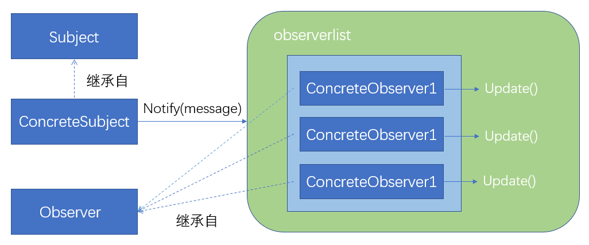

# observer和subscribe/publish

## observer（观察者模式）

> 一个或多个观察者对目标的状态敢兴趣，他们通过将自己依附在目标对象上以便注册所感兴趣的内容。目标状态发生改变并且观察者可能对这些改变感兴趣，就会发送一个通知消息，调用每个观察的更新方法，当观察者不在对目标状态感兴趣是，他们可以简单地将自己从中分离
>
> ——自用字《javascript设计模式》引用《设计模式：可复用面向对象软件的基础》

《JavaScript设计模式》一书中给出了观察者模式的实现方法，使用了四个组件（书中原文翻译，感觉比较奇怪，实际看起来更像是一个普通类、抽象类和分别继承自这两个类的实例对象）来实现Observer模式

- Subject（目标）

  维护一系列的观察者，方便添加或删除观察者

- Observer（观察者）

  为哪些在目标状态发生改变时需获得通知的对象提供一个更新接口

- ConcreteSubject（具体目标）

  状态发生改变时，向Obser发出通知，存储ConcreteObserver的状态

- ConcreteObserver（具体观察者）

  存储一个指向ConcreteSubject的引用，实现Observer的更新接口，以使自身状态与目标状态保持一致

